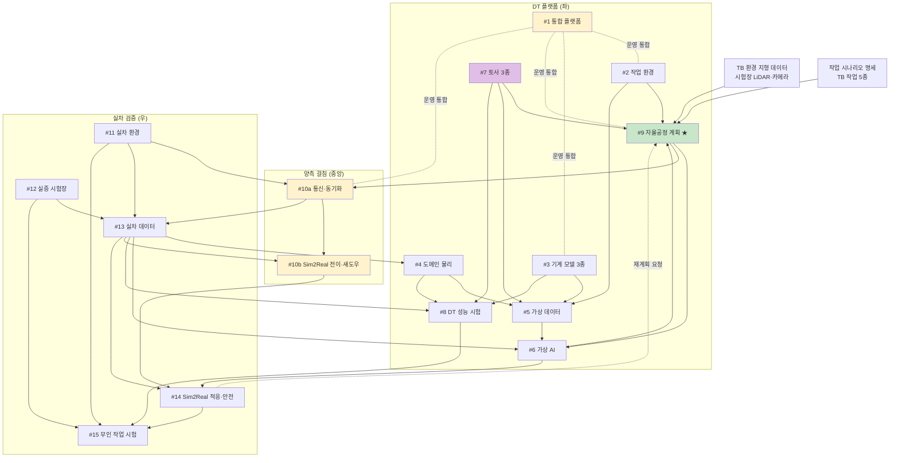
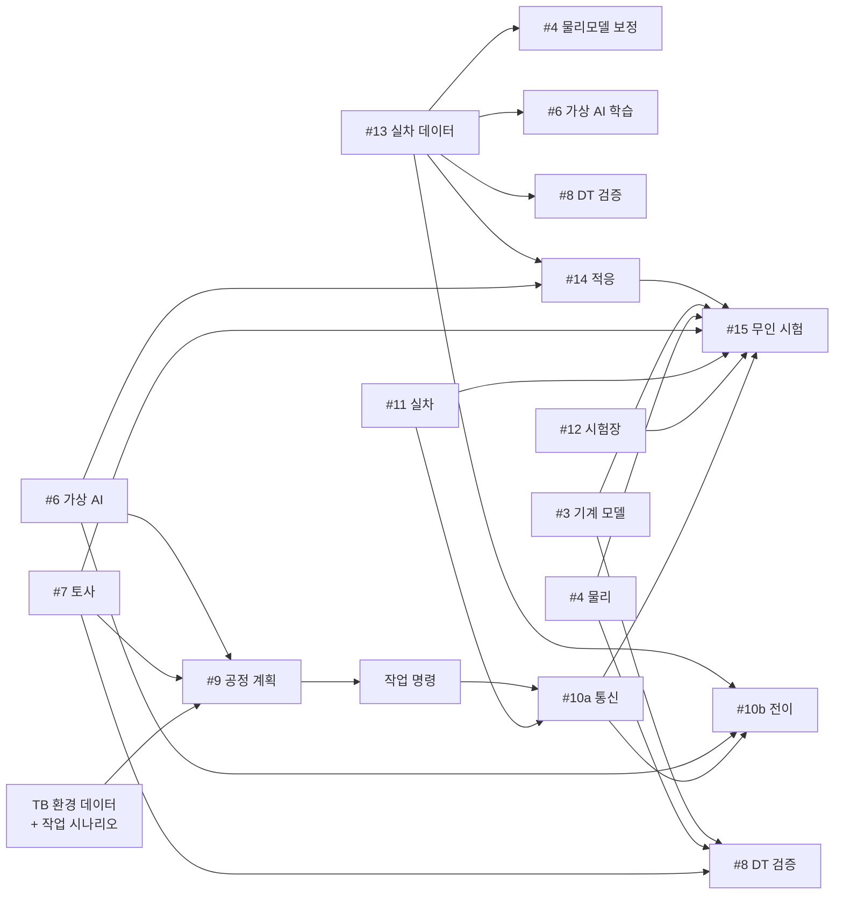

# 인공지능 기반 무인 자율 굴착기 디지털 트윈 플랫폼 사업
## 업무 상세화 · 연계 · KPI 정의 문서 (v1.3)

---

## 0. 문서 정보

| 항목 | 내용 |
|---|---|
| 문서명 | 사업기획_업무상세화_v1 |
| 작성일 | 2026-05-04 |
| 작성자 | 한국건설기계연구원(KOCETI) / 이민수 |
| 사업 코드 | 2026-기계장비-품목-07 |
| 사업명 | 인공지능 기반 무인 자율 굴착기 개발을 위한 초실감 디지털 트윈 플랫폼 개발 |
| 버전 | v1.3 |
| 변경 이력 | v1.0 (2026-05-04) 초안 작성<br>v1.1 (2026-05-04) #9를 DT 좌측으로 이동·재정의<br>v1.2 (2026-05-04) #9 범위 보정 (TRL 3~5 한정)<br>v1.3 (2026-05-04) **용어 한글화** — #14의 *"Curriculum (점진적 배포)"* → **"단계별 시험 캠페인"**. #6의 *Curriculum Learning*은 학술 표준이므로 한글 병기 형태로 유지. |

---

## 1. 사업 개요

### 1.1 기본 정보

| 구분 | 내용 |
|---|---|
| 사업 트랙 | 산업/일반기계, 임베디드 SW, 혁신제품형, AI 연계, 비수도권 |
| 미션 | 무인공장 실현을 위한 제조장비의 지능화 |
| 프로젝트 | 디지털 제조장비 및 부품 핵심기술 개발 |
| 세부기술 | 디지털트윈 기반 시뮬레이션 플랫폼 기술 |
| TRL | 시작 3단계 → 종료 5단계 |
| 연구개발기간 | 43개월 (1차 9개월 / 2차 10개월 / 3·4차 각 12개월) |
| 정부지원금 | 48억원 (1차년도 10억원 한도) |
| 주관기관 | 중소·중견 기업 (혁신제품형) |
| 기술료 | 정부납부 대상 |

### 1.2 핵심 목표 (요약)

```
[목표 G1] 디지털 트윈 물리 거동 일치도 90% 이상
[목표 G2] 학습모델 실차 전이 성공률 90% 이상
```

### 1.3 정량적 성능 지표 (5개)

| 코드 | 지표 | 목표 |
|:---:|---|---|
| P1 | 디지털트윈 물리 일치도 (%) | ≥ 90% |
| P2 | 토사종류별 작업환경 구현 (종) | ≥ 3종 |
| P3 | 건설기계 디지털트윈 모델 (종) | ≥ 3종 |
| P4 | AI 기반 무인작업 성공률 (%) | ≥ 90% |
| P5 | 실차–시뮬레이션 데이터 연동 지연시간 (ms) | ≤ 100ms (평균) |

> G1 ≡ P1, G2 ⊃ P4 (목표와 지표가 부분적으로 중복).

---

## 2. 핵심 목표 및 성능 지표 상세 정의

### 2.1 [G1 / P1] 디지털 트윈 물리 거동 일치도

| 항목 | 내용 |
|---|---|
| **정의** | 동일 입력(제어 명령·환경 조건)에서 가상 모델과 실차의 출력(위치·속도·관절각·반력)이 일치하는 정도 |
| **단위** | % |
| **목표값** | ≥ 90% |
| **측정 변수** | 위치 (x,y,z), 자세 (roll/pitch/yaw), 관절각 (4축), 관절 속도, 버킷 반력 (3축), 유압 압력 |
| **계산식** | `일치도 = 100% × (1 - MAPE)` <br> MAPE = Mean Absolute Percentage Error (정규화 RMSE 가능) |
| **변수별 가중치** | 위치 30% / 속도 20% / 관절각 25% / 반력 25% (사업 시작 시 협의 확정) |
| **측정 시나리오** | 표준 시험 시나리오 ≥ 10개 (직선 굴착·곡선·상차·정지 등) |
| **시험 환경** | #12 실증 시험장 |
| **계측 도구** | GPS RTK (cm 정확도), IMU 9축, 관절 엔코더, 압력·토크 센서, motion capture (옵션) |
| **측정 주기** | 매년 중간 점검, 4차년도 최종 평가 |
| **검증 책임** | ◎ #8 (DT 성능 시험) |
| **모델링 책임** | ◎ #3 (기계 모델), ◎ #4 (도메인 물리), ◎ #7 (토사) |

### 2.2 [P2] 토사종류별 작업환경 구현

| 항목 | 내용 |
|---|---|
| **정의** | 시뮬레이션 환경에서 정량적 기준을 충족한 토사 모델의 종류 수 |
| **단위** | 종 (정수) |
| **목표값** | ≥ 3종 (진흙·모래·자갈 권장) |
| **개별 종 검증 기준 (모두 충족 시 1종 인정)** | ① 정역학: 자연 안식각 실측치 ±10% 이내 <br> ② 동역학: 버킷–토사 반력 실측치 ±15% 이내 <br> ③ 시각: 실차 영상 대비 사용자 평가 ≥ 4/5점 |
| **시험 환경** | #12 실증 시험장 (토사 베드 3종) |
| **계측 도구** | 표준 안식각 시험기, 6축 force/torque 센서 (버킷 부착), 카메라 |
| **측정 주기** | 3차년도 말 1차 검증, 4차년도 최종 검증 |
| **책임 항목** | ◎ #7 (토사 모델 및 반력 3종) |

### 2.3 [P3] 건설기계 디지털트윈 모델

| 항목 | 내용 |
|---|---|
| **정의** | G1/P1 검증을 통과한 건설기계 디지털 트윈 모델의 종류 수 |
| **단위** | 종 |
| **목표값** | ≥ 3종 (굴착기 + 로더 + 1종 — 도저·그레이더·휠로더 중 택일) |
| **개별 종 검증 기준** | G1/P1 일치도 ≥ 90% 달성 |
| **종별 산출물** | 3D 형상 + 기구학 모델 + 도메인 물리 모델 + 제어 인터페이스 |
| **측정 주기** | 종별로 4차년도까지 순차 완성 |
| **책임 항목** | ◎ #3 (기계 모델), ○ #4 (도메인 물리) |

### 2.4 [G2 / P4] AI 무인작업 성공률 / 학습모델 실차 전이 성공률

| 항목 | 내용 |
|---|---|
| **정의** | AI가 정의된 작업 시나리오에서 자율로 성공 완료한 비율 (실차 기준) |
| **단위** | % |
| **목표값** | ≥ 90% |
| **성공 정의 (모두 충족)** | ① 작업 목표 달성 (예: 굴착량 ≥ 목표치 95%) <br> ② 안전 위반 없음 (충돌·전복·페일세이프 미발동) <br> ③ 시간 한계 내 (시나리오별 정의) |
| **시나리오** | 표준 작업 시나리오 ≥ 10종 × 반복 ≥ 5회 (총 50회 이상) |
| **시험 환경** | #12 실증 시험장 (4단계 시험 캠페인 #15) |
| **시험 단계** | 단계1 Bench → 단계2 주간 평탄지 → 단계3 다양 지형 → 단계4 야간/위험지 |
| **각 단계별 성공률 목표** | 단계1: 95% / 단계2: 92% / 단계3: 90% / 단계4: 85% (참고치) |
| **측정 주기** | 4차년도 최종 시험 |
| **책임 항목** | ◎ #6 (가상 AI), ◎ #14 (실차 적응), ◎ #10b (전이), ◎ #9 (자율공정), ◎ #15 (검증) |

### 2.5 [P6 — 협의 제안] 공정 계획 시뮬-실차 일치도

> ⚠️ RFP 미명시 지표. **사업 시작 시 채택 여부 협의 권장**.

| 항목 | 내용 |
|---|---|
| **정의** | DT 시뮬레이션에서 예측한 공정 결과(작업 시간·굴착량·경로)와 실차 수행 결과의 일치 정도 |
| **단위** | % |
| **목표값** | 편차 ≤ 15% (제안) |
| **계산식** | `편차 = |X_시뮬예측 - X_실차실측| / X_실차실측 × 100` <br> X = 작업시간, 굴착량, 경로 길이 등 |
| **측정 대상** | TB 환경 표준 작업 시나리오 ≥ 5종 |
| **측정 주기** | 3차년도 1차, 4차년도 최종 |
| **시험 환경** | #12 실증 시험장 (TB) |
| **책임 항목** | ◎ #9 (TB 환경 공정 계획), ○ #6 (가상 AI 검증) |

→ DT의 *공정 계획 알고리즘이 실차에서도 작동함*을 정량화하는 보조 지표. TRL 3~5 수준 검증.

### 2.6 [P5] 실차–시뮬레이션 데이터 연동 지연시간

| 항목 | 내용 |
|---|---|
| **정의** | 실차 센서 이벤트가 발생한 시점부터 시뮬레이션에 반영 완료될 때까지의 end-to-end 시간 지연 |
| **단위** | ms |
| **계산식** | `지연시간 = t_시뮬반영 - t_센서발생` |
| **목표값** | 평균 ≤ 100ms, P99 ≤ 200ms (RFP 미명시 — 사업 시작 시 협의 확정 필요) |
| **시간 동기화** | NTP/PTP 기반, 동기 정확도 ≤ 1ms |
| **측정 변수** | 카메라 frame, LiDAR scan, IMU/엔코더 stream, 제어 명령 |
| **측정 방법** | hardware timestamp 비교 (실차 NIC ↔ 시뮬 머신 NIC) |
| **시험 환경** | 실차 (#11) + 통신 인프라 (#12) + 시뮬 머신 동시 운영 |
| **측정 주기** | 매년 검증 |
| **책임 항목** | ◎ #10a (통신·동기화), ○ #10b (디지털 섀도우), ○ #11 (실차 환경) |

---

## 3. 항목별 업무 상세화 (16개 항목)

> ⚠️ **수정 필요** — 아래 §3.1~§3.16의 1차년도 비중표를 현 비중대로 합산 시 1차년도 합계 ≈ 10.6억으로 1차년도 10억원 한도 초과. **비중 재조정 후 본 표 갱신 필요** (R10 참조).

> 각 항목은 다음 구조로 정리: **개요 / 세부 업무 / 입력 / 출력 / 책임 KPI / 연계 항목 / 연차 계획 / 예산 / 담당**

### 3.1 [#1] DT 통합 플랫폼 SW (5.0억 / 🟧A 주관)

**개요** — 모든 모델·AI·시뮬레이션 모듈을 통합하여 단일 환경에서 운용 가능한 backbone 미들웨어 및 사용자 인터페이스 개발. 사업의 *주력 산출물*.

**세부 업무**

1. 시스템 아키텍처 설계 (마이크로서비스 vs 모놀리식 결정, 모듈 IF 정의)
2. 통합 미들웨어·API 게이트웨이 구현 (REST/gRPC/메시지 버스)
3. 사용자 UI/UX 설계·개발 (대시보드, 시나리오 편집기, 시각화)
4. 모듈 간 인터페이스 표준 정의 (#2~#10b 모두와 호환)
5. 데이터 관리 인프라 (DB, 데이터레이크, 로깅, 버전 관리)
6. 권한·보안·계정 시스템 (다기관 협업 환경)
7. CI/CD 파이프라인 및 통합 테스트 환경
8. 플랫폼 운영 매뉴얼·SDK·문서화

**입력** — 모든 항목의 인터페이스 요구사항 (1차년도 수렴)
**출력** — 통합 플랫폼 SW (α 1차년도, β 2차년도, RC 3차년도, 정식 4차년도)
**책임 KPI** — 모든 KPI에 ○ (간접 — 통합 backbone)
**연계 항목** — 거의 모든 항목 (#2~#15)

| 연차 | 비중 | 주요 작업 |
|:---:|:---:|---|
| 1차 | 30% | 아키텍처 + α 버전 |
| 2차 | 30% | β 버전 + 모듈 통합 |
| 3차 | 25% | RC + 성능 최적화 |
| 4차 | 15% | 정식 + 운영 안정화 |

---

### 3.2 [#2] 작업 환경 구성 (2.5억 / 🟦B)

**개요** — 굴착 작업장(지형·장애물·건물)을 가상에서 정밀 구축. 시각·물리적 사실성 확보.

**세부 업무**

1. 가상 환경 엔진 선정·구축 (Omniverse / Isaac Sim / Unity / Unreal)
2. 표준 작업 시나리오 정의 (≥ 5종: 평지 터파기, 경사지, 상차, 도랑 작업, 야간)
3. 지형·장애물 3D 모델링 라이브러리
4. 조명·날씨·시간대 변동 모듈 (Domain Randomization 지원)
5. 충돌 검출·물리 시뮬 연동 인터페이스 (#4·#7과 연동)
6. 시각화 품질 검증 (실 영상 대비 photorealism)
7. 시나리오 편집기 (사용자가 새 시나리오 생성 가능)

**입력** — 실차 작업 사례 영상 (#13에서 일부)
**출력** — 가상 작업장 시나리오 라이브러리, 시나리오 편집 도구
**책임 KPI** — G1/P1 ○ (보조 — 환경 정확도)
**연계 항목** — #1 (통합), #6 (학습 환경), #7 (토사 배치), #14 (실차 환경 비교)

| 연차 | 비중 |
|:---:|:---:|
| 1차 | 40% (엔진 셋업 + 기본 시나리오) |
| 2차 | 30% (시나리오 확장) |
| 3차 | 20% (사실성 향상) |
| 4차 | 10% (검증·보완) |

---

### 3.3 [#3] 건설기계 모델 개발 3종 (3.5억 / 🟦B)

**개요** — 굴착기·로더·1종 추가 등 *3종* 건설기계의 디지털 트윈 모델 (외형 + 기구학 + 제어 인터페이스).

**세부 업무**

1. 3종 건설기계 선정 (OEM 협의)
2. CAD 도면 확보 (또는 reverse engineering)
3. 3D 형상 모델링 (시각용 + 충돌 메시)
4. 기구학적 모델링 (관절·링크·D-H 파라미터)
5. 제어 인터페이스 정의 (조이스틱 입력 → 관절 명령)
6. 기본 거동 검증 (자유낙하·관절 동작)
7. 제조사별 변형 모델 (예: 굴착기 5톤 / 14톤 / 21톤급)
8. 모델 라이브러리화 (#1과 연동)

**입력** — OEM 도면, 실차 측정 데이터 (#13)
**출력** — 3종 건설기계 디지털 트윈 모델 패키지
**책임 KPI** — **P3 ◎** (3종 모델), **G1/P1 ◎** (거동 일치)
**연계 항목** — #1, #4 (도메인 물리 결합), #8 (검증), #14 (실차 비교)

| 연차 | 비중 |
|:---:|:---:|
| 1차 | 25% (1종 — 굴착기 우선) |
| 2차 | 35% (2종 추가) |
| 3차 | 25% (3종 완성 + 변형) |
| 4차 | 15% (검증·보완) |

---

### 3.4 [#4] 주요 도메인별 물리모델 (3.0억 / 🟦B)

**개요** — 굴착기 내부 시스템(유압·전동·파워트레인)의 multi-physics 시뮬 모델.

**세부 업무**

1. **유압 시스템 모델** — 펌프, 실린더, 밸브, 호스 (압력·유량·온도)
2. **전동 시스템 모델** — 모터, 인버터, 배터리 (전압·전류·SOC)
3. **파워트레인 모델** — 엔진, 변속기, 유성기어 (RPM·토크·연비)
4. **도메인 간 통합 인터페이스** — 에너지 흐름 일관성
5. 실측 기반 파라미터 보정 (#13 입력)
6. 도메인별 정확도 검증
7. 통합 검증 (전체 굴착기 거동 재현)

**입력** — OEM 사양서, #13 실차 데이터
**출력** — 도메인별 물리모델 라이브러리, 통합 인터페이스
**책임 KPI** — **G1/P1 ◎**, **P3 ○** (모델의 일부)
**연계 항목** — #3 (기계 모델 결합), #1, #8

| 연차 | 비중 |
|:---:|:---:|
| 1차 | 30% (유압 우선) |
| 2차 | 35% (전동·파워트레인) |
| 3차 | 25% (통합·보정) |
| 4차 | 10% (검증) |

---

### 3.5 [#5] 학습데이터 수집(가상 환경) (2.0억 / 🟩C)

**개요** — 시뮬레이션 환경에서 AI 학습용 데이터 자동 생성·관리.

**세부 업무**

1. Procedural 시나리오 자동 생성 (지형·토사·날씨 랜덤화)
2. GPU 클러스터 운영 (병렬 시뮬 N개 동시 실행)
3. 자동 라벨링 (시뮬 ground truth 활용)
4. 데이터 저장·관리 (데이터레이크, 메타데이터)
5. 데이터 증강 (augmentation, noise injection)
6. 데이터 품질 관리 (이상 데이터 필터링)
7. #6 학습 파이프라인 연결

**입력** — #2 시나리오, #3·#4·#7 모델
**출력** — 학습 데이터셋 (수십만 시나리오), 데이터 관리 시스템
**책임 KPI** — G2/P4 ○ (학습 fuel)
**연계 항목** — #6 (직접 사용), #2·#3·#4·#7 (생성 기반)

| 연차 | 비중 |
|:---:|:---:|
| 1차 | 20% (인프라 구축) |
| 2차 | 35% (대량 생성) |
| 3차 | 30% (재생성·증강) |
| 4차 | 15% |

---

### 3.6 [#6] 가상 환경 AI 정책 학습 (4.0억 / 🟩C)

**개요** — 가상 환경에서 RL/IL 기법으로 자율 굴착기 정책 학습. **사업 핵심 KPI(G2/P4)의 출발점**.

**세부 업무**

1. AI 알고리즘 설계 (PPO/SAC/IL/Hybrid 결정)
2. 보상 함수·손실 함수 설계 (작업 완수·안전·효율)
3. Domain Randomization 적용 (sim2real 강건화)
4. 정책 학습 (대용량 GPU, 수개월)
5. 단계별 학습 (Curriculum Learning — 학습 시나리오 난이도를 쉬운 → 어려운 단계로 점진 확대)
6. 평가 메트릭 정의 (성공률, 효율, 강건성)
7. 모델 버전 관리 및 #14·#10b로 핸드오프
8. Behavior Cloning baseline (#13 시연 데이터)

**입력** — #5 학습 데이터, #13 시연 데이터 (Behavior Cloning용)
**출력** — 가상 환경 AI 정책 모델 (versioned)
**책임 KPI** — **G2/P4 ◎**
**연계 항목** — #14 (전이), #9 (자율공정과 통합)

| 연차 | 비중 |
|:---:|:---:|
| 1차 | 15% (알고리즘 설계 + 프로토) |
| 2차 | 30% (1차 학습) |
| 3차 | 35% (본 학습) |
| 4차 | 20% (개선·미세조정) |

---

### 3.7 [#7] 토사 모델 및 반력 3종 (4.0억 / 🟪D)

**개요** — 진흙·모래·자갈 *3종* 토사의 물리 특성과 버킷-토사 상호작용 시뮬레이션. **기술적 난도 최상위**.

**세부 업무**

1. 토사 종류별 물성 측정·DB 구축 (입자 크기·수분율·점착력·내부마찰각)
2. DEM (Discrete Element Method) 입자 시뮬 코드 개발
3. SPH (Smoothed Particle Hydrodynamics) — 진흙 등 점성 토사용
4. 버킷-토사 반력 모델 (6축 힘·토크)
5. 시뮬레이션 가속화 (GPU 병렬, MPI)
6. 실측 검증 (정역학 + 동역학)
7. 시뮬 단순화 (실시간성 확보 — 입자 수 절감 + ML surrogate)
8. #1 플랫폼 연동 (#4 물리모델과 인터페이스)

**입력** — 토사 실측 데이터 (현장 + 실험실)
**출력** — 토사 3종 모델, 반력 라이브러리, 실시간 surrogate 모델
**책임 KPI** — **P2 ◎**, **G1/P1 ◎**
**연계 항목** — #4 (물리 인터페이스), #2 (작업장 배치), #8 (검증)

| 연차 | 비중 |
|:---:|:---:|
| 1차 | 20% (1종 + 인프라) |
| 2차 | 30% (2종 추가) |
| 3차 | 35% (3종 완성 + 가속화) |
| 4차 | 15% (검증·실시간화) |

---

### 3.8 [#8] DT 성능 시험 (3.0억 / 🟦B)

**개요** — 디지털 트윈 모델의 거동 일치도 90% 검증. **G1/P1 KPI의 검증 책임자**.

**세부 업무**

1. 시험 시나리오 정의·표준화 (≥ 10종)
2. 가상 vs 실차 동시 실행·비교 측정
3. 일치도 정량화 (RMSE, MAPE, 변수별 가중)
4. 시험 자동화 인프라 (스크립트, CI 통합)
5. 비검증 영역 식별 (시뮬-현실 격차 큰 영역)
6. 보완 사이클 (#3·#4·#7로 피드백)
7. 최종 검증 보고서

**입력** — #3·#4·#7 모델, #13 실차 비교 데이터
**출력** — 일치도 측정 보고서, 자동 검증 인프라
**책임 KPI** — **G1/P1 ◎ (검증 책임)**
**연계 항목** — #3·#4·#7 (검증 대상), #15 (실차 비교)

| 연차 | 비중 |
|:---:|:---:|
| 1차 | 15% (인프라) |
| 2차 | 25% (1차 검증) |
| 3차 | 30% (본 검증) |
| 4차 | 30% (최종 검증) |

---

### 3.9 [#9] 굴착기 자율공정 계획 (TB 환경) (3.5억 / 🟩C 주관 + 🟦B 협력) — **DT 좌측**

**개요** — *TB(테스트베드) 환경*에서 굴착기의 자율공정 계획 알고리즘 개발. 시험장 지형 분석 → 터파기·상차 경로 수립 → DT 시뮬 검증 → 실차 작업 명령 변환.

> 📌 **v1.2 보정** — TRL 3~5 수준에 맞춰 *BIM·측량 통합 등 사업화 인터페이스는 범위에서 제외*. *TB 환경에서 DT↔실차 양방향 검증이 가능한 공정 계획 기술* 수준으로 한정.
>
> **RFP 명시 범위 준수**: "작업현장 지형 분석, 터파기 및 상차경로 수립 등 자율공정계획 수립 기술"

**세부 업무 (7개)**

1. **TB 환경 지형 인식** — 시험장 LiDAR/카메라 데이터 → 작업 영역 segmentation (TB 한정)
2. **터파기 경로 수립 알고리즘** — 지형·토사 정보 기반 굴착 순서·경로 최적화
3. **상차 경로 수립 알고리즘** — 적재 위치·접근 경로 계획
4. **DT 시뮬 검증 루프** — 계획안을 #6 가상 AI로 시뮬 → 성공 가능성·소요시간 예측
5. **작업 시나리오 라이브러리** — 표준 시나리오 (TB 작업 5종) 관리
6. **작업 명령 변환·송신** — 검증된 계획을 실차 작업 sequence로 변환 (#10a 통해 송신)
7. **동적 재계획 트리거 인터페이스** — 작업 중 환경 변화 발생 시 #14에서 통보받아 계획 갱신

**입력** — TB 환경 지형 데이터 (시험장 LiDAR/카메라), 작업 시나리오 명세, #2 작업환경, #7 토사 정보
**출력** — TB 환경 공정 계획 알고리즘, 작업 명령 sequence
**책임 KPI** — **G2/P4 ◎** (계획 품질이 무인 작업 성공률에 직결), **P6 ◎** (제안 — 시뮬-실차 공정 일치도)
**연계 항목** — #2 (가상 환경), #6 (시뮬 검증), #7 (토사 정보), #10a (작업 명령 송신), #14 (재계획 협업)

> ❗ **범위 외(out of scope)**: BIM/IFC 도면 import, 드론 외부 측량 통합, 사업화용 사용자 UI/UX. 이는 *후속 사업·상용화 단계*의 기술 영역.

| 연차 | 비중 | 주요 작업 |
|:---:|:---:|---|
| 1차 | 15% | TB 지형 인식 + 시나리오 정의 |
| 2차 | 30% | 터파기·상차 알고리즘 |
| 3차 | 40% | DT 시뮬 검증 루프 + 명령 변환 |
| 4차 | 15% | 통합 검증 |

---

### 3.10 [#10a] 실시간 통신·동기화 인프라 (3.0억 / 🟧A)

**개요** — 실차–가상 간 실시간 데이터 통신·동기화 SW. **P5 KPI 직접 책임자**.

**세부 업무**

1. 통신 프로토콜 선정·구현 (DDS / MQTT / WebSocket / 자체)
2. 데이터 직렬화 표준 (Protobuf / FlatBuffers)
3. 시간 동기화 (NTP/PTP, 정밀도 ≤ 1ms)
4. 저지연 최적화 (압축, 우선순위 큐)
5. 신뢰성 확보 (재전송, redundancy, 장애 복구)
6. 모니터링·알람 (지연·손실 실시간 추적)
7. 5G/Wi-Fi 6 인프라 통합 (필요시 #12와 협력)

**입력** — 실차 센서 데이터 (#11), 시뮬 상태
**출력** — 실시간 통신 SW, 동기화 미들웨어
**책임 KPI** — **P5 ◎**
**연계 항목** — #10b, #11, #12

| 연차 | 비중 |
|:---:|:---:|
| 1차 | 30% (프로토콜 + 인프라) |
| 2차 | 35% (최적화) |
| 3차 | 25% (검증·튜닝) |
| 4차 | 10% |

---

### 3.11 [#10b] Sim2Real 전이·디지털 섀도우 (2.0억 / 🟧A)

**개요** — 가상↔실차 양방향 데이터 흐름과 모델 전이 파이프라인. **G2/P4 일부 책임**.

**세부 업무**

1. 디지털 섀도우 동기화 SW (실차→가상 일방향 거울)
2. 이상 감지·예측 모듈 (실시간)
3. Sim2Real 전이 자동화 파이프라인 (offline 배치)
4. 모델 OTA 배포 시스템 (실차에 새 모델 안전 적용)
5. 모델 롤백·버전 관리
6. 디지털 섀도우 시각화 대시보드

**입력** — #6 가상 모델, #13 실차 데이터, #10a 통신
**출력** — 전이 파이프라인, 디지털 섀도우 시스템
**책임 KPI** — **G2/P4 ◎ (전이 책임)**
**연계 항목** — #6, #14, #15, #10a

| 연차 | 비중 |
|:---:|:---:|
| 1차 | 15% (개념 설계) |
| 2차 | 30% (섀도우 SW) |
| 3차 | 35% (전이 파이프라인) |
| 4차 | 20% (운영 안정화) |

---

### 3.12 [#11] 실차 환경 구축 (1.5억 / 🟨E 제조사)

**개요** — 보유 실차에 센서·통신·제어 인터페이스 retrofit. *실차는 보유*되므로 장비비 X.

**세부 업무**

1. 실차 사양 분석·인터페이스 정의
2. 센서 설치 (RGB 카메라, 스테레오, LiDAR, IMU, GPS RTK, 압력·토크)
3. 제어 명령 인터페이스 구축 (CAN 또는 EtherCAT)
4. 통신 장비 설치 (5G 모뎀, 안테나, edge gateway)
5. 데이터 수집 단말기 (edge computer, 시간 동기)
6. 안전 장치 (E-stop 다중화, 페일세이프, 비상 제어 채널)
7. 시운전·통합 검증

**입력** — 실차 (제조사 보유)
**출력** — 계측·통신 가능 실차 1~2대
**책임 KPI** — P5 ○ (지연 측정의 한 끝)
**연계 항목** — #10a, #12, #13, #15

| 연차 | 비중 |
|:---:|:---:|
| 1차 | 60% (retrofit 본작업) |
| 2차 | 25% (보완) |
| 3차 | 10% |
| 4차 | 5% |

---

### 3.13 [#12] 실증 시험 환경 구성 (2.0억 / 🟨E 시험기관)

**개요** — 실증 시험장 구축 (토사 베드 + 안전 인프라 + 계측).

**세부 업무**

1. 시험장 부지 확보·설계 (≥ 1,000m²)
2. 토사 3종 베드 조성 (진흙·모래·자갈, 각 50~100m²)
3. 안전 펜스·접근 통제·CCTV
4. 외부 계측 인프라 (RTK 기지국, 모션 캡처, 표적 마커)
5. 통신 인프라 (5G 기지국 또는 Wi-Fi 6 AP)
6. 야간 시험용 조명 설비
7. 위험 작업 시험 영역 (경사·움푹 파인 지형)
8. 운영 매뉴얼·안전 절차서

**입력** — 토사 실물, 실차 (#11)
**출력** — 운영 가능 시험장 + 안전 인증
**책임 KPI** — 간접 (시험 환경 제공)
**연계 항목** — #11, #15, #8

| 연차 | 비중 |
|:---:|:---:|
| 1차 | 50% (부지·인프라) |
| 2차 | 30% (계측 보완) |
| 3차 | 15% (운영) |
| 4차 | 5% |

---

### 3.14 [#13] 학습데이터 수집(실차 환경) (2.0억 / 🟨E 제조사)

**개요** — 실차 운용 데이터 수집 — *사업 전체의 fuel*.

**세부 업무**

1. 데이터 수집 시나리오 매트릭스 정의 (토사 3종 × 작업 5종 × 환경 4종 = 60+ 시나리오)
2. 전문가 시연 운전 데이터 (모방학습용)
3. 원격 조종 (Teleoperation) 데이터
4. 가상 vs 실차 비교 데이터 (#8 검증용)
5. AI 자율 운전 데이터 (3~4차년도)
6. 데이터 라벨링 (자동 + 수동 외주)
7. 데이터 품질 관리 (이상치 제거, 검증)
8. 데이터 거버넌스 (포맷, IP, 보관)

**입력** — 실차 (#11), 시험장 (#12)
**출력** — 누적 7,500~10,000시간 학습·검증 데이터
**책임 KPI** — 간접 (데이터 자체)
**연계 항목** — **#4·#6·#8·#10b·#14** (5개 항목 fuel)

| 연차 | 비중 |
|:---:|:---:|
| 1차 | 5% (pilot) |
| 2차 | 25% (baseline) |
| 3차 | 50% (main) |
| 4차 | 20% (검증·미세조정) |

---

### 3.15 [#14] Sim2Real 적응 + 안전 레이어 (3.0억 / 🟩C)

**개요** — 가상 학습 모델을 실차에 적응시키고 안전 보장. **G2/P4 핵심 책임**.

> 📌 **v1.1 변경** — 동적 재계획 트리거 책임 일부를 #9로 이전. 예산 3.5 → 3.0 (-0.5억).

**세부 업무**

1. **시스템 식별** — 실차 측정 → 시뮬 파라미터 보정
2. **도메인 적응 학습** — Fine-tune / Residual Policy / DANN 중 적용
3. **안전 레이어 4단계 구현**
   - L1 기구학 한계 (관절 각도·속도)
   - L2 동력학 한계 (토크·압력·전복)
   - L3 이상 감지 (AI 출력 패턴)
   - L4 페일세이프 (통신·센서 단절 시)
4. **단계별 시험 캠페인** — Bench → 주간 평탄지 → 다양 지형 → 야간/위험지 (위험도 점진 확대)
5. **차량별 캘리브레이션**
6. **재계획 트리거 송신** — 환경 변화 감지 시 #9에 통보 (계획 갱신 요청)
7. **안전 인증 대응** (산업안전·기능안전 표준)

**입력** — #6 가상 모델, #13 실차 데이터, #10a/#10b
**출력** — 실차 적응 모델 + 안전 SW 스택
**책임 KPI** — **G2/P4 ◎**
**연계 항목** — #6 (입력), #15 (검증), #11 (적용 대상)

| 연차 | 비중 |
|:---:|:---:|
| 1차 | 5% (개념) |
| 2차 | 20% (시스템 식별) |
| 3차 | 45% (적응 + 안전) |
| 4차 | 30% (배포·검증) |

---

### 3.16 [#15] 실차 무인 작업 성능 시험 (4.0억 / 🟨E 공동)

**개요** — 실차에서 무인 자율 작업의 종합 성능 검증. **G2/P4 최종 검증**.

**세부 업무**

1. 시험 시나리오·평가 기준 정의 (≥ 10종)
2. **4단계 시험 캠페인** — Bench → 주간 평탄지 → 다양 지형 → 야간/위험지
3. KPI 측정 (작업 성공률, 시간, 효율, 안전 지표)
4. 시험 데이터 분석·보고서 작성
5. 안전 인증 시험 대응
6. 시연 행사 (사업 종료 전)
7. 사업화 준비 (인증, 표준화)

**입력** — #11 실차, #14 실차 모델, #12 시험장
**출력** — 4단계 시험 보고서, KPI 검증 데이터
**책임 KPI** — **G2/P4 ◎ (실차 검증)**
**연계 항목** — #14, #11, #12, #8

| 연차 | 비중 |
|:---:|:---:|
| 1차 | 5% (시나리오 설계) |
| 2차 | 15% (단계1 Bench) |
| 3차 | 30% (단계2~3) |
| 4차 | 50% (단계4 + 종합 검증) |

---

## 4. 항목 간 연계 다이어그램

### 4.1 전체 데이터 흐름도



> ★ #9는 DT 좌측. 입력은 *TB 환경 데이터 + 작업 시나리오*로 한정 (BIM·외부 측량은 범위 외). 계획 → 시뮬 검증(#6) → 작업 명령(#10a) 흐름.

### 4.2 의존성 그래프 (입력 → 출력 관점)



> #9 공정 계획은 *TB 환경 데이터 + 작업 시나리오 + #6 가상 AI + #7 토사 모델*을 입력받아 *작업 명령*을 산출. 산출된 명령은 #10a를 통해 실차로 송신.

### 4.3 KPI 책임 매트릭스

| 항목 | G1/P1 거동90% | P2 토사3종 | P3 기계3종 | G2/P4 무인90% | P5 지연ms | **P6 계획정확도** |
|---|:---:|:---:|:---:|:---:|:---:|:---:|
| #1 통합 플랫폼 | ○ | ○ | ○ | ○ | ○ | ○ |
| #2 작업 환경 | ○ | ○ | | | | ○ |
| #3 기계 모델 3종 | **◎** | | **◎** | | | |
| #4 도메인 물리 | **◎** | | ◎ | | | |
| #5 가상 데이터 | | | | ○ | | |
| #6 가상 AI | | | | **◎** | | ○ |
| #7 토사 3종 | ◎ | **◎** | | | | ○ |
| #8 DT 성능 시험 | **◎** | ○ | ○ | | | |
| **#9 자율공정 (DT)** | | | | **◎** | | **◎** |
| #10a 통신·동기 | | | | | **◎** | |
| #10b 전이·섀도우 | | | | **◎** | ◎ | |
| #11 실차 환경 | | | | ○ | ○ | |
| #12 실증 시험장 | | | | ○ | | |
| #13 실차 데이터 | | | | ○ | | |
| #14 적응·안전 | | | | **◎** | | |
| #15 무인 시험 | | | | **◎** | ○ | ○ |

> 굵은 ◎ = *해당 KPI의 핵심 주관 항목*. ○ = 보조. **P6 (계획정확도)는 협의 후 채택 결정 권장**.

### 4.4 KPI별 책임 예산 합계

| KPI | 주관 (◎) 항목 | 책임 예산 |
|---|---|---:|
| G1/P1 거동 일치도 | #3, #4, #7, #8 | 13.5억 |
| P2 토사 3종 | #7 | 4.0억 |
| P3 기계 3종 | #3, #4 | 6.5억 |
| G2/P4 무인·전이 90% | #6, #9, #10b, #14, #15 | **16.5억** (#9: 3.5 / #14: 3.0) |
| P5 지연시간 | #10a, #10b | 5.0억 |
| **P6 계획 정확도 (제안)** | **#9** | **3.5억** |

> 총합이 48억을 초과하는 이유는 한 항목이 다중 KPI 책임을 갖기 때문 (예: #7 → G1+P2, #9 → G2/P4+P6).

### 4.5 연차별 작업 흐름 (Gantt 개요)

```
              1차(9개월)    2차(10개월)   3차(12개월)   4차(12개월)
#1 플랫폼     ▓▓▓▓▓▓▓▓     ▓▓▓▓▓▓▓▓▓    ▓▓▓▓▓▓▓      ▓▓▓▓
#2 작업환경   ▓▓▓▓▓▓       ▓▓▓▓▓        ▓▓▓          ▓
#3 기계3종    ▓▓▓          ▓▓▓▓▓        ▓▓▓▓▓        ▓▓▓
#4 도메인물리 ▓▓▓▓         ▓▓▓▓▓        ▓▓▓▓         ▓▓
#5 가상데이터 ▓▓            ▓▓▓▓▓        ▓▓▓▓         ▓▓
#6 가상AI     ▓▓            ▓▓▓▓         ▓▓▓▓▓▓       ▓▓▓
#7 토사3종    ▓▓▓           ▓▓▓▓▓        ▓▓▓▓▓▓▓      ▓▓
#8 DT시험     ▓▓            ▓▓▓▓         ▓▓▓▓▓        ▓▓▓▓▓
#9 자율공정   ▓▓            ▓▓▓▓         ▓▓▓▓▓        ▓▓▓
#10a 통신     ▓▓▓▓          ▓▓▓▓▓        ▓▓▓▓         ▓▓
#10b 전이     ▓▓            ▓▓▓▓         ▓▓▓▓▓        ▓▓▓
#11 실차환경  ▓▓▓▓▓▓        ▓▓▓          ▓            
#12 시험장    ▓▓▓▓▓▓        ▓▓▓▓         ▓▓           
#13 실차데이터              ▓▓▓▓         ▓▓▓▓▓▓▓      ▓▓▓▓
#14 적응·안전              ▓▓            ▓▓▓▓▓▓       ▓▓▓▓▓
#15 무인시험  ▓             ▓▓            ▓▓▓▓         ▓▓▓▓▓▓▓
```

---

## 5. 위험 요인 및 완화 방안

| # | 위험 요인 | 영향 항목 | 영향 KPI | 완화 방안 |
|:--:|---|---|---|---|
| R1 | 토사 모델 정확도 미달 (#7) | #7, #8 | P2, G1/P1 | 대학·KIMM 외부 위탁 + #7 예산 +0.5억 옵션 |
| R2 | 실차 retrofit 지연 (#11) | #11, #13 | 후속 모든 항목 | 1차년도 6개월 내 완료 마일스톤 |
| R3 | Sim2Real 전이 실패 (#10b, #14) | #10b, #14, #15 | G2/P4 | #6 단계에서 Domain Randomization 강화, #9 시뮬 검증 루프로 위험 시나리오 사전 차단 |
| R3-1 | **TB 환경 시나리오 다양성 부족 (#9)** | #9 | G2/P4, P6 | 1차년도 TB 작업 시나리오 5종 우선 정의, #12 시험장과 협의하여 시나리오 매트릭스 합의 |
| R4 | 핵심 인력 이탈 (특히 AI 팀 🟩C) | #5·#6·#9·#14 | G2/P4 | 2명 이상 cross-training, 외부 자문단 |
| R5 | 안전 인증 지연 (#14, #15) | #15 | G2/P4 | 2차년도부터 인증기관과 사전 협의 |
| R6 | OEM 도면 확보 실패 (#3) | #3 | P3 | reverse engineering 백업 + OEM 협력각서 |
| R7 | 통신 인프라 비용 초과 (#10a) | #10a | P5 | 5G/Wi-Fi 6 선택지 다중 검토 |
| R8 | 데이터 라벨링 품질 저하 (#13) | #6·#14 | G2/P4 | 라벨링 외주 다중 업체 + 검증 sampling |
| R9 | 다기관 인터페이스 불일치 (#1 통합) | 전체 | 전체 | 1차년도 *시스템 통합 명세서* 공동 작성 |
| R10 | 1차년도 10억 한도 초과 | 전체 | 일정 | 1차년도 작업 사전 매핑 (제2.5절 참고) |

---

## 6. 다음 단계 (To-Do)

### 6.1 단기 (사업 기획 단계 — 현 시점)

- [ ] 컨소시엄 5개 기관 후보 확정 (🟧A 주관 우선)
- [ ] (주)심지 등 주관 후보와 협의 진행
- [ ] OEM (HD현대인프라코어·두산밥캣 등) 공동 참여 의향 타진
- [ ] 대학·출연연(KIMM) 위탁 협의 (#7 토사 모델)
- [ ] 시험기관 협의 (#12, #15)
- [ ] 사업 기획서 초안 (RFP 대응)

### 6.2 중기 (사업 착수 ~ 1차년도)

- [ ] 시스템 통합 명세서(System Integration Spec) 공동 작성 (R9 완화)
- [ ] 데이터 표준·라벨 스키마 확정 (#13 거버넌스)
- [ ] KPI 측정 기준 협의·확정 (P5 목표값 명시 등)
- [ ] 1차년도 마일스톤 (10억 한도 내 완료 목표) 설정

### 6.3 장기 (3~4차년도)

- [ ] 안전 인증 사전 협의 (산업안전·기능안전)
- [ ] 사업화 전략 수립 (혁신제품형 트랙)
- [ ] 기술료 납부 계획·IP 분배 합의

---

## 7. 부록

### 7.1 약어 정리

| 약어 | 의미 |
|---|---|
| DT | Digital Twin |
| RFP | Request for Proposal |
| KPI | Key Performance Indicator |
| OEM | Original Equipment Manufacturer |
| RL | Reinforcement Learning (강화학습) |
| IL | Imitation Learning (모방학습) |
| DEM | Discrete Element Method (이산요소법) |
| SPH | Smoothed Particle Hydrodynamics |
| MAPE | Mean Absolute Percentage Error |
| RTK | Real-Time Kinematic (GPS) |
| OTA | Over-The-Air (원격 SW 업데이트) |
| FTE | Full-Time Equivalent |
| TRL | Technology Readiness Level |

### 7.2 참고 문서

- RFP_DT.hwpx (한국산업기술진흥원, 2026)
- 2026년도 기계장비산업기술개발사업 신규지원 대상과제 공고
- 미래모빌리티(건설·농기계) 초격차 로드맵

### 7.3 변경 이력

| 버전 | 일자 | 작성자 | 변경 내용 |
|---|---|---|---|
| v1.0 | 2026-05-04 | 이민수 | 초안 작성 |
| v1.1 | 2026-05-04 | 이민수 | #9 자율공정 계획을 DT 좌측으로 이동·재정의 (반응형 → DT 사전 계획 검증형). 예산 재분배: #9 3.0→3.5, #14 3.5→3.0. 신규 KPI P6(계획 정확도) 협의 제안 추가. 데이터 흐름도(BIM·측량 입력)·의존성 그래프·KPI 매트릭스·예산 합계·위험 항목 동기화. |
| v1.2 | 2026-05-04 | 이민수 | **#9 범위 보정 (TRL 3~5 적합화)** — BIM·외부 측량 통합을 범위에서 제거. *TB 환경 공정 계획 알고리즘*으로 한정. 데이터 흐름도 입력원(BIM·드론) → (TB 환경 데이터·작업 시나리오)로 변경. P6 정의 보정. 위험 R3-1을 BIM 미확보 → TB 시나리오 다양성으로 변경. 예산 3.5억 유지. |
| v1.3 | 2026-05-04 | 이민수 | **용어 한글화** — #6 "Curriculum Learning"은 학술 표준 용어이므로 *"단계별 학습 (Curriculum Learning)"* 병기 형태 유지. #14 "Curriculum (점진적 배포)"은 학술 외래어가 아닌 반-표준 표현이므로 **"단계별 시험 캠페인"**으로 통일. 평가위원 가독성 개선. |

---

*문서 끝.*
