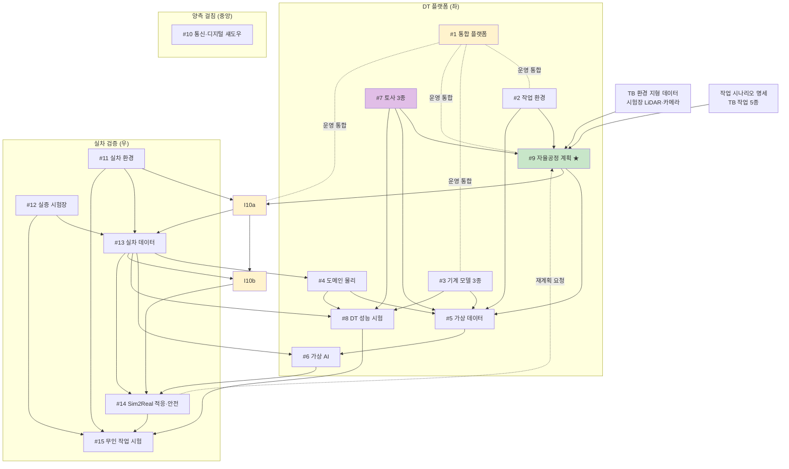
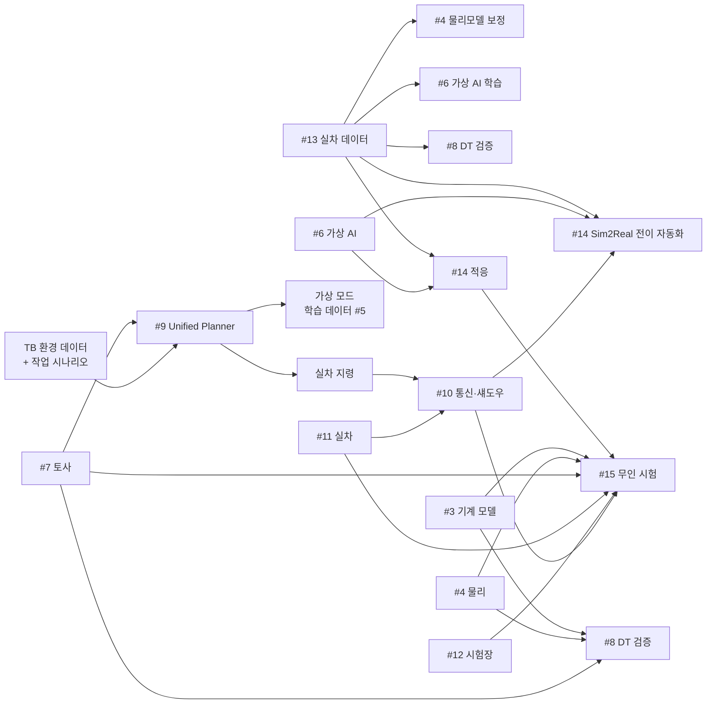

# 인공지능 기반 무인 자율 굴착기 디지털 트윈 플랫폼 사업
## 업무 상세화 · 연계 · KPI 정의 문서 (v1.3)

---

## 0. 문서 정보

| 항목 | 내용 |
|---|---|
| 문서명 | 사업기획_업무상세화_v1 |
| 작성일 | 2026-05-04 |
| 작성자 | 한국건설기계연구원(KOCETI) / 이민수 |
| 사업 코드 | 2026-기계장비-품목-07 |
| 사업명 | 인공지능 기반 무인 자율 굴착기 개발을 위한 초실감 디지털 트윈 플랫폼 개발 |
| 버전 | v1.8 |
| 변경 이력 | v1.0 (2026-05-04) 초안 작성<br>v1.1 (2026-05-04) #9를 DT 좌측으로 이동·재정의<br>v1.2 (2026-05-04) #9 범위 보정 (TRL 3~5 한정)<br>v1.3 (2026-05-04) **용어 한글화** — #14의 *"Curriculum (점진적 배포)"* → **"단계별 시험 캠페인"**. #6의 *Curriculum Learning*은 학술 표준이므로 한글 병기 형태로 유지.<br>v1.4 (2026-05-07) **두 기둥(Two-Pillar) 가치 프레임 도입** — HDX 수요기업 활용 가치를 사업 목표 동등 수준으로 격상. ㉠ OEM 신제품·변형 모델 개발 가속, ㉡ AI 실차 전이. **#3·#4·#1에 파라미터화(parameterization) 요건 명시**. P3 정의에 *변형 모델 포함*, HDX 역할 확장. KITECH(#7 토사 모델) 책임기관 확정 반영. |

---

## 1. 사업 개요

### 1.1 기본 정보

| 구분 | 내용 |
|---|---|
| 사업 트랙 | 산업/일반기계, 임베디드 SW, 혁신제품형, AI 연계, 비수도권 |
| 미션 | 무인공장 실현을 위한 제조장비의 지능화 |
| 프로젝트 | 디지털 제조장비 및 부품 핵심기술 개발 |
| 세부기술 | 디지털트윈 기반 시뮬레이션 플랫폼 기술 |
| TRL | 시작 3단계 → 종료 5단계 |
| 연구개발기간 | 43개월 (1차 9개월 / 2차 10개월 / 3·4차 각 12개월) |
| 정부지원금 | 48억원 (1차년도 10억원 한도) |
| 주관기관 | 중소·중견 기업 (혁신제품형) |
| 기술료 | 정부납부 대상 |

### 1.2 핵심 목표 (요약) — 두 기둥(Two-Pillar) 구조

```
                ┌──────────────────────────────────────────────────────┐
                │  공통 자산: 파라미터화 + 정밀도 가변 Multi-physics DT │
                │  (MBD·기구학·유압·전동·파워트레인·토사 반력)            │
                │  ↕ 정밀 모드 (OEM) ↔ 실시간 모드 (AI) ↔ 도메인 mix      │
                └──────────────────┬───────────────────────────────────┘
                                   │
            ┌──────────────────────┴──────────────────────┐
            ▼                                             ▼
  [기둥 A] OEM 신제품·변형 모델 개발 가속        [기둥 B] 무인 자율 작업 AI 전이
  • 파라미터(실린더경·유압 압력·관절 길이·     • 가상 학습 → 실차 전이
    토사 종류 등) 가변 multi-physics 모델       • 4단계 안전 캠페인
  • 변형 모델 자동 생성 (5/14/21톤급 등)        • TB 환경 자율공정 계획
  • 가상 검증으로 시작품 회차 감소
  → 거동 일치도 ≥ 90% (G1/P1)                  → 학습모델 실차 전이 성공률 ≥ 90% (G2/P4)
  → HDX 직접 활용 가치                          → 사회적 가치 (인력난·중대재해)
```

> **두 기둥은 같은 multi-physics DT 플랫폼을 공통 자산으로 공유**한다. RFP §3 활용분야 ① 무인화 + ② 장비 개발 플랫폼 양쪽을 동시 충족.

```
[목표 G1] 디지털 트윈 물리 거동 일치도 90% 이상
[목표 G2] 학습모델 실차 전이 성공률 90% 이상
```

### 1.3 정량적 성능 지표 (5개)

| 코드 | 지표 | 목표 |
|:---:|---|---|
| P1 | 디지털트윈 물리 일치도 (%) | ≥ 90% |
| P2 | 토사종류별 작업환경 구현 (종) | ≥ 3종 |
| P3 | 건설기계 디지털트윈 모델 (종) | ≥ 3종 (변형 모델 포함, 파라미터 가변형) |
| P4 | AI 기반 무인작업 성공률 (%) | ≥ 90% |
| P5 | 실차–시뮬레이션 데이터 연동 지연시간 (ms) | ≤ 100ms (평균) |

> G1 ≡ P1, G2 ⊃ P4 (목표와 지표가 부분적으로 중복).

### 1.4 차별화 포인트 (3대) *(v1.4 신설)*

| # | 차별화 포인트 | 정량 KPI | 대응 활용분야 |
|:---:|---|---|---|
| ① | **파라미터화 + 정밀도 가변 multi-physics 통합 DT** — MBD·기구학·유압·전동·파워트레인·토사 반력을 통합하고, *(가)* 사양 파라미터(실린더경·유압 압력·관절 길이·토사 종류 등) 수정 가능 + *(나)* 도메인별 정밀도 모드 가변(*OEM 정밀 ↔ AI 실시간 ↔ 도메인 선택적 mix*). 한 플랫폼이 신제품 개발(정밀)과 AI 학습(실시간)의 상충 요구를 모두 수용 | G1/P1 거동 일치도 ≥ 90% (정밀 모드) / P3 ≥ 3종 (변형 포함) | RFP §3 ②장비 개발 플랫폼 *(HDX 직접 활용)* |
| ② | **Unified Planner 기반 가상 학습 AI 정책의 실차 무인 자율 작업 전이** — 단일 자율공정 모듈(#9)이 ㈎ 가상 환경 학습 데이터 생성, ㈏ 실차 시연 지령 송신, ㈐ 실차 무인 작업 실행을 *모두* 담당. 같은 계획 모듈이 시뮬-실차 양쪽에서 동작하므로 Sim2Real(가상-실차 전이) 일관성 확보 + 4단계 안전 레이어 | G2/P4 실차 전이 ≥ 90% | RFP §3 ①건설 현장 무인화 |

> **두 차별화 모두 같은 multi-physics DT 플랫폼을 공통 자산으로 공유** → ① OEM 신제품 개발 가치 + ② 무인화 사회적 가치 *동시* 충족 (RFP §3 ①·② 정면 대응).

### 1.5 연구목표 (서술형) *(v1.4 신설)*

> 도메인별 물리(기구학·동역학·유압·토사 반력)를 통합·**파라미터화**한 초실감 디지털 트윈 플랫폼을 개발하여,
> ㉠ OEM의 신제품·변형 모델 개발에 활용할 수 있는 **모델 기반 개발(Model-Based Development) 체계**를 구축하고,
> ㉡ 동 플랫폼에서 학습한 AI 정책을 **실차 무인 자율 작업으로 전이**시키는 Sim2Real 체계를 동시에 구현한다.

---

## 2. 핵심 목표 및 성능 지표 상세 정의

### 2.1 [G1 / P1] 디지털 트윈 물리 거동 일치도

| 항목 | 내용 |
|---|---|
| **정의** | 동일 입력(제어 명령·환경 조건)에서 가상 모델과 실차의 출력(위치·속도·관절각·반력)이 일치하는 정도 |
| **단위** | % |
| **목표값** | ≥ 90% |
| **측정 정밀도 모드** *(v1.6 신설)* | **정밀 모드 기준** — 모든 도메인을 정밀(고차) 솔버로 운용. 실시간 모드(surrogate(근사·대리 모델))는 별도 측정·보고 (참고치) |
| **측정 변수** | 위치 (x,y,z), 자세 (roll/pitch/yaw), 관절각 (4축), 관절 속도, 버킷 반력 (3축), 유압 압력 |
| **계산식** | `일치도 = 100% × (1 - MAPE)` <br> MAPE(평균 오차율) = Mean Absolute Percentage Error (정규화 RMSE 가능) |
| **변수별 가중치** | 위치 30% / 속도 20% / 관절각 25% / 반력 25% (사업 시작 시 협의 확정) |
| **측정 시나리오** | 표준 시험 시나리오 ≥ 10개 (직선 굴착·곡선·상차·정지 등) |
| **시험 환경** | #12 실증 시험장 |
| **계측 도구** | GPS RTK (cm 정확도), IMU 9축, 관절 엔코더, 압력·토크 센서, motion capture (옵션) |
| **측정 주기** | 매년 중간 점검, 4차년도 최종 평가 |
| **측정 책임** *(v1.6)* | ○ #15 (실차 측정·데이터 수집 — 시험 캠페인 단계1부터 G1 데이터 함께 수집) |
| **분석·검증 책임** *(v1.6)* | ◎ #8 (DT V&V 센터 — Stage 2 시스템 V&V: #15 데이터 ↔ 시뮬 비교, MAPE 산출, 일치도 보고) |
| **모델링 책임** | ◎ #3 (기계 모델), ◎ #4 (도메인 물리·MBD), ◎ #7 (토사) |

### 2.2 [P2] 토사종류별 작업환경 구현

| 항목 | 내용 |
|---|---|
| **정의** | 시뮬레이션 환경에서 정량적 기준을 충족한 토사 모델의 종류 수 |
| **단위** | 종 (정수) |
| **목표값** | ≥ 3종 (진흙·모래·자갈 권장) |
| **개별 종 검증 기준 (모두 충족 시 1종 인정)** | ① 정역학: 자연 안식각 실측치 ±10% 이내 <br> ② 동역학: 버킷–토사 반력 실측치 ±15% 이내 <br> ③ 시각: 실차 영상 대비 사용자 평가 ≥ 4/5점 |
| **시험 환경** | #12 실증 시험장 (토사 베드 3종) |
| **계측 도구** | 표준 안식각 시험기, 6축 force/torque 센서 (버킷 부착), 카메라 |
| **측정 주기** | 3차년도 말 1차 검증, 4차년도 최종 검증 |
| **책임 항목** | ◎ #7 (토사 모델 및 반력 3종) |

### 2.3 [P3] 건설기계 디지털트윈 모델

| 항목 | 내용 |
|---|---|
| **정의** | G1/P1 검증을 통과한 *파라미터 가변형* 건설기계 디지털 트윈 모델의 종류 수 *(v1.4: 변형 모델 포함)* |
| **단위** | 종 |
| **목표값** | ≥ 3종 (굴착기 + 로더 + 1종 — 도저·그레이더·휠로더 중 택일) + **종별 ≥ 2 변형 모델** *(예: 굴착기 14톤·21톤급)* |
| **개별 종 검증 기준** | G1/P1 일치도 ≥ 90% 달성 + **사양 파라미터 외부 주입 시 거동 자동 재계산** *(v1.4)* |
| **종별 산출물** | 3D 형상 + 기구학 모델 + 도메인 물리 모델 + 제어 인터페이스 + **파라미터 스키마·라이브러리** *(v1.4)* |
| **측정 주기** | 종별로 4차년도까지 순차 완성 |
| **책임 항목** | ◎ #3 (기계 모델), ○ #4 (도메인 물리), ○ **HDX (활용 검증)** *(v1.4)* |

### 2.4 [G2 / P4] AI 무인작업 성공률 / 학습모델 실차 전이 성공률

| 항목 | 내용 |
|---|---|
| **정의** | AI가 정의된 작업 시나리오에서 자율로 성공 완료한 비율 (실차 기준) |
| **단위** | % |
| **목표값** | ≥ 90% |
| **성공 정의 (모두 충족)** | ① 작업 목표 달성 (예: 굴착량 ≥ 목표치 95%) <br> ② 안전 위반 없음 (충돌·전복·페일세이프 미발동) <br> ③ 시간 한계 내 (시나리오별 정의) |
| **시나리오** | 표준 작업 시나리오 ≥ 10종 × 반복 ≥ 5회 (총 50회 이상) |
| **시험 환경** | #12 실증 시험장 (4단계 시험 캠페인 #15) |
| **시험 단계** | 단계1 Bench → 단계2 주간 평탄지 → 단계3 다양 지형 → 단계4 야간/위험지 |
| **각 단계별 성공률 목표** | 단계1: 95% / 단계2: 92% / 단계3: 90% / 단계4: 85% (참고치) |
| **측정 주기** | 4차년도 최종 시험 |
| **책임 항목** | ◎ #6 (가상 AI), ◎ #14 (실차 적응 + Sim2Real 전이 자동화), ◎ #9 (자율공정), ◎ #15 (검증), ○ #10 (디지털 섀도우 일부) |

### 2.5 [P5] 실차–시뮬레이션 데이터 연동 지연시간

| 항목 | 내용 |
|---|---|
| **정의** | 실차 센서 이벤트가 발생한 시점부터 시뮬레이션에 반영 완료될 때까지의 end-to-end 시간 지연 |
| **단위** | ms |
| **측정 정밀도 모드** *(v1.6 신설)* | **실시간 모드 기준** — 도메인별 surrogate(ML 대리·축소차수 모델 등) 적용 상태에서 측정. 정밀 모드는 P5 대상 외 |
| **계산식** | `지연시간 = t_시뮬반영 - t_센서발생` |
| **목표값** | 평균 ≤ 100ms, P99 ≤ 200ms (RFP 미명시 — 사업 시작 시 협의 확정 필요) |
| **시간 동기화** | NTP/PTP 기반, 동기 정확도 ≤ 1ms |
| **측정 변수** | 카메라 frame, LiDAR scan, IMU/엔코더 stream, 제어 명령 |
| **측정 방법** | hardware timestamp 비교 (실차 NIC ↔ 시뮬 머신 NIC) |
| **시험 환경** | 실차 (#11) + 통신 인프라 (#12) + 시뮬 머신 동시 운영 |
| **측정 주기** | 매년 검증 |
| **책임 항목** | ◎ #10 (실차–DT 통신·디지털 섀도우 인프라), ○ #11 (실차 환경) |

---

## 3. 항목별 업무 상세화 (16개 항목)

> ⚠️ **수정 필요** — 아래 §3.1~§3.16의 1차년도 비중표를 현 비중대로 합산 시 1차년도 합계 ≈ 10.6억으로 1차년도 10억원 한도 초과. **비중 재조정 후 본 표 갱신 필요** (R10 참조).

> 각 항목은 다음 구조로 정리: **개요 / 세부 업무 / 입력 / 출력 / 책임 KPI / 연계 항목 / 연차 계획 / 예산 / 담당**

### 3.1 [#1] DT 통합 플랫폼 SW (5.0억 / 🟧A 주관)

**개요** — 모든 모델·AI·시뮬레이션 모듈을 통합하여 단일 환경에서 운용 가능한 backbone 미들웨어 및 사용자 인터페이스 개발. 사업의 *주력 산출물*. **두 기둥(A: OEM 정밀 / B: AI 실시간)의 상충 요구를 정밀도 모드 관리자로 수용**.

**세부 업무**

1. 시스템 아키텍처 설계 (마이크로서비스 vs 모놀리식 결정, 모듈 IF 정의)
2. 통합 미들웨어·API 게이트웨이 구현 (REST/gRPC/메시지 버스)
3. 사용자 UI/UX 설계·개발 (대시보드, 시나리오 편집기, 시각화, **파라미터 편집기·변형 모델 비교 대시보드** — 기둥 A 활용)
4. 모듈 간 인터페이스 표준 정의 (#2~#10 모두와 호환, **파라미터 스키마 표준 포함**)
5. **정밀도 모드 관리자 (Fidelity Mode Manager)** *(v1.6 신설)* — 두 기둥 trade-off 해결 핵심 인프라
   - (5-1) **모델 LoD(Level of Detail, 정밀도 단계) 레지스트리** — 도메인별로 ≥ 2개 정밀도 모델 등록 (예: 유압 *고차/surrogate*, 토사 *DEM full / 입자 절감 / ML surrogate*, MBD *full/단순화/lookup*)
   - (5-2) **시나리오별 정밀도 프로파일** — *OEM 신제품 검증 (전 도메인 정밀)* / *AI 학습 (전 도메인 surrogate)* / *도메인 부분 검증 (검증 대상만 정밀, 나머지 surrogate)* / 사용자 정의 mix
   - (5-3) **자동 모드 전환** — 시뮬 시작 시 프로파일 선택 → 솔버 자동 조립. 실차 동기화 시 자동으로 실시간 모드 강제
   - (5-4) **정밀도 vs 성능 측정 대시보드** — 각 모드별 정확도/지연시간 보고 (G1 정밀 vs P5 실시간 검증 분리 지원)
6. 데이터 관리 인프라 (DB, 데이터레이크, 로깅, 버전 관리, **모델 weights 저장소·롤백** *(v1.10 #10b에서 흡수)*)
7. 권한·보안·계정 시스템 (다기관 협업 환경)
8. CI/CD 파이프라인 및 통합 테스트 환경
9. 플랫폼 운영 매뉴얼·SDK·문서화

**입력** — 모든 항목의 인터페이스 요구사항 (1차년도 수렴)
**출력** — 통합 플랫폼 SW (α 1차년도, β 2차년도, RC 3차년도, 정식 4차년도)
**책임 KPI** — 모든 KPI에 ○ (간접 — 통합 backbone)
**연계 항목** — 거의 모든 항목 (#2~#15)

| 연차 | 비중 | 주요 작업 |
|:---:|:---:|---|
| 1차 | 30% | 아키텍처 + α 버전 |
| 2차 | 30% | β 버전 + 모듈 통합 |
| 3차 | 25% | RC + 성능 최적화 |
| 4차 | 15% | 정식 + 운영 안정화 |

---

### 3.2 [#2] 작업 환경 구성 (2.5억 / 🟦B)

**개요** — 굴착 작업장(지형·장애물·건물)을 가상에서 정밀 구축. 시각·물리적 사실성 확보.

**세부 업무**

1. 가상 환경 엔진 선정·구축 — **Isaac Sim 우선** (로봇 RL(강화학습)·Domain Randomization(환경 변동 학습)·ROS2 통합 강점) **+ Omniverse 일부 활용** (USD 기반 자산 협업·시각화). 기타 후보: Unity/Unreal/MuJoCo. *1차년도 1개월 내 PoC(개념검증) 후 최종 확정* *(v1.6 명시)*
2. 표준 작업 시나리오 정의 (≥ 5종: 평지 터파기, 경사지, 상차, 도랑 작업, 야간)
3. 지형·장애물 3D 모델링 라이브러리
4. 조명·날씨·시간대 변동 모듈 (Domain Randomization 지원)
5. 충돌 검출·물리 시뮬 연동 인터페이스 (#4·#7과 연동)
6. 시각화 품질 검증 (실 영상 대비 photorealism)
7. 시나리오 편집기 (사용자가 새 시나리오 생성 가능)

**입력** — 실차 작업 사례 영상 (#13에서 일부)
**출력** — 가상 작업장 시나리오 라이브러리, 시나리오 편집 도구
**책임 KPI** — G1/P1 ○ (보조 — 환경 정확도)
**연계 항목** — #1 (통합), #6 (학습 환경), #7 (토사 배치), #14 (실차 환경 비교)

| 연차 | 비중 |
|:---:|:---:|
| 1차 | 40% (엔진 셋업 + 기본 시나리오) |
| 2차 | 30% (시나리오 확장) |
| 3차 | 20% (사실성 향상) |
| 4차 | 10% (검증·보완) |

---

### 3.3 [#3] 건설기계 모델 개발 3종 (3.5억 / 🟦B) — **기둥 A 핵심**

**개요** — 굴착기·로더·1종 추가 등 *3종* 건설기계의 디지털 트윈 모델 (외형 + 기구학 + 제어 인터페이스). **HDX 신제품 개발 활용을 위한 파라미터 가변형 구축**.

**세부 업무**

1. 3종 건설기계 선정 (HDX·OEM 협의)
2. CAD 도면 확보 (또는 reverse engineering)
3. 3D 형상 모델링 (시각용 + 충돌 메시)
4. 기구학적 모델링 (관절·링크·D-H 파라미터)
5. 제어 인터페이스 정의 (조이스틱 입력 → 관절 명령)
6. 기본 거동 검증 (자유낙하·관절 동작)
7. **파라미터 라이브러리 + 변형 모델 자동 생성 도구** *(v1.4 격상)* — 사양 파라미터(관절 길이·실린더 보어·총중량·트랙 폭 등)를 외부 주입 가능한 형태로 정의. 변형 모델(예: 굴착기 5톤 / 14톤 / 21톤급) 자동 인스턴스화. **HDX가 신차·신모델 개발 시 직접 활용**
8. 모델 라이브러리화 (#1과 연동, 파라미터 스키마 표준 준수)

**입력** — OEM 도면, 실차 측정 데이터 (#13)
**출력** — 3종 건설기계 디지털 트윈 모델 패키지
**책임 KPI** — **P3 ◎** (3종 + 변형 모델), **G1/P1 ◎** (거동 일치)
**연계 항목** — #1 (파라미터 편집기), #4 (도메인 물리 결합), #8 (검증), #14 (실차 비교), **HDX (신제품 활용·검증)**

| 연차 | 비중 |
|:---:|:---:|
| 1차 | 25% (1종 — 굴착기 우선) |
| 2차 | 35% (2종 추가) |
| 3차 | 25% (3종 완성 + 변형) |
| 4차 | 15% (검증·보완) |

---

### 3.4 [#4] 주요 도메인별 물리모델 (3.0억 / 🟦B) — **기둥 A 핵심**

**개요** — 굴착기의 **멀티바디 동역학(MBD) + 유압 + 전동 + 파워트레인** 도메인을 풀어내는 multi-physics 솔버 통합. **HDX 신제품 개발 시 사양 파라미터를 변경해 가상 검증할 수 있는 파라미터 가변형 구축**. 도메인별 ≥ 2 정밀도 모델 등록 (#1 정밀도 모드 관리자 연계).

> 📌 **R&R 정리** *(v1.6 명시)* — *모델 정의*(외형·관절 구조·D-H 파라미터·사양)는 **#3**, *모델을 푸는 솔버 통합*(MBD·유압·전동·파워트레인 + 도메인 간 인터페이스)는 **#4**, *토사 자체 + 버킷-토사 반력*은 **#7**. #4 MBD가 #4 유압 힘과 #7 토사 반력을 입력으로 받아 굴착기 자세 변화를 계산.

**세부 업무**

1. **멀티바디 동역학(MBD) 솔버** *(v1.6 신설 — 최상위 도메인)* — 강체 운동방정식 + 관절 제약 + 외력(유압 실린더 힘·토사 반력) → *실제 거동* 계산. 솔버 후보: RecurDyn / Adams / Simpack / PhysX / MuJoCo. *#4의 다른 도메인을 묶는 코어 엔진*. 정밀도 옵션: full / 단순화 / lookup table
2. **유압 시스템 모델** — 펌프, 실린더, 밸브, 호스 (압력·유량·온도). *파라미터: 실린더 보어·로드경·유압 압력·유량 계수 등*. 정밀도 옵션: 고차/surrogate
3. **전동 시스템 모델** — 모터, 인버터, 배터리 (전압·전류·SOC). *파라미터: 정격 출력·배터리 용량·인버터 효율 등*. 정밀도 옵션: 고차/surrogate
4. **파워트레인 모델** — 엔진, 변속기, 유성기어 (RPM·토크·연비). *파라미터: 정격 토크·기어비·연비 곡선 등*. 정밀도 옵션: 고차/surrogate
5. **도메인 간 통합 인터페이스** — MBD ↔ 유압·전동·파워트레인 에너지 흐름 일관성, MBD ↔ #7 토사 반력 인터페이스
6. **파라미터 가변 인터페이스** *(v1.4 신설)* — 사양 파라미터를 외부 주입(JSON/YAML/UI)받아 모델 거동 자동 재계산. 변형 모델 빠른 비교를 위한 스키마·API 표준화 (#1과 연계)
7. **정밀도 모드별 모델 등록** *(v1.6 신설)* — 도메인별 정밀/실시간 surrogate 모델을 #1 정밀도 모드 관리자에 등록 (LoD 레지스트리)
8. 실측 기반 파라미터 보정 (#13 입력)
9. 도메인별 정확도 검증 (#8 Stage 1 벤치 V&V로 송부)
10. 통합 검증 데이터 송부 (#8 Stage 2 시스템 V&V 입력)

**입력** — OEM 사양서, #13 실차 데이터
**출력** — 도메인별 물리모델 라이브러리, 통합 인터페이스
**책임 KPI** — **G1/P1 ◎**, **P3 ○** (모델의 일부)
**연계 항목** — #3 (기계 모델 결합), #1, #8

| 연차 | 비중 |
|:---:|:---:|
| 1차 | 30% (유압 우선) |
| 2차 | 35% (전동·파워트레인) |
| 3차 | 25% (통합·보정) |
| 4차 | 10% (검증) |

---

### 3.5 [#5] 학습데이터 수집(가상 환경) (2.0억 / 🟩C)

**개요** — 시뮬레이션 환경에서 AI 학습용 데이터 자동 생성·관리.

**세부 업무**

1. Procedural 시나리오 자동 생성 (지형·토사·날씨 랜덤화)
2. GPU 클러스터 운영 (병렬 시뮬 N개 동시 실행)
3. 자동 라벨링 (시뮬 ground truth 활용)
4. 데이터 저장·관리 (데이터레이크, 메타데이터)
5. 데이터 증강 (augmentation, noise injection)
6. 데이터 품질 관리 (이상 데이터 필터링)
7. #6 학습 파이프라인 연결

**입력** — #2 시나리오, #3·#4·#7 모델
**출력** — 학습 데이터셋 (수십만 시나리오), 데이터 관리 시스템
**책임 KPI** — G2/P4 ○ (학습 fuel)
**연계 항목** — #6 (직접 사용), #2·#3·#4·#7 (생성 기반)

| 연차 | 비중 |
|:---:|:---:|
| 1차 | 20% (인프라 구축) |
| 2차 | 35% (대량 생성) |
| 3차 | 30% (재생성·증강) |
| 4차 | 15% |

---

### 3.6 [#6] 가상 환경 AI 정책 학습 (4.0억 / 🟩C)

**개요** — 가상 환경에서 RL/IL 기법으로 자율 굴착기 정책 학습. **사업 핵심 KPI(G2/P4)의 출발점**.

**세부 업무**

1. AI 알고리즘 설계 (PPO/SAC/IL/Hybrid 결정)
2. 보상 함수·손실 함수 설계 (작업 완수·안전·효율)
3. Domain Randomization 적용 (sim2real 강건화)
4. 정책 학습 (대용량 GPU, 수개월)
5. 단계별 학습 (Curriculum Learning — 학습 시나리오 난이도를 쉬운 → 어려운 단계로 점진 확대)
6. 평가 메트릭 정의 (성공률, 효율, 강건성)
7. 모델 버전 관리 및 #14로 핸드오프 (#1 모델 저장소 활용)
8. Behavior Cloning baseline (#13 시연 데이터)

**입력** — #5 학습 데이터, #13 시연 데이터 (Behavior Cloning용)
**출력** — 가상 환경 AI 정책 모델 (versioned)
**책임 KPI** — **G2/P4 ◎**
**연계 항목** — #14 (전이), #9 (자율공정과 통합)

| 연차 | 비중 |
|:---:|:---:|
| 1차 | 15% (알고리즘 설계 + 프로토) |
| 2차 | 30% (1차 학습) |
| 3차 | 35% (본 학습) |
| 4차 | 20% (개선·미세조정) |

---

### 3.7 [#7] 토사 모델 및 반력 3종 (4.0억 / 🟪D) — **KITECH 확정** *(v1.4)*

**개요** — 진흙·모래·자갈 *3종* 토사의 물리 특성과 버킷-토사 상호작용 시뮬레이션. **기술적 난도 최상위**. KITECH(한국생산기술연구원) 책임 수행 (제안서 수령 완료, 예산·SPH 범위 협의 중).

**세부 업무**

1. 토사 종류별 물성 측정·DB 구축 (입자 크기·수분율·점착력·내부마찰각)
2. DEM(Discrete Element Method, 입자 단위 토사 해석) 입자 시뮬 코드 개발
3. SPH(Smoothed Particle Hydrodynamics, 점성토 입자 해석) — 진흙 등 점성 토사용
4. 버킷-토사 반력 모델 (6축 힘·토크)
5. 시뮬레이션 가속화 (GPU 병렬, MPI)
6. 실측 검증 (정역학 + 동역학)
7. 시뮬 단순화 (실시간성 확보 — 입자 수 절감 + ML surrogate)
8. #1 플랫폼 연동 (#4 물리모델과 인터페이스)

**입력** — 토사 실측 데이터 (현장 + 실험실)
**출력** — 토사 3종 모델, 반력 라이브러리, 실시간 surrogate 모델
**책임 KPI** — **P2 ◎**, **G1/P1 ◎**
**연계 항목** — #4 (물리 인터페이스), #2 (작업장 배치), #8 (검증)

| 연차 | 비중 |
|:---:|:---:|
| 1차 | 20% (1종 + 인프라) |
| 2차 | 30% (2종 추가) |
| 3차 | 35% (3종 완성 + 가속화) |
| 4차 | 15% (검증·실시간화) |

---

### 3.8 [#8] DT 성능 시험 — DT V&V 센터 (3.0억 / 🟦B) — **옵션 Y 재정의** *(v1.6)*

**개요** — 디지털 트윈 모델의 **2-stage V&V**(Verification & Validation) 센터. **Stage 1**: 도메인별 벤치 V&V (component-level). **Stage 2**: 시스템 V&V 분석 — #15가 실차 시험 캠페인에서 수집한 데이터를 받아 시뮬과 비교, 일치도 정량화. **G1/P1 KPI 분석·검증 책임자** (측정은 #15).

> 📌 **v1.6 변경 요지** — *측정 ≠ 분석* 분리. #15가 실차 데이터 *측정*, #8이 시뮬 비교 *분석*. 시험기관(🟨E)은 측정·계측 본업에 집중, #8(🟦B CAE)이 V&V 분석 본업 수행.

**세부 업무**

#### Stage 1 — 도메인별 벤치 V&V (component-level)

1. **유압 도메인 벤치** — 테스트 리그(펌프·실린더·밸브 단독) 시험 → #4 유압 모델 검증
2. **전동·파워트레인 벤치** — 모터 다이나모·엔진 다이나모 데이터 → #4 모델 검증
3. **MBD 단독 검증** — 관절 토크 입력 → 자세 응답 측정 → #4 MBD 솔버 검증
4. **토사 반력 벤치** — 안식각 시험기·6축 force/torque 시험 (#7과 협력) → #7 모델 검증
5. **도메인별 일치도 보고** — 각 도메인 ≥ 90% 개별 달성 확인, 미달 시 #3·#4·#7로 보정 요청

#### Stage 2 — 시스템 V&V 분석 (system-level, G1/P1 대응)

6. **시험 시나리오 정의·표준화** (≥ 10종) — #15와 공동
7. **데이터 수신 인터페이스** *(v1.6 신설)* — #15 실차 측정 데이터 자동 수신·저장 (단계1 Bench부터)
8. **통합 시뮬 실행** — 동일 시나리오를 정밀 모드(#1 정밀도 모드 관리자)로 시뮬
9. **시뮬 vs 실차 비교 분석** — RMSE, MAPE, 변수별 가중 → 일치도 정량화
10. **자동 검증 파이프라인** — CI 통합, 매년 자동 보고서 생성
11. **비검증 영역 식별 + 보완 사이클** — 시뮬-현실 격차 큰 영역을 #3·#4·#7로 피드백
12. **최종 검증 보고서** — G1/P1 ≥ 90% 입증

**입력** — #3·#4·#7 모델 (정밀 모드), #15 실차 측정 데이터
**출력** — Stage 1 도메인별 V&V 보고서 / Stage 2 시스템 일치도 보고서 (G1/P1 입증)
**책임 KPI** — **G1/P1 ◎ (분석·검증 책임 — 측정은 #15)**
**연계 항목** — #3·#4·#7 (검증 대상·보정 피드백), **#15 (실차 측정 데이터 수신)**, #1 (정밀 모드 실행)

| 연차 | 비중 |
|:---:|:---:|
| 1차 | 15% (인프라) |
| 2차 | 25% (1차 검증) |
| 3차 | 30% (본 검증) |
| 4차 | 30% (최종 검증) |

---

### 3.9 [#9] 굴착기 자율공정 계획 — Unified Planner (TB 환경) (3.5억 / 🟩C 주관 + 🟦B 협력) — **DT 좌측**

**개요** *(v1.5 재정의)* — *TB(테스트베드) 환경*에서 굴착기의 자율공정 계획 알고리즘을 개발하되, **단일 계획 모듈이 가상·실차 양쪽에서 동작**하는 **Unified Planner** 형태로 구축. 같은 계획 모듈이 ㈎ 가상 환경에서 AI 학습 데이터 생성, ㈏ 실차에 시연 지령 송신, ㈐ 실차에서 무인 자율 작업 실행 — *세 가지 모드*를 모두 담당. *차별화 ②의 핵심 메커니즘.*

> 📌 **v1.2 보정** — TRL 3~5 수준에 맞춰 *BIM·측량 통합 등 사업화 인터페이스는 범위에서 제외*. *TB 환경 공정 계획 기술*로 한정.
>
> 📌 **v1.5 변경** — "DT 시뮬 검증 루프" 세부업무 삭제 (사용자 비전과 불일치 — DT 사전검증은 본 사업 범위 외). 대신 **Unified Planner의 3개 모드(가상학습 데이터 생성·실차 지령·무인 실행)**를 명시. 신규 KPI P6(시뮬-실차 공정 일치도) 폐기.
>
> **RFP 명시 범위 준수**: "작업현장 지형 분석, 터파기 및 상차경로 수립 등 자율공정계획 수립 기술"

**세부 업무 (7개)**

1. **TB 환경 지형 인식** — 시험장 LiDAR/카메라 데이터 → 작업 영역 segmentation (TB 한정)
2. **터파기 경로 수립 알고리즘** — 지형·토사 정보 기반 굴착 순서·경로 최적화
3. **상차 경로 수립 알고리즘** — 적재 위치·접근 경로 계획
4. **Unified Planner 실행 인터페이스** *(v1.5 재정의)* — 동일 계획 모듈이 *3개 모드*로 동작:
   - ㈎ **가상 모드** — 계획 → #2/#6 가상 환경 실행 → AI 학습 데이터(#5) 생성
   - ㈏ **실차 시연 모드** — 계획 → #10 통해 실차 지령 → 시연·원격조종 데이터(#13) 수집
   - ㈐ **실차 무인 모드** — 계획 → #14 안전 레이어 경유 → 실차 무인 자율 작업 실행
5. **작업 시나리오 라이브러리** — 표준 시나리오 (TB 작업 5종) 관리
6. **작업 명령 변환·송신** — 계획을 가상 또는 실차 작업 sequence로 변환 (#10 통신 채널 통해 송신)
7. **동적 재계획 트리거 인터페이스** — 작업 중 환경 변화 발생 시 #14에서 통보받아 계획 갱신

**입력** — TB 환경 지형 데이터 (시험장 LiDAR/카메라), 작업 시나리오 명세, #2 작업환경, #7 토사 정보
**출력** — Unified Planner 알고리즘 + 3개 모드 작업 명령 sequence
**책임 KPI** — **G2/P4 ◎** (계획 품질이 무인 작업 성공률에 직결)
**연계 항목** — #2 (가상 환경), #5 (가상 학습 데이터 생성 fuel), #6 (가상 AI), #7 (토사 정보), #10 (작업 명령 송신·디지털 섀도우), #13 (실차 시연 데이터), #14 (무인 모드 안전 경유)

> ❗ **범위 외(out of scope)**: BIM/IFC 도면 import, 드론 외부 측량 통합, 사업화용 사용자 UI/UX, **계획안에 대한 DT 사전검증 루프** *(v1.5 추가)*. 이는 *후속 사업·상용화 단계*의 기술 영역.

| 연차 | 비중 | 주요 작업 |
|:---:|:---:|---|
| 1차 | 15% | TB 지형 인식 + 시나리오 정의 |
| 2차 | 30% | 터파기·상차 알고리즘 |
| 3차 | 40% | DT 시뮬 검증 루프 + 명령 변환 |
| 4차 | 15% | 통합 검증 |

---

### 3.10 [#10] 실차–DT 통신·디지털 섀도우 인프라 (4.5억 / 🟧A 주관) — *(v1.10 #10a/#10b 통합)*

**개요** — 실차의 데이터를 DT로 실시간 전송하여 *DT 대시보드에서 실차 굴착기를 동시 시청* 가능하게 하는 통신 인프라와 디지털 섀도우. **P5 KPI 직접 책임자 + G2/P4 일부 책임 (디지털 섀도우 측면)**.

> 📌 **v1.10 변경** — *기존 #10a (실시간 통신·동기화 인프라, 3.0억) + #10b (Sim2Real·디지털 섀도우, 2.0억) 통합*. 분리 명분이 약했고(둘 다 같은 통신 채널 위에서 동작), Sim2Real *전이 자동화 파이프라인*은 *학습 기법 그룹과 합쳐 #14로 이전* (+0.5억). *모델 롤백·버전 관리*는 *#1 플랫폼의 데이터/모델 관리 인프라*로 흡수. 단순화된 #10은 사용자 멘탈 모델(*실차→DT 데이터 전송 → 대시보드 동시 시청*)에 정확히 매칭.

**세부 업무 (3개 그룹)**

#### A. 실차 시험장 네트워크 인프라 구축

1. 5G/Wi-Fi 6 인프라 통합 (#12 시험장과 협력)
2. 시간 동기화 (NTP/PTP, 정밀도 ≤ 1ms)
3. 신뢰성 확보 (재전송, redundancy, 장애 복구)
4. 모니터링·알람 (지연·손실 실시간 추적)

#### B. 통신 프로토콜 설계 (양방향)

5. 통신 프로토콜 선정·구현 (DDS / MQTT / WebSocket / 자체)
6. 데이터 직렬화 표준 (Protobuf / FlatBuffers)
7. 저지연 최적화 (압축, 우선순위 큐)
8. 양방향 채널 — *실차→DT* (텔레메트리·디지털 섀도우 입력) + *DT→실차* (#9 Unified Planner 명령 송신·#14 적응 정책 배포)

#### C. 데이터 동기화 + 디지털 섀도우

9. 디지털 섀도우 동기화 SW (실차→가상 일방향 거울)
10. 디지털 섀도우 시각화 대시보드 (DT 위에서 실차 거동 *동시 시청*)
11. 이상 감지·예측 모듈 (실시간 — 통신 지연·실차 거동 이상 검출)
12. 모델 배포 채널 (단순 파일 전송 — 시험장 LAN/SCP/SD, *국책과제 TRL 3~5는 OTA 불필요*)

**입력** — 실차 센서 데이터 (#11), 시뮬 상태, #9 Planner 명령, #14 적응된 정책 모델
**출력** — 실시간 통신 SW + 동기화 미들웨어 + 디지털 섀도우 시스템 + 시각화 대시보드
**책임 KPI** — **P5 ◎ (지연 ≤ 100ms)**, **G2/P4 ○ (디지털 섀도우 일부)**
**연계 항목** — #11 (실차), #12 (시험장 인프라), #9 (Planner 명령), #14 (Sim2Real 전이 자동화 이전), #1 (모델 버전 관리)

| 연차 | 비중 | 주요 작업 |
|:---:|:---:|---|
| 1차 | 25% | 네트워크 인프라 + 프로토콜 설계 |
| 2차 | 35% | 동기화·섀도우 SW 구현 |
| 3차 | 30% | 시각화 대시보드 + 검증·튜닝 |
| 4차 | 10% | 운영 안정화 |

> ❗ **범위 외(out of scope, v1.10 명시)**: Sim2Real *전이 학습 기법* 및 *전이 자동화 파이프라인* (#14로 이전), 모델 OTA 인프라 (TRL 3~5 단계 불필요), 모델 weights long-term 저장소·롤백 (#1로 이전).

---

### 3.12 [#11] 실차 환경 구축 (1.5억 / 🟨E 제조사)

**개요** — 보유 실차에 센서·통신·제어 인터페이스 retrofit. *실차는 보유*되므로 장비비 X.

**세부 업무**

1. 실차 사양 분석·인터페이스 정의
2. 센서 설치 (RGB 카메라, 스테레오, LiDAR, IMU, GPS RTK, 압력·토크)
3. 제어 명령 인터페이스 구축 (CAN 또는 EtherCAT)
4. 통신 장비 설치 (5G 모뎀, 안테나, edge gateway)
5. 데이터 수집 단말기 (edge computer, 시간 동기)
6. 안전 장치 (E-stop 다중화, 페일세이프, 비상 제어 채널)
7. 시운전·통합 검증

**입력** — 실차 (제조사 보유)
**출력** — 계측·통신 가능 실차 1~2대
**책임 KPI** — P5 ○ (지연 측정의 한 끝)
**연계 항목** — #10, #12, #13, #15

| 연차 | 비중 |
|:---:|:---:|
| 1차 | 60% (retrofit 본작업) |
| 2차 | 25% (보완) |
| 3차 | 10% |
| 4차 | 5% |

---

### 3.13 [#12] 실증 시험 환경 구성 (2.0억 / 🟨E 시험기관)

**개요** — 실증 시험장 구축 (토사 베드 + 안전 인프라 + 계측).

**세부 업무**

1. 시험장 부지 확보·설계 (≥ 1,000m²)
2. 토사 3종 베드 조성 (진흙·모래·자갈, 각 50~100m²)
3. 안전 펜스·접근 통제·CCTV
4. 외부 계측 인프라 (RTK 기지국, 모션 캡처, 표적 마커)
5. 통신 인프라 (5G 기지국 또는 Wi-Fi 6 AP)
6. 야간 시험용 조명 설비
7. 위험 작업 시험 영역 (경사·움푹 파인 지형)
8. 운영 매뉴얼·안전 절차서

**입력** — 토사 실물, 실차 (#11)
**출력** — 운영 가능 시험장 + 안전 인증
**책임 KPI** — 간접 (시험 환경 제공)
**연계 항목** — #11, #15, #8

| 연차 | 비중 |
|:---:|:---:|
| 1차 | 50% (부지·인프라) |
| 2차 | 30% (계측 보완) |
| 3차 | 15% (운영) |
| 4차 | 5% |

---

### 3.14 [#13] 학습데이터 수집(실차 환경) (2.0억 / 🟨E 제조사)

**개요** — 실차 운용 데이터 수집 — *사업 전체의 fuel*.

**세부 업무**

1. 데이터 수집 시나리오 매트릭스 정의 (토사 3종 × 작업 5종 × 환경 4종 = 60+ 시나리오)
2. 전문가 시연 운전 데이터 (모방학습용)
3. 원격 조종 (Teleoperation) 데이터
4. 가상 vs 실차 비교 데이터 (#8 검증용)
5. AI 자율 운전 데이터 (3~4차년도)
6. 데이터 라벨링 (자동 + 수동 외주)
7. 데이터 품질 관리 (이상치 제거, 검증)
8. 데이터 거버넌스 (포맷, IP, 보관)

**입력** — 실차 (#11), 시험장 (#12)
**출력** — 누적 7,500~10,000시간 학습·검증 데이터
**책임 KPI** — 간접 (데이터 자체)
**연계 항목** — **#4·#6·#8·#14** (4개 항목 fuel — *#10b의 전이 파이프라인이 #14로 통합되어 fuel 흐름도 #14 단일화*)

| 연차 | 비중 |
|:---:|:---:|
| 1차 | 5% (pilot) |
| 2차 | 25% (baseline) |
| 3차 | 50% (main) |
| 4차 | 20% (검증·미세조정) |

---

### 3.15 [#14] Sim2Real(가상-실차 전이) 적응 + 안전 레이어 (3.5억 / 🟩C) — *(v1.10 +0.5억)*

**개요** — 가상 학습 모델을 실차에 적응시키고 안전 보장. **G2/P4 핵심 책임**. *Sim2Real 전이 자동화 파이프라인*을 #10b에서 흡수하여 학습 기법(시스템 식별·도메인 적응·잔차 정책·전이 자동화)을 단일 항목으로 통합.

> 📌 **v1.1 변경** — 동적 재계획 트리거 책임 일부를 #9로 이전. 예산 3.5 → 3.0 (-0.5억).
> 📌 **v1.10 변경** — *Sim2Real 전이 자동화 파이프라인*을 #10b에서 흡수 (+0.5억, 3.0 → 3.5억). #10이 *통신·섀도우 인프라*에 집중되도록 학습 기법은 #14에 통합.

**세부 업무**

1. **시스템 식별 (System Identification)** — 실차 측정 → *sim 모델 파라미터* 보정 (sim 자체를 현실에 맞춤)
2. **도메인 적응 학습 (Domain Adaptation)** — *AI 정책 weights* fine-tune / Residual Policy / DANN 중 적용 (정책을 실차에 맞춤)
3. **Sim2Real 전이 자동화 파이프라인** *(v1.10 신설 — #10b에서 이전)* — sim 학습 정책 → 도메인 랜덤화 → 실차 적응 → 검증의 자동화된 offline 배치 워크플로우
4. **안전 레이어 4단계 구현**
   - L1 기구학 한계 (관절 각도·속도)
   - L2 동력학 한계 (토크·압력·전복)
   - L3 이상 감지 (AI 출력 패턴)
   - L4 페일세이프 (통신·센서 단절 시)
5. **단계별 시험 캠페인** — Bench → 주간 평탄지 → 다양 지형 → 야간/위험지 (위험도 점진 확대)
6. **차량별 캘리브레이션**
7. **재계획 트리거 송신** — 환경 변화 감지 시 #9에 통보 (계획 갱신 요청)
8. **안전 인증 대응** (산업안전·기능안전 표준)

**입력** — #6 가상 모델, #13 실차 데이터, #10 통신·섀도우
**출력** — 실차 적응 모델 + 안전 SW 스택 + Sim2Real 전이 자동화 파이프라인
**책임 KPI** — **G2/P4 ◎**
**연계 항목** — #6 (입력), #15 (검증), #11 (적용 대상), #10 (통신 채널)

| 연차 | 비중 |
|:---:|:---:|
| 1차 | 5% (개념) |
| 2차 | 20% (시스템 식별) |
| 3차 | 45% (적응 + 안전) |
| 4차 | 30% (배포·검증) |

---

### 3.16 [#15] 실차 무인 작업 성능 시험 + G1 측정 (4.0억 / 🟨E 공동) — *(v1.6 책임 확장)*

**개요** — 실차에서 무인 자율 작업의 종합 성능 검증 (**G2/P4**) + **G1/P1 시스템 거동 일치도 측정 데이터 수집** *(v1.6 신설)*. 같은 4단계 시험 캠페인에서 두 KPI 데이터를 동시 수집해 #8(분석)에 송부.

**세부 업무**

1. 시험 시나리오·평가 기준 정의 (≥ 10종) — #8과 공동
2. **4단계 시험 캠페인** — Bench → 주간 평탄지 → 다양 지형 → 야간/위험지
3. **G2/P4 측정** — 작업 성공률, 시간, 효율, 안전 지표
4. **G1/P1 측정** *(v1.6 신설)* — 단계1 Bench부터 위치/자세/관절각/반력/유압압력 등 *시스템 거동 변수* 동시 계측·수집. #8 Stage 2 분석으로 송부
5. 시험 데이터 분석·보고서 작성 (G2/P4 시험 결과 위주, G1/P1 시뮬 비교 분석은 #8)
6. 안전 인증 시험 대응
7. 시연 행사 (사업 종료 전)
8. 사업화 준비 (인증, 표준화)

**입력** — #11 실차, #14 실차 모델, #12 시험장
**출력** — 4단계 시험 보고서 (G2/P4) + G1/P1 측정 데이터 (#8 송부)
**책임 KPI** — **G2/P4 ◎ (실차 검증)**, **G1/P1 ○ (측정 책임)** *(v1.6)*
**연계 항목** — #14, #11, #12, **#8 (G1 데이터 송부)**

| 연차 | 비중 *(v1.6 조정)* | 변경 사유 |
|:---:|:---:|---|
| 1차 | **10%** (←5%) | G1 측정 인프라 셋업 + 단계1 Bench 일부 시작 |
| 2차 | **20%** (←15%) | 단계1 Bench 본격 + 단계2 일부 — G1 1차 측정 데이터 흘리기 시작 |
| 3차 | 30% | 단계2~3 |
| 4차 | **40%** (←50%) | 단계4 + 종합 검증 (1·2차 상향에 따른 4차 ↓) |

> ⚠️ **R10 영향** — 1차년도 #15 비중 5%→10% (+0.2억). 1차년도 10억 한도 *재계산 필요*. (다른 항목 비중 미세 조정 또는 R10 종합 재정렬 시 같이 처리)

---

## 4. 항목 간 연계 다이어그램

### 4.1 전체 데이터 흐름도



> ★ #9는 DT 좌측 — **Unified Planner**. 입력은 *TB 환경 데이터 + 작업 시나리오*로 한정 (BIM·외부 측량은 범위 외). 흐름: ㈎ 계획 → 가상 환경(#2/#6) 실행 → 학습 데이터(#5) 생성 / ㈏ 계획 → #10 통해 실차 지령 → 시연 데이터(#13) 수집 / ㈐ 계획 → #14 안전 경유 → 실차 무인 작업 실행. *(v1.5: 계획안에 대한 DT 사전검증 루프는 범위 외)*

### 4.2 의존성 그래프 (입력 → 출력 관점)



> #9 Unified Planner는 *TB 환경 데이터 + 작업 시나리오 + #7 토사 모델*을 입력받아 *3개 모드*(가상 학습 데이터 생성·실차 시연 지령·실차 무인 실행)로 동작. 실차 지령은 #10 통신 채널을 통해 송신.

### 4.3 KPI 책임 매트릭스

| 항목 | G1/P1 거동90% | P2 토사3종 | P3 기계3종 | G2/P4 무인90% | P5 지연ms |
|---|:---:|:---:|:---:|:---:|:---:|
| #1 통합 플랫폼 | ○ | ○ | ○ | ○ | ○ |
| #2 작업 환경 | ○ | ○ | | | |
| #3 기계 모델 3종 | **◎** | | **◎** | | |
| #4 도메인 물리 | **◎** | | ◎ | | |
| #5 가상 데이터 | | | | ○ | |
| #6 가상 AI | | | | **◎** | |
| #7 토사 3종 | ◎ | **◎** | | | |
| #8 DT 성능 시험 | **◎** | ○ | ○ | | |
| **#9 Unified Planner** | | | | **◎** | |
| #10 통신·디지털 섀도우 | | | | ○ | **◎** |
| #11 실차 환경 | | | | ○ | ○ |
| #12 실증 시험장 | | | | ○ | |
| #13 실차 데이터 | | | | ○ | |
| #14 적응·안전 | | | | **◎** | |
| #15 무인 시험 + G1 측정 | ○ | | | **◎** | ○ |

> 굵은 ◎ = *해당 KPI의 핵심 주관 항목*. ○ = 보조. *(v1.5: P6 KPI 폐기에 따라 P6 열 제거. v1.6: #15에 G1 측정 ○ 추가, #8은 분석·검증 ◎ 유지 — 옵션 Y 분리 구조.)*

### 4.4 KPI별 책임 예산 합계

| KPI | 주관 (◎) 항목 | 책임 예산 |
|---|---|---:|
| G1/P1 거동 일치도 | #3, #4, #7, #8 | 13.5억 |
| P2 토사 3종 | #7 | 4.0억 |
| P3 기계 3종 | #3, #4 | 6.5억 |
| G2/P4 무인·전이 90% | #6, #9, #14, #15 (+#10 디지털 섀도우 보조) | **17.0억** (#9: 3.5 / #14: 3.5 / #6: 4.0 / #15: 4.0 / #10 ○ 4.5의 일부) |
| P5 지연시간 | #10 (단일) | 4.5억 |

> 총합이 48억을 초과하는 이유는 한 항목이 다중 KPI 책임을 갖기 때문 (예: #7 → G1+P2).

### 4.5 연차별 작업 흐름 (Gantt 개요)

```
              1차(9개월)    2차(10개월)   3차(12개월)   4차(12개월)
#1 플랫폼     ▓▓▓▓▓▓▓▓     ▓▓▓▓▓▓▓▓▓    ▓▓▓▓▓▓▓      ▓▓▓▓
#2 작업환경   ▓▓▓▓▓▓       ▓▓▓▓▓        ▓▓▓          ▓
#3 기계3종    ▓▓▓          ▓▓▓▓▓        ▓▓▓▓▓        ▓▓▓
#4 도메인물리 ▓▓▓▓         ▓▓▓▓▓        ▓▓▓▓         ▓▓
#5 가상데이터 ▓▓            ▓▓▓▓▓        ▓▓▓▓         ▓▓
#6 가상AI     ▓▓            ▓▓▓▓         ▓▓▓▓▓▓       ▓▓▓
#7 토사3종    ▓▓▓           ▓▓▓▓▓        ▓▓▓▓▓▓▓      ▓▓
#8 DT시험     ▓▓            ▓▓▓▓         ▓▓▓▓▓        ▓▓▓▓▓
#9 자율공정   ▓▓            ▓▓▓▓         ▓▓▓▓▓        ▓▓▓
#10 통신·섀도우 ▓▓▓▓        ▓▓▓▓▓        ▓▓▓▓▓        ▓▓
#11 실차환경  ▓▓▓▓▓▓        ▓▓▓          ▓            
#12 시험장    ▓▓▓▓▓▓        ▓▓▓▓         ▓▓           
#13 실차데이터              ▓▓▓▓         ▓▓▓▓▓▓▓      ▓▓▓▓
#14 적응·안전              ▓▓            ▓▓▓▓▓▓       ▓▓▓▓▓
#15 무인시험  ▓             ▓▓            ▓▓▓▓         ▓▓▓▓▓▓▓
```

---

## 5. 위험 요인 및 완화 방안

| # | 위험 요인 | 영향 항목 | 영향 KPI | 완화 방안 |
|:--:|---|---|---|---|
| R1 | 토사 모델 정확도 미달 (#7) | #7, #8 | P2, G1/P1 | **KITECH 책임 수행 확정 (v1.4)** + SPH 점성토 모델 협의 / 잔여 위험: SPH·진흙 정확도 |
| R2 | 실차 retrofit 지연 (#11) | #11, #13 | 후속 모든 항목 | 1차년도 6개월 내 완료 마일스톤 |
| R3 | Sim2Real 전이 실패 (#14) | #14, #15 | G2/P4 | #6 단계에서 Domain Randomization 강화, #9 시뮬 검증 루프로 위험 시나리오 사전 차단 |
| R3-1 | **TB 환경 시나리오 다양성 부족 (#9)** | #9 | G2/P4 | 1차년도 TB 작업 시나리오 5종 우선 정의, #12 시험장과 협의하여 시나리오 매트릭스 합의 |
| R4 | 핵심 인력 이탈 (특히 AI 팀 🟩C) | #5·#6·#9·#14 | G2/P4 | 2명 이상 cross-training, 외부 자문단 |
| R5 | 안전 인증 지연 (#14, #15) | #15 | G2/P4 | 2차년도부터 인증기관과 사전 협의 |
| R6 | OEM 도면 확보 실패 (#3) | #3 | P3 | reverse engineering 백업 + OEM 협력각서 |
| R7 | 통신 인프라 비용 초과 (#10) | #10 | P5 | 5G/Wi-Fi 6 선택지 다중 검토 |
| R8 | 데이터 라벨링 품질 저하 (#13) | #6·#14 | G2/P4 | 라벨링 외주 다중 업체 + 검증 sampling |
| R9 | 다기관 인터페이스 불일치 (#1 통합) | 전체 | 전체 | 1차년도 *시스템 통합 명세서* 공동 작성 |
| R10 | 1차년도 10억 한도 초과 | 전체 | 일정 | 1차년도 작업 사전 매핑 (제2.5절 참고) |

---

## 6. 다음 단계 (To-Do)

### 6.1 단기 (사업 기획 단계 — 현 시점)

- [ ] 컨소시엄 5개 기관 후보 확정 (🟧A 주관 우선)
- [ ] (주)심지 등 주관 후보와 협의 진행
- [ ] OEM (HD현대인프라코어·두산밥캣 등) 공동 참여 의향 타진
- [ ] 대학·출연연(KIMM) 위탁 협의 (#7 토사 모델)
- [ ] 시험기관 협의 (#12, #15)
- [ ] 사업 기획서 초안 (RFP 대응)

### 6.2 중기 (사업 착수 ~ 1차년도)

- [ ] 시스템 통합 명세서(System Integration Spec) 공동 작성 (R9 완화)
- [ ] 데이터 표준·라벨 스키마 확정 (#13 거버넌스)
- [ ] KPI 측정 기준 협의·확정 (P5 목표값 명시 등)
- [ ] 1차년도 마일스톤 (10억 한도 내 완료 목표) 설정

### 6.3 장기 (3~4차년도)

- [ ] 안전 인증 사전 협의 (산업안전·기능안전)
- [ ] 사업화 전략 수립 (혁신제품형 트랙)
- [ ] 기술료 납부 계획·IP 분배 합의

---

## 7. 부록

### 7.1 약어 정리 *(영문(한글) 표기 통일 — v1.8)*

| 약어 | 영문(한글) |
|---|---|
| DT | Digital Twin (디지털 트윈) |
| RFP | Request for Proposal (제안요청서) |
| KPI | Key Performance Indicator (핵심 성과 지표) |
| OEM | Original Equipment Manufacturer (제조사) |
| RL | Reinforcement Learning (강화학습) |
| IL | Imitation Learning (모방학습) |
| DEM | Discrete Element Method (입자 단위 토사 해석) |
| SPH | Smoothed Particle Hydrodynamics (점성토 입자 해석) |
| MBD | Multi-body Dynamics (다관절 동역학) |
| MAPE | Mean Absolute Percentage Error (평균 오차율) |
| RTK | Real-Time Kinematic GPS (정밀 위치 측위) |
| OTA | Over-The-Air (원격 SW 배포) — *본 사업 범위 외, fleet 운영 단계에서 필요. TRL 3~5는 LAN/SCP/SD 등 간이 수단 사용* |
| FTE | Full-Time Equivalent (풀타임 환산 인력) |
| TRL | Technology Readiness Level (기술 성숙도) |
| Sim2Real | Simulation to Real (가상-실차 전이) |
| LoD | Level of Detail (정밀도 단계) |
| PINN | Physics-Informed Neural Network (물리정보 신경망) |
| Domain Randomization | (환경 변동 학습) |
| surrogate (model) | (근사·대리 모델) |
| Curriculum Learning | (단계별 학습) |

### 7.2 참고 문서

- RFP_DT.hwpx (한국산업기술진흥원, 2026)
- 2026년도 기계장비산업기술개발사업 신규지원 대상과제 공고
- 미래모빌리티(건설·농기계) 초격차 로드맵

### 7.3 변경 이력

| 버전 | 일자 | 작성자 | 변경 내용 |
|---|---|---|---|
| v1.0 | 2026-05-04 | 이민수 | 초안 작성 |
| v1.1 | 2026-05-04 | 이민수 | #9 자율공정 계획을 DT 좌측으로 이동·재정의 (반응형 → DT 사전 계획 검증형). 예산 재분배: #9 3.0→3.5, #14 3.5→3.0. 신규 KPI P6(계획 정확도) 협의 제안 추가. 데이터 흐름도(BIM·측량 입력)·의존성 그래프·KPI 매트릭스·예산 합계·위험 항목 동기화. |
| v1.2 | 2026-05-04 | 이민수 | **#9 범위 보정 (TRL 3~5 적합화)** — BIM·외부 측량 통합을 범위에서 제거. *TB 환경 공정 계획 알고리즘*으로 한정. 데이터 흐름도 입력원(BIM·드론) → (TB 환경 데이터·작업 시나리오)로 변경. P6 정의 보정. 위험 R3-1을 BIM 미확보 → TB 시나리오 다양성으로 변경. 예산 3.5억 유지. |
| v1.3 | 2026-05-04 | 이민수 | **용어 한글화** — #6 "Curriculum Learning"은 학술 표준 용어이므로 *"단계별 학습 (Curriculum Learning)"* 병기 형태 유지. #14 "Curriculum (점진적 배포)"은 학술 외래어가 아닌 반-표준 표현이므로 **"단계별 시험 캠페인"**으로 통일. 평가위원 가독성 개선. |
| v1.4 | 2026-05-07 | 이민수 | **두 기둥(Two-Pillar) 가치 프레임 도입** — HDX 수요기업의 실수요(파라미터화 multi-physics 모델 기반 신제품 개발)를 사업 목표로 격상. §1.2 핵심 목표 다이어그램 신설, §1.4 차별화 포인트 3대 신설, §1.5 연구목표(서술형) 신설. **#1·#3·#4에 파라미터화 요건 명시** (#1 파라미터 편집기·변형 모델 비교 대시보드 / #3 파라미터 라이브러리·변형 모델 자동 생성 도구 격상 / #4 파라미터 가변 인터페이스 신설). P3 정의에 *변형 모델 포함·파라미터 가변형* 조건 추가, HDX 활용 검증 책임 명시. **#7 KITECH 책임 수행 확정** 표기, 위험 R1 갱신. *용어 통일*: "모수화" → "파라미터화" (CAE 평가위원 가독성). |
| v1.5 | 2026-05-07 | 이민수 | **차별화 ③ "DT 사전검증 루프" 폐기 + 차별화 2개로 축소** (사용자 비전 정합화 — 사용자가 검토하지 않은 개념을 v1.4가 임의 확장한 부분 제거). 차별화 ②에 **Unified Planner** 개념 통합 — *단일 자율공정 모듈(#9)이 가상 학습 데이터 생성·실차 시연 지령·실차 무인 실행 3개 모드 모두 담당*. **§2.5 P6 KPI 섹션 전체 삭제** (P6 폐기), §4.3 KPI 매트릭스 P6 열 삭제, §4.4 P6 행 삭제, §5 R3-1에서 P6 참조 제거. **§3.9 #9 재정의** — 제목에 "Unified Planner" 명시, 세부업무 4번 "DT 시뮬 검증 루프" → "Unified Planner 실행 인터페이스 (3개 모드)"로 교체, 범위 외 항목에 "계획안 DT 사전검증 루프" 명시 추가. §4.1·§4.2 데이터 흐름도 수정 (#9 → 가상 실행/실차 지령 단방향). |
| v1.8 | 2026-05-07 | 이민수 | **약어 영문(한글) 표기 통일** — §7.1 약어 표를 *영문(한글)* 표기로 일괄 갱신·신규 항목 추가(MBD·Sim2Real·LoD·PINN·Domain Randomization·surrogate·Curriculum Learning). 본문 첫 등장 위치에 한글 병기 추가: §1.4 차별화 ② *Sim2Real(가상-실차 전이)*, §2.1 *MAPE(평균 오차율)*, §3.1 *LoD(Level of Detail, 정밀도 단계)*, §3.2 *RL(강화학습)·Domain Randomization(환경 변동 학습)·PoC(개념검증)*, §3.7 *DEM·SPH 풀이*, §3.11/§3.15 제목에 *Sim2Real(가상-실차 전이)* 병기, §3.11 *OTA(원격 SW 배포)*. **약어 충돌 해소** — §1.5 연구목표의 *모델 기반 개발(MBD)*은 *Multi-body Dynamics(MBD)*와 충돌 → *모델 기반 개발(Model-Based Development)*로 풀이 변경. |
| v1.7 | 2026-05-07 | 이민수 | **용어 한글화** — *Fidelity Mode Manager* → **정밀도 모드 관리자** (전 문서 일괄 치환). 첫 정의(§3.1 #1 세부업무 5번)에서만 *(Fidelity Mode Manager)* 병기 유지. *Fidelity 가변 → 정밀도 가변*, *fidelity 모드/모델/프로파일 → 정밀도 모드/모델/프로파일* 등 부수 표현 일괄 갱신. *사용자 가독성 우선 — 어려운 영어 약어 자제 정책 적용 시작.* |
| v1.6 | 2026-05-07 | 이민수 | **5대 구조 보강** — ① **#4에 멀티바디 동역학(MBD) 솔버를 최상위 도메인으로 명시** (유압 힘 → 자세 변환 풀어내는 핵심 누락 보정). ② **#8 2-stage V&V 재정의 (옵션 Y)** — Stage 1 도메인별 벤치 V&V (component) + Stage 2 시스템 V&V 분석 (#15 측정 데이터 기반). #15는 G1/P1 *측정 책임* 추가, 비중 1차 5%→10% / 2차 15%→20% 상향 (R10 1차년도 한도 영향 — 재계산 필요). ③ **#1에 정밀도 모드 관리자 신설** — OEM 정밀 모드 ↔ AI 실시간 모드 ↔ 도메인 선택적 mix 자동 전환. *기둥 A·B의 정밀 vs 실시간 trade-off 해결 핵심 인프라*. ④ **KPI 정의에 측정 정밀도 모드 명시** — G1/P1은 정밀 모드, P5는 실시간 모드 기준. ⑤ **#2 시뮬 엔진** — Isaac Sim 우선 + Omniverse 자산 협업 표기. §1.2 공통 자산에 *정밀도 가변* 추가, §1.4 차별화 ① 정의 보강, §4.3 KPI 매트릭스 G1 열에 #15 ○ 추가. |
| v1.9 | 2026-05-09 | 이민수 | **OTA 인프라 → 간이 모델 배포로 정정** (사용자 결정: *"국책과제 TRL 3~5에 OTA는 배보다 배꼽이 크다"*). §3.11 #10b 세부업무 4번 *"모델 OTA 배포 시스템"* → *"모델 배포 시스템 (시험장 LAN/SCP/SD 카드 swap, 무결성 검증·롤백만 자동화)"*. §7.1 약어 표 OTA 항목에 *"본 사업 범위 외 — fleet 운영 단계에서 필요"* 주석 추가. fleet 운영 시 OTA가 표준이지만 1~3대 testbed 규모에서는 PKI·롤백·서명·delta·네트워크 신뢰도 인프라 구축이 over-engineering. *학습 정책의 학술적 Sim2Real 전이*(DR·SysID·DA·Residual)는 #6/#14에서 다루고, #10b는 *모델 weights 전달*만 담당으로 의미 분리. |
| v1.10 | 2026-05-09 | 이민수 | **#10a + #10b → 통합 #10 "실차–DT 통신·디지털 섀도우 인프라"** (사용자 지적: *"#10a/#10b 분할은 인위적 — 실차 데이터를 DT로 전송해 대시보드 동시 시청이 본질"*). 통합 §3.10 신규 작성, §3.11 삭제. 3개 그룹 — A. 실차 시험장 네트워크 인프라 / B. 통신 프로토콜 설계 (양방향) / C. 데이터 동기화 + 디지털 섀도우. 예산 5.0억 → **4.5억** (-0.5억). 이전: ① *Sim2Real 전이 자동화 파이프라인* → **#14** (+0.5억, 3.0→3.5억) — 학습 기법 그룹과 통합. ② *모델 롤백·버전 관리* → **#1 §3.1 6번** (플랫폼 데이터 관리 인프라로 흡수). 책임 KPI 정정: P5 ◎ (단일), G2/P4 ○ (디지털 섀도우 일부). 본문·KPI 매트릭스·예산 합계·Gantt·위험 R3/R7·#1/#5/#6/#9/#11/#13 연계 항목까지 일괄 갱신. 총 사업비 48억 변동 없음. 기관 분담 영향: 주관 SW 10.0→9.5억(-0.5), AI 기업 12.5→13.0억(+0.5). |

---

*문서 끝.*
