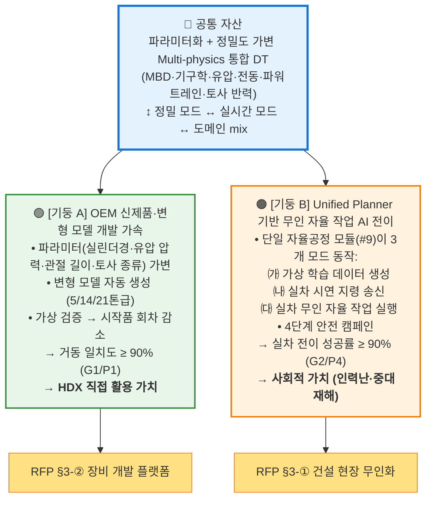
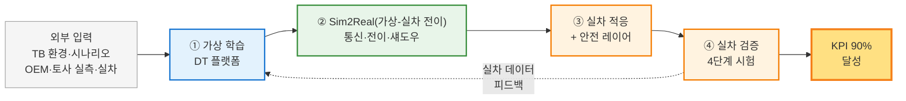

# 사업 한 장 구조도 (v1.5)

> **A4/A3 1장 인쇄용 · PPT 1슬라이드용** — 모든 기관에게 한 번에 보여주는 사업 구조도
>
> **v1.1 (2026-05-07)** — 두 기둥(Two-Pillar) 가치 프레임 도입. HDX 수요기업의 *파라미터화 multi-physics 모델 기반 신제품 개발* 활용을 사업 비전 동등 수준으로 격상.
>
> **v1.2 (2026-05-07)** — 차별화 ③ "DT 사전검증" 폐기, 차별화 2개로 축소. 기둥 B에 **Unified Planner** 명시(단일 자율공정 모듈이 가상 학습 데이터 생성·실차 지령·무인 실행 3개 모드 모두 담당). KPI P6 폐기, 결정사항 표 정리.
>
> **v1.3 (2026-05-07)** — **5대 구조 보강**: ① #4에 **MBD 솔버** 최상위 도메인 명시, ② #8 2-stage V&V (옵션 Y) — 도메인 벤치 + 시스템 V&V 분석, ③ #1 **정밀도 모드 관리자** (정밀 ↔ 실시간 ↔ 도메인 mix), ④ KPI 정의에 정밀도 모드 명시 (G1 정밀 / P5 실시간), ⑤ #2 **Isaac Sim 우선 + Omniverse 자산 협업**.

---

## 🚜 사업 한 줄 비전

> **"파라미터화 + 정밀도 가변 multi-physics 디지털 트윈으로 ㉠ OEM 신제품 개발(정밀 모드)을 가속하고, ㉡ 가상 학습 AI를 실차 무인 자율 작업(실시간 모드)으로 전이하는 플랫폼"**

| | |
|---|---|
| **사업 규모** | 48억원 / 43개월 / 16개 항목 / 5개 기관 |
| **핵심 목표** | 물리 거동 일치도 90% + 학습모델 실차 전이 90% |
| **사업 트랙** | 혁신제품형 (TRL 3 → 5) |

---

## 🏛️ 두 기둥(Two-Pillar) 가치 구조 *(v1.1 신설)*



---

## 📊 4단계 가치 흐름 (기둥 B 상세 — AI 전이)



> 기둥 A(OEM 신제품 개발) 활용 흐름: *HDX 사양 정의 → #1 파라미터 편집기 → #3·#4 변형 모델 자동 생성 → #8 거동 검증 → 시작품 의사결정.* 같은 DT 자산 위에서 두 흐름이 병행.

---

## 🏢 기관 × 영역 매트릭스 (수영장 레인)

| 기관 (예산·비중) | 외부 입력 | 🔵 가상 (DT 좌) | 🟢 중앙 (걸침) | 🟠 실차 (우) |
|---|:---:|---|---|---|
| 🟧 **주관 SW** (10.0억 · 21%) | | **#1** 통합 플랫폼 | **#10a** 통신·동기화 <br> **#10b** 전이·섀도우 | |
| 🟦 **시뮬·CAE** (12.0억 · 25%) | 작업 시나리오 | **#2** 환경 · **#3** 기계3종 <br> **#4** 도메인 물리 · **#8** DT 시험 | | |
| 🟩 **AI 기업** (12.5억 · 26%) | | **#5** 가상 데이터 · **#6** 가상 AI <br> **#9** Unified Planner | | **#14** 적응·안전 |
| 🟪 **대학·출연연** (4.0억 · 8%) | 토사 실측 | **#7** 토사 3종 | | |
| 🟨 **OEM·시험기관** (9.5억 · 20%) | 실차 보유 | | | **#11** 실차 · **#12** 시험장 <br> **#13** 데이터 · **#15** 무인 시험 |

> **읽는 법** — 가로(영역)는 *데이터의 흐름 방향*, 세로(기관)는 *책임자*. 같은 셀의 항목은 *같은 기관·같은 영역에서 함께 다룸*.

---

## 🎯 5개 KPI 책임 항목 (◎ 주관)

| 코드 | 지표 | 목표 | 책임 항목 | 책임 기관 |
|:---:|---|:---:|---|---|
| **G1/P1** | DT 거동 일치도 (정밀 모드) | **≥ 90%** | #3 · #4 · #7 · **#8** (분석 ◎) · #15 (측정 ○) | 🟦 + 🟪 + 🟨 |
| **P2** | 토사 3종 구현 | **≥ 3종** | #7 | 🟪 |
| **P3** | 기계 모델 3종 | **≥ 3종** | #3 · #4 | 🟦 |
| **G2/P4** | 무인 작업 / 실차 전이 | **≥ 90%** | #6 · #9 · #10b · #14 · #15 | 🟧 + 🟩 + 🟨 |
| **P5** | 연동 지연시간 (실시간 모드) | **≤ 100ms** | #10a · #10b | 🟧 |

---

## ⛽ 데이터 Fuel 흐름 (#13 = 사업 전체의 연료)

```
[#11 실차]   ┐
              ├→  #13 실차 데이터  ─┬→  #4 물리모델 보정 (시뮬↔실차 격차 ↓)
[#12 시험장] ┘                     ├→  #6 가상 AI 모방학습
                                   ├→  #8 DT 거동 검증 (G1)
                                   ├→  #10b Sim2Real 전이 사이클
                                   └→  #14 실차 도메인 적응 (G2)
```

---

## 📅 4년 마일스톤

| 시점 | 핵심 작업 | KPI 점검 |
|:---:|---|:---:|
| **1차년도** (9개월) | 시스템 통합 명세, 실차 retrofit, 가상 환경 구축, 데이터 baseline | — |
| **2차년도** (10개월) | 가상 AI 본격 학습, 토사 2종 완성, 도메인 물리 검증 | 중간 |
| **3차년도** (12개월) | Sim2Real 전이, 실차 적응, 토사 3종, 시험 단계 1~2 | G1 1차 |
| **4차년도** (12개월) | 단계별 시험 캠페인 (3~4단계), 최종 KPI 검증 | **최종** |

---

## 🤝 인터페이스 합의 우선순위 (1차년도 필수)

연결 빈도 기준 *허브 노드 3개* — 사업 1차년도에 *시스템 통합 명세서*로 표준화 필요.

| 순위 | 항목 | 합의 사항 | 협업 기관 |
|:---:|---|---|---|
| ① | **#13 실차 데이터** | 데이터 포맷·라벨 스키마·IP 거버넌스 | 🟨 ↔ 🟧·🟦·🟩 |
| ② | **#2 작업 환경** | 시뮬 시나리오·인터페이스 표준 | 🟦 ↔ 🟩·🟪 |
| ③ | **#10a/b 통신·전이** | 통신 프로토콜·모델 배포 방식 (TRL 3~5는 LAN/SCP/SD 등 간이 수단, OTA 인프라 불필요) | 🟧 ↔ 🟨·🟩 |

---

## 📋 한눈에 보는 결정 사항 요약

| 항목 | 결정 |
|---|---|
| **주관 후보** | (주)심지 (DT 업체) — 협의 진행 중 |
| **#7 토사 모델** | **KITECH 책임 수행 확정** *(v1.1)* — 예산·SPH(점성토 입자 해석) 범위 협의 중 |
| **수요기업 가치** | **HDX = 파라미터화 multi-physics 모델로 신제품·변형 모델 개발 활용** *(v1.1)* |
| **#9 Unified Planner** *(v1.2)* | TRL 3~5 적합 — TB 환경 한정 (BIM·외부 측량·DT 사전검증 범위 외). 단일 모듈이 *가상 학습 데이터 생성·실차 지령·무인 실행* 3개 모드 모두 담당 |
| **#10 분리** | #10a (통신·동기) / #10b (전이·섀도우)로 분리 |
| **P3 정의 보강** *(v1.1)* | ≥ 3종 + 종별 ≥ 2 변형 모델, 파라미터 가변형 |
| **#4 도메인** *(v1.3)* | **MBD 솔버 최상위 도메인** + 유압 + 전동 + 파워트레인 (R&R: 모델 정의 #3 / 솔버 통합 #4 / 토사 #7) |
| **#8 V&V 구조** *(v1.3)* | 2-stage — Stage 1 도메인 벤치 V&V + Stage 2 시스템 V&V 분석 (G1 분석 ◎) |
| **#15 책임 확장** *(v1.3)* | G2/P4 ◎ + **G1 측정 ○** (실차 시험 캠페인에서 G1 데이터 동시 수집) |
| **#1 정밀도 모드 관리자** *(v1.3)* | 정밀(OEM) ↔ 실시간(AI) ↔ 도메인 mix 자동 전환 — 두 기둥 trade-off 해결 |
| **#2 시뮬 엔진** *(v1.3)* | Isaac Sim 우선 (RL 학습) + Omniverse 자산 협업 — 1차년도 PoC 후 확정 |
| **안전 레이어** | 4단계 (L1 기구학 / L2 동력학 / L3 이상감지 / L4 페일세이프) |
| **시험 캠페인** | 4단계 (Bench → 평탄지 → 다양 지형 → 야간/위험지) |

---

> 📄 상세 자료: [사업기획_업무상세화_v1.md](사업기획_업무상세화_v1.md) · [항목별_연계_다이어그램_v1.md](항목별_연계_다이어그램_v1.md) · [심지미팅_준비자료_v1.md](심지미팅_준비자료_v1.md)
>
> *문서 버전 v1.5 (2026-05-07) · 작성: 한국건설기계연구원(KOCETI) 이민수*
>
> **변경 이력**
> - v1.0 (2026-05-04) 초안
> - v1.1 (2026-05-07) 두 기둥 가치 구조 신설 / 비전 문장 갱신 / KITECH·HDX 결정사항 표 반영
> - v1.2 (2026-05-07) 차별화 ③ "DT 사전검증" 폐기 / 차별화 2개로 축소 / 기둥 B에 **Unified Planner**(3개 모드: 가상 학습 데이터·실차 지령·무인 실행) 명시 / KPI P6 행 삭제 / 기관×영역 매트릭스의 #9 표기를 "Unified Planner"로 갱신 / 결정사항 표 정리
> - v1.3 (2026-05-07) **5대 구조 보강** — #4 MBD 추가 / #8 2-stage V&V (옵션 Y) / #1 정밀도 모드 관리자 / KPI에 정밀도 모드 명시 / #2 Isaac Sim 우선 + Omniverse. 비전 문장에 *정밀 모드 / 실시간 모드* 명시. KPI 표에 #15 G1 측정 ○ 추가, P5 실시간 모드 표기. 결정사항 표 5행 추가.
> - v1.4 (2026-05-07) **용어 한글화** — *Fidelity Mode Manager → 정밀도 모드 관리자* 일괄 치환, *Fidelity 가변 → 정밀도 가변*, *fidelity 모드 → 정밀도 모드* 등 부수 표현 갱신. 사용자 가독성 우선 정책 적용.
> - v1.5 (2026-05-07) **약어 영문(한글) 표기 통일** — 가치 흐름도의 *Sim2Real → Sim2Real(가상-실차 전이)*, 인터페이스 표의 *OTA → OTA(원격 SW 배포)*, 결정사항 표의 *SPH → SPH(점성토 입자 해석)* 한글 병기 추가.
> - v1.6 (2026-05-09) **OTA → 간이 모델 배포로 정정** (사용자 결정: *국책과제 TRL 3~5는 OTA 인프라 over-engineering, 시험장 LAN/SCP/SD 카드 swap으로 충분*). 인터페이스 합의 ③의 *"통신 프로토콜·모델 OTA 포맷"* → *"통신 프로토콜·모델 배포 방식 (LAN/SCP/SD)"*로 변경. fleet 운영 단계가 아닌 *testbed 1~3대 규모*에서 PKI·롤백·서명·delta·네트워크 신뢰도 인프라는 배보다 배꼽이 큼.
