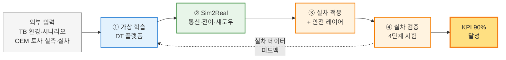

# 사업 한 장 구조도 (v1)

> **A4/A3 1장 인쇄용 · PPT 1슬라이드용** — 모든 기관에게 한 번에 보여주는 사업 구조도

---

## 🚜 사업 한 줄 비전

> **"가상에서 학습한 AI를 실차에 적응시켜 무인 자율 굴착 작업을 검증하는 디지털 트윈 플랫폼"**

| | |
|---|---|
| **사업 규모** | 48억원 / 43개월 / 16개 항목 / 5개 기관 |
| **핵심 목표** | 물리 거동 일치도 90% + 학습모델 실차 전이 90% |
| **사업 트랙** | 혁신제품형 (TRL 3 → 5) |

---

## 📊 4단계 가치 흐름



---

## 🏢 기관 × 영역 매트릭스 (수영장 레인)

| 기관 (예산·비중) | 외부 입력 | 🔵 가상 (DT 좌) | 🟢 중앙 (걸침) | 🟠 실차 (우) |
|---|:---:|---|---|---|
| 🟧 **주관 SW** (10.0억 · 21%) | | **#1** 통합 플랫폼 | **#10a** 통신·동기화 <br> **#10b** 전이·섀도우 | |
| 🟦 **시뮬·CAE** (12.0억 · 25%) | 작업 시나리오 | **#2** 환경 · **#3** 기계3종 <br> **#4** 도메인 물리 · **#8** DT 시험 | | |
| 🟩 **AI 기업** (12.5억 · 26%) | | **#5** 가상 데이터 · **#6** 가상 AI <br> **#9** 공정 계획 | | **#14** 적응·안전 |
| 🟪 **대학·출연연** (4.0억 · 8%) | 토사 실측 | **#7** 토사 3종 | | |
| 🟨 **OEM·시험기관** (9.5억 · 20%) | 실차 보유 | | | **#11** 실차 · **#12** 시험장 <br> **#13** 데이터 · **#15** 무인 시험 |

> **읽는 법** — 가로(영역)는 *데이터의 흐름 방향*, 세로(기관)는 *책임자*. 같은 셀의 항목은 *같은 기관·같은 영역에서 함께 다룸*.

---

## 🎯 5개 KPI 책임 항목 (◎ 주관)

| 코드 | 지표 | 목표 | 책임 항목 | 책임 기관 |
|:---:|---|:---:|---|---|
| **G1/P1** | DT 거동 일치도 | **≥ 90%** | #3 · #4 · #7 · #8 | 🟦 + 🟪 |
| **P2** | 토사 3종 구현 | **≥ 3종** | #7 | 🟪 |
| **P3** | 기계 모델 3종 | **≥ 3종** | #3 · #4 | 🟦 |
| **G2/P4** | 무인 작업 / 실차 전이 | **≥ 90%** | #6 · #9 · #10b · #14 · #15 | 🟧 + 🟩 + 🟨 |
| **P5** | 연동 지연시간 | **≤ 100ms** | #10a · #10b | 🟧 |

---

## ⛽ 데이터 Fuel 흐름 (#13 = 사업 전체의 연료)

```
[#11 실차]   ┐
              ├→  #13 실차 데이터  ─┬→  #4 물리모델 보정 (시뮬↔실차 격차 ↓)
[#12 시험장] ┘                     ├→  #6 가상 AI 모방학습
                                   ├→  #8 DT 거동 검증 (G1)
                                   ├→  #10b Sim2Real 전이 사이클
                                   └→  #14 실차 도메인 적응 (G2)
```

---

## 📅 4년 마일스톤

| 시점 | 핵심 작업 | KPI 점검 |
|:---:|---|:---:|
| **1차년도** (9개월) | 시스템 통합 명세, 실차 retrofit, 가상 환경 구축, 데이터 baseline | — |
| **2차년도** (10개월) | 가상 AI 본격 학습, 토사 2종 완성, 도메인 물리 검증 | 중간 |
| **3차년도** (12개월) | Sim2Real 전이, 실차 적응, 토사 3종, 시험 단계 1~2 | G1 1차 |
| **4차년도** (12개월) | 단계별 시험 캠페인 (3~4단계), 최종 KPI 검증 | **최종** |

---

## 🤝 인터페이스 합의 우선순위 (1차년도 필수)

연결 빈도 기준 *허브 노드 3개* — 사업 1차년도에 *시스템 통합 명세서*로 표준화 필요.

| 순위 | 항목 | 합의 사항 | 협업 기관 |
|:---:|---|---|---|
| ① | **#13 실차 데이터** | 데이터 포맷·라벨 스키마·IP 거버넌스 | 🟨 ↔ 🟧·🟦·🟩 |
| ② | **#2 작업 환경** | 시뮬 시나리오·인터페이스 표준 | 🟦 ↔ 🟩·🟪 |
| ③ | **#10a/b 통신·전이** | 통신 프로토콜·모델 OTA 포맷 | 🟧 ↔ 🟨·🟩 |

---

## 📋 한눈에 보는 결정 사항 요약

| 항목 | 결정 |
|---|---|
| **주관 후보** | (주)심지 (DT 업체) — 협의 진행 중 |
| **#9 자율공정 계획** | TRL 3~5 적합 — TB 환경 한정 (BIM·외부 측량 범위 외) |
| **#10 분리** | #10a (통신·동기) / #10b (전이·섀도우)로 분리 |
| **신규 KPI P6** | 시뮬-실차 공정 일치도 ≤ 15% — 협의 후 채택 |
| **안전 레이어** | 4단계 (L1 기구학 / L2 동력학 / L3 이상감지 / L4 페일세이프) |
| **시험 캠페인** | 4단계 (Bench → 평탄지 → 다양 지형 → 야간/위험지) |

---

> 📄 상세 자료: [사업기획_업무상세화_v1.md](사업기획_업무상세화_v1.md) · [항목별_연계_다이어그램_v1.md](항목별_연계_다이어그램_v1.md) · [심지미팅_준비자료_v1.md](심지미팅_준비자료_v1.md)
>
> *문서 버전 v1.0 (2026-05-04) · 작성: 한국건설기계연구원(KOCETI) 이민수*
