# 항목별 연계 다이어그램 (v1)

> 16개 연구 항목 각각의 **직접 연계 관계만** 표시한 미니 다이어그램 모음.
> 각 다이어그램은 해당 항목의 *입력원·산출물·연계 항목*만 보여주며, 전체 다이어그램은 [사업기획_업무상세화_v1.md §4.1](사업기획_업무상세화_v1.md) 참조.
>
> **용도**: 모듈별 담당 기관에게 *"당신 모듈의 위치"* 를 한 장으로 전달.

---

## 공통 범례

| 색상 | 의미 |
|:---:|---|
| 🟡 **노란색** | 해당 다이어그램의 *주인공 항목* (focal) |
| 🔵 파란색 | DT 플랫폼 영역 (좌) |
| 🟢 초록색 | 양측 걸침 영역 (중앙) |
| 🟠 주황색 | 실차 검증 영역 (우) |
| ⚪ 회색 | 외부 입력·산출 (사업 외부) |

| 화살표 | 의미 |
|---|---|
| `─→` | 데이터·산출물 흐름 |
| `─-→` | 운영 통합 / 인터페이스 |
| `←-(label)-→` | 양방향 협업 |

---

## #1. DT 통합 플랫폼 SW (5.0억 / 🟧A)

> 모든 모듈을 묶는 backbone 미들웨어·API·UI

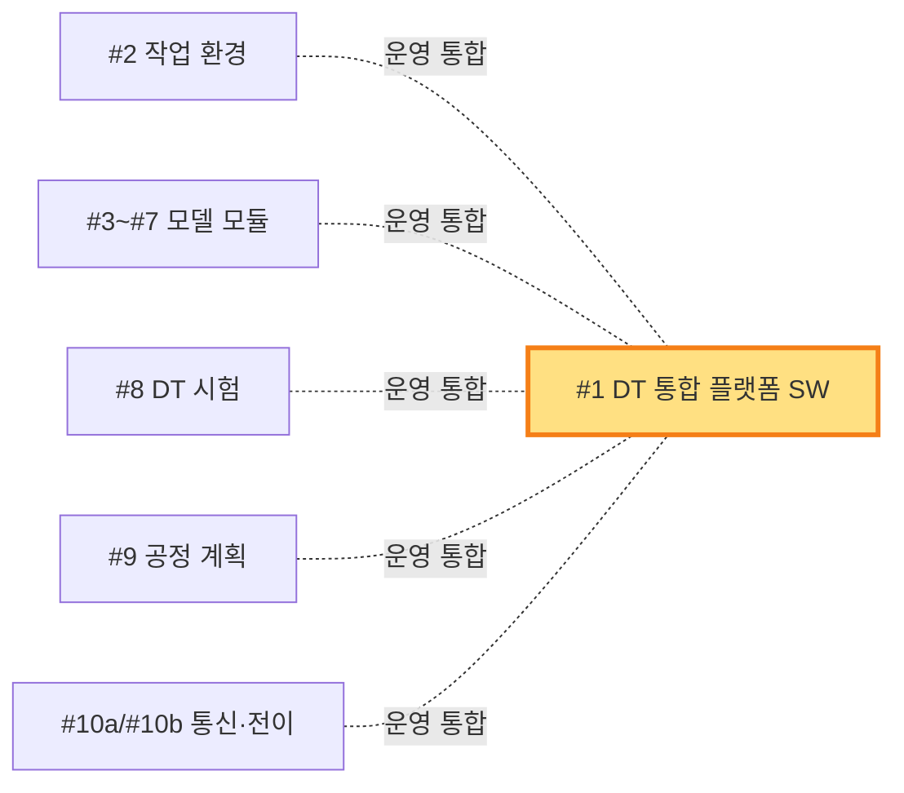

**역할** — 모든 DT·중앙 항목이 사용하는 *공통 인프라*. 직접 데이터 흐름은 없지만 모든 모듈이 #1의 API·미들웨어를 통해 동작.
**책임 KPI** — 간접 (모든 KPI에 ○)

---

## #2. 작업 환경 구성 (2.5억 / 🟦B)

> 가상 작업장(지형·장애물·시나리오) 구축

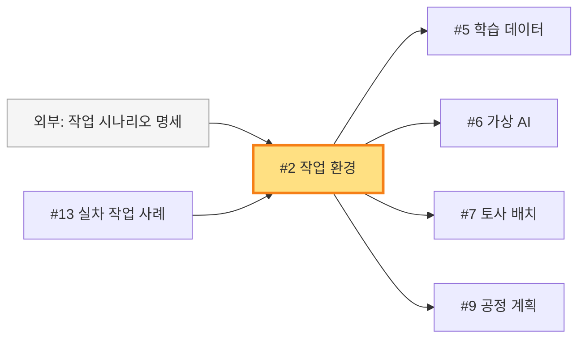

**역할** — 가상 작업장을 만들어 *#5/#6/#7/#9에 가상 환경 제공*.
**책임 KPI** — G1/P1 ○ (보조)

---

## #3. 건설기계 모델 3종 (3.5억 / 🟦B)

> 굴착기·로더·1종 추가의 디지털 트윈 (외형+기구학)

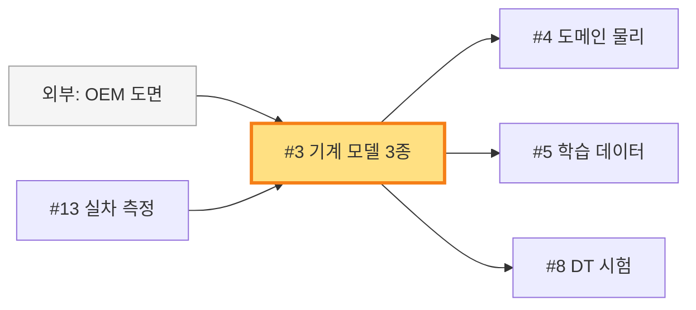

**역할** — 3종 기계의 형상·기구학 모델 → 다른 시뮬·학습 모듈 기반 제공.
**책임 KPI** — **P3 ◎ (3종)**, **G1/P1 ◎ (거동)**

---

## #4. 주요 도메인별 물리모델 (3.0억 / 🟦B)

> 유압·전동·파워트레인 multi-physics

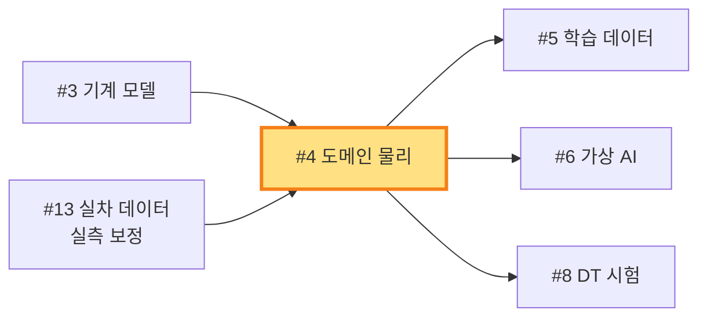

**역할** — 굴착기 *내부 시스템* 물리 시뮬 → 거동 정확도 기반.
**책임 KPI** — **G1/P1 ◎**, P3 ○

---

## #5. 학습데이터 수집(가상) (2.0억 / 🟩C)

> 시뮬에서 AI 학습용 데이터 자동 생성

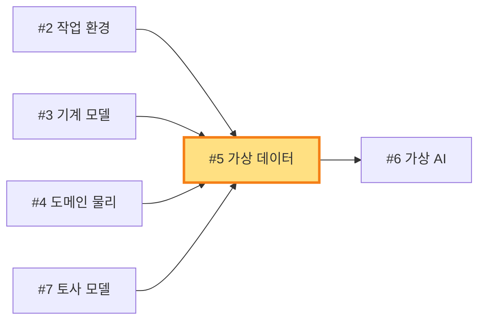

**역할** — *4개 모듈 통합 환경*에서 시뮬 실행 → AI 학습용 대규모 데이터 생산.
**책임 KPI** — G2/P4 ○

---

## #6. 가상 환경 AI 정책 학습 (4.0억 / 🟩C)

> 시뮬에서 RL/IL로 자율 굴착기 정책 학습

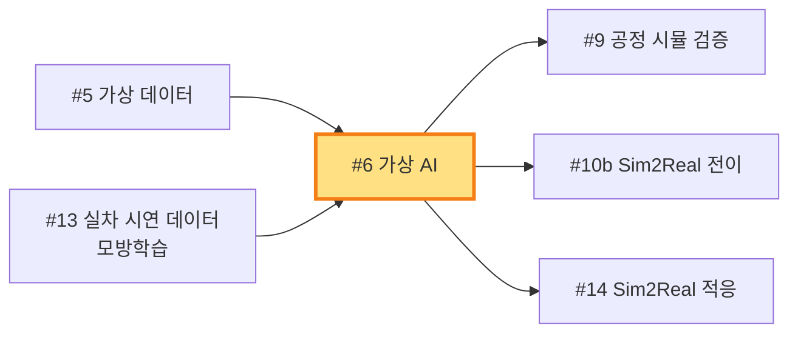

**역할** — *사업의 AI 핵심*. #14·#10b로 핸드오프되어 실차에 적응됨.
**책임 KPI** — **G2/P4 ◎**

---

## #7. 토사 모델 및 반력 3종 (4.0억 / 🟪D)

> 진흙·모래·자갈 + bucket-soil 반력 (난도 최상)

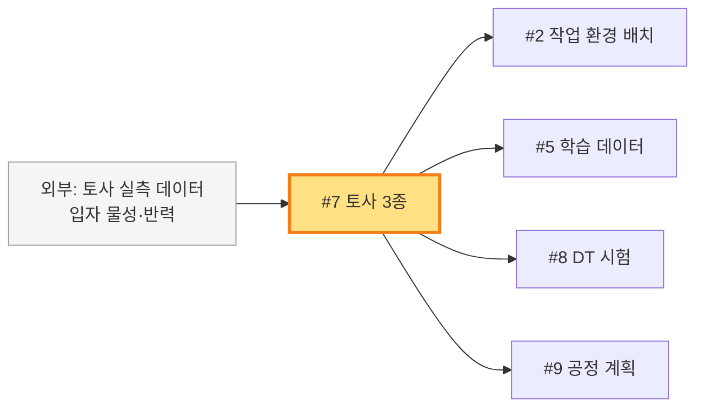

**역할** — 토사 물리를 4개 모듈에 공급. *외부 위탁 비중 큼* (대학·KIMM).
**책임 KPI** — **P2 ◎ (3종)**, **G1/P1 ◎ (반력)**

---

## #8. DT 성능 시험 (3.0억 / 🟦B)

> 거동 일치도 90% 검증 책임

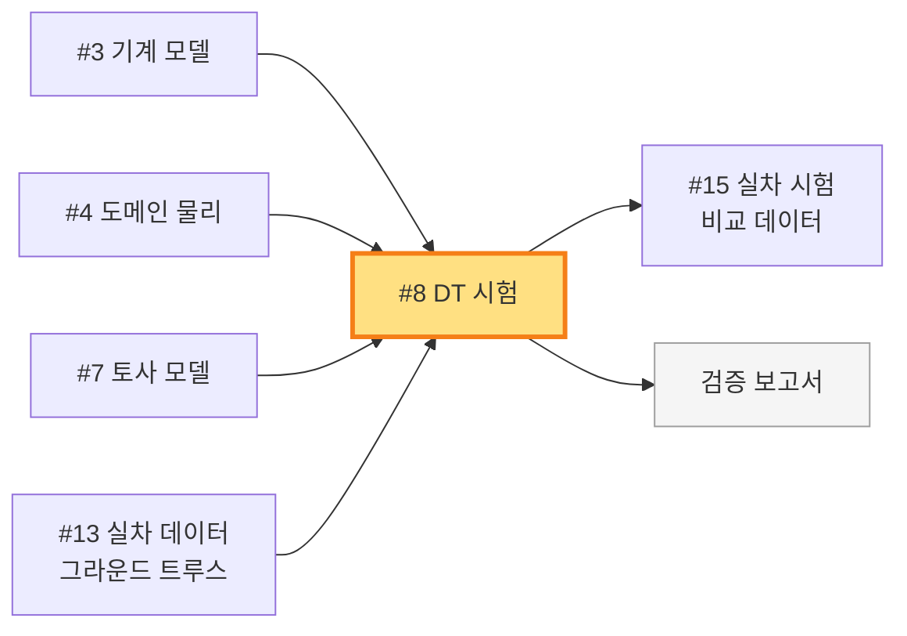

**역할** — 가상 vs 실차 거동 비교 → 일치도 측정. *G1/P1의 검증 게이트*.
**책임 KPI** — **G1/P1 ◎ (검증)**

---

## #9. 굴착기 자율공정 계획 (TB 환경) (3.5억 / 🟩C+🟦B)

> TB 환경에서 공정 계획 알고리즘 (지형 분석·터파기·상차)

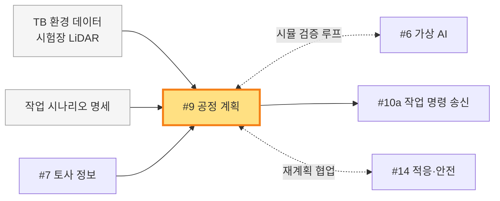

**역할** — TB 환경 한정 공정 계획. *#6과 시뮬 검증 루프* + *#14와 재계획 협업*.
**책임 KPI** — **G2/P4 ◎**, **P6 ◎ (제안)**

---

## #10a. 실시간 통신·동기화 인프라 (3.0억 / 🟧A)

> 실차↔가상 ms 단위 통신 SW

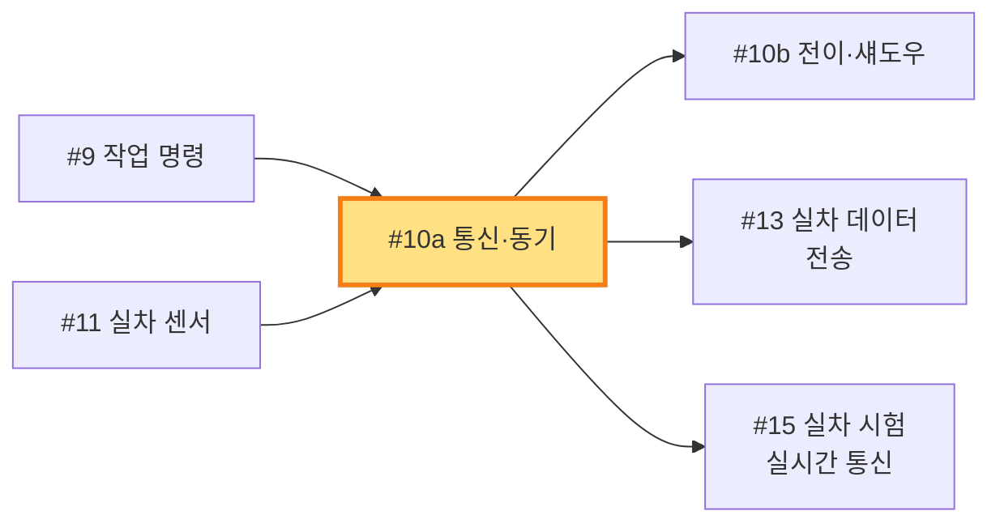

**역할** — 모든 *실시간 양방향 데이터*의 통로. P5 KPI 단독 책임.
**책임 KPI** — **P5 ◎ (지연 ms)**

---

## #10b. Sim2Real 전이·디지털 섀도우 (2.0억 / 🟧A)

> 가상↔실차 모델 전이 + 실시간 거울 동기화

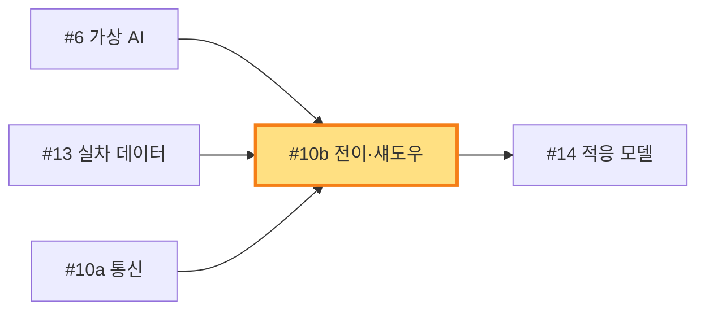

**역할** — *AI 모델 배포(시험장 LAN/SCP/SD — TRL 3~5는 OTA 인프라 불필요) + 디지털 섀도우 실시간 동기화*. G2/P4 핵심 브리지.
**책임 KPI** — **G2/P4 ◎ (전이)**, P5 ○

---

## #11. 실차 환경 구축 (1.5억 / 🟨E 제조사)

> 보유 실차에 센서·통신·안전 retrofit

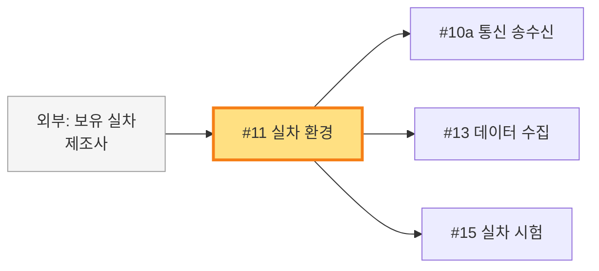

**역할** — 실차 retrofit. 모든 *실차 측 활동의 출발점*.
**책임 KPI** — P5 ○

---

## #12. 실증 시험 환경 구성 (2.0억 / 🟨E 시험기관)

> 시험장·토사 베드·안전 인프라

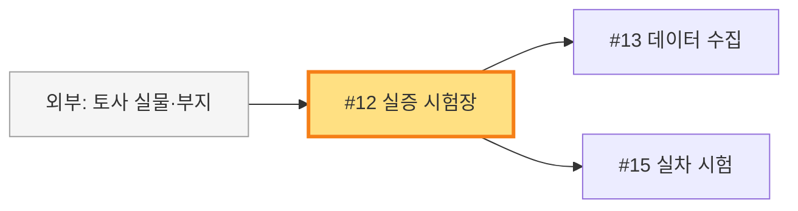

**역할** — 모든 실차 작업이 일어나는 *물리 공간*.
**책임 KPI** — 간접

---

## #13. 학습데이터 수집(실차) (2.0억 / 🟨E 제조사) ⭐

> 사업 전체의 *fuel*. 5개 항목으로 흐름

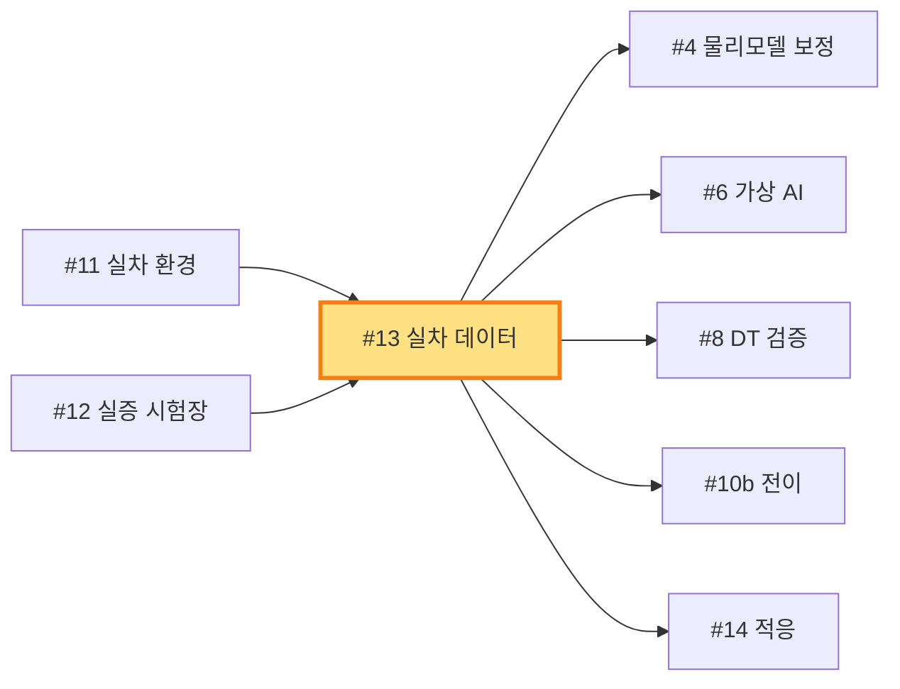

**역할** — *5개 항목으로 흐르는 데이터 fuel*. 1~2차년도 baseline 수집이 사업 성패 결정.
**책임 KPI** — 간접 (데이터 자체)

---

## #14. Sim2Real 적응 + 안전 레이어 (3.0억 / 🟩C)

> 가상 모델을 실차에 적응 + 4단계 안전 레이어

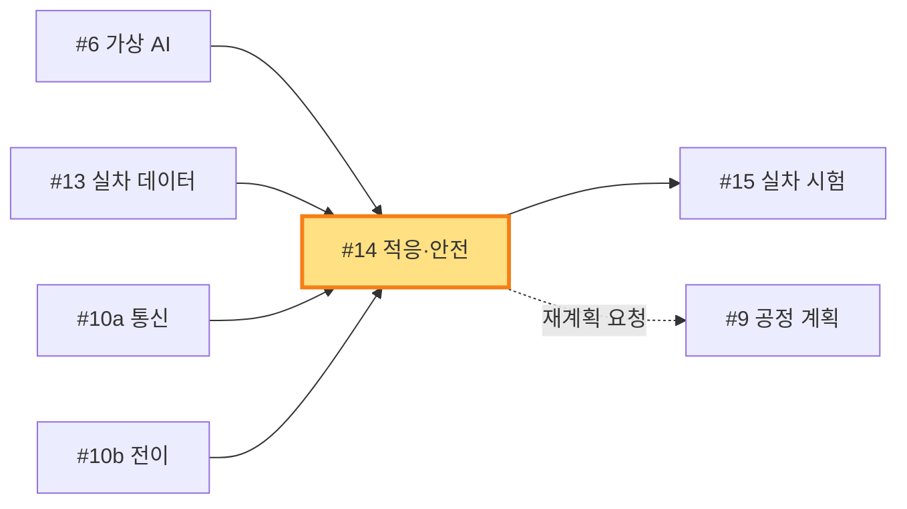

**역할** — *Sim2Real 격차 메우기 + 안전 보장*. G2/P4 실차 측 책임.
**책임 KPI** — **G2/P4 ◎**

---

## #15. 실차 무인 작업 성능 시험 (4.0억 / 🟨E 공동)

> 4단계 시험 캠페인으로 KPI 90% 검증

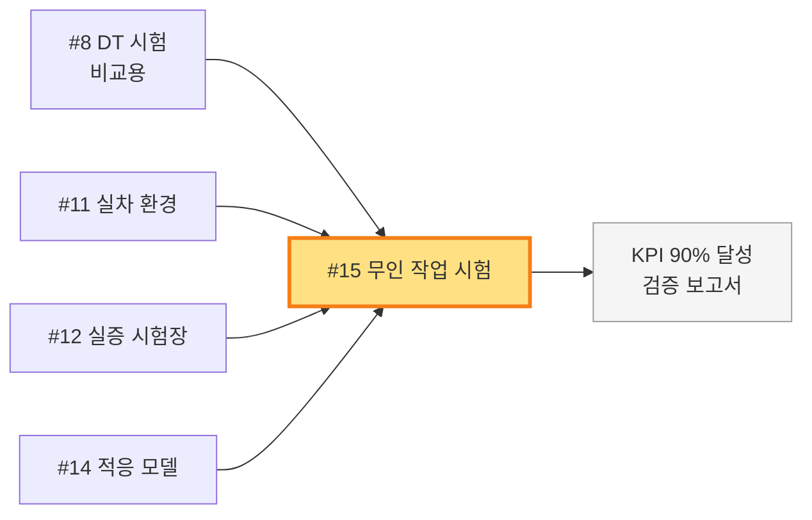

**역할** — *사업 최종 검증 게이트*. Bench → 평탄 → 다양 → 야간/위험 4단계.
**책임 KPI** — **G2/P4 ◎ (실차 검증)**, P5 ○

---

## 부록: 항목 간 *연결 빈도* 통계

연결이 많은 항목 = *허브 노드* = 인터페이스 설계가 중요한 항목.

| 항목 | 입력 수 | 출력 수 | 합계 | 성격 |
|:---:|:---:|:---:|:---:|---|
| #13 실차 데이터 | 2 | **5** | **7** | ⭐ 최대 허브 (downstream fuel) |
| #6 가상 AI | 2 | 3 | 5 | AI 핵심 분기점 |
| #2 작업 환경 | 2 | 4 | 6 | DT 환경 허브 |
| #7 토사 모델 | 1 | 4 | 5 | 모델 허브 |
| #14 적응·안전 | 4 | 2 | 6 | Sim2Real 수렴점 |
| #15 무인 시험 | 4 | 1 | 5 | 검증 수렴점 |
| #1 통합 플랫폼 | (인터페이스 N) | (인터페이스 N) | — | backbone (별도) |

→ **#13, #6, #2가 인터페이스 합의의 *최우선 대상*** (사업 1차년도 시스템 통합 명세서 작성 시).

---

## 변경 이력

| 버전 | 일자 | 변경 내용 |
|---|---|---|
| v1.0 | 2026-05-04 | 초안 — 16개 항목 미니 다이어그램, 공통 범례, 허브 통계 |
| v1.1 | 2026-05-09 | **#10b 역할 정정 — OTA → 간이 모델 배포** (사용자 결정: *국책과제 TRL 3~5는 OTA 인프라 over-engineering*). #10b 역할의 *"AI 모델 OTA 배포"* → *"AI 모델 배포(시험장 LAN/SCP/SD)"*로 변경. 학술적 *Sim2Real 전이 기법*(DR·SysID·DA·Residual)은 #6/#14에 분산 — #10b는 *모델 weights 전달*만. |
