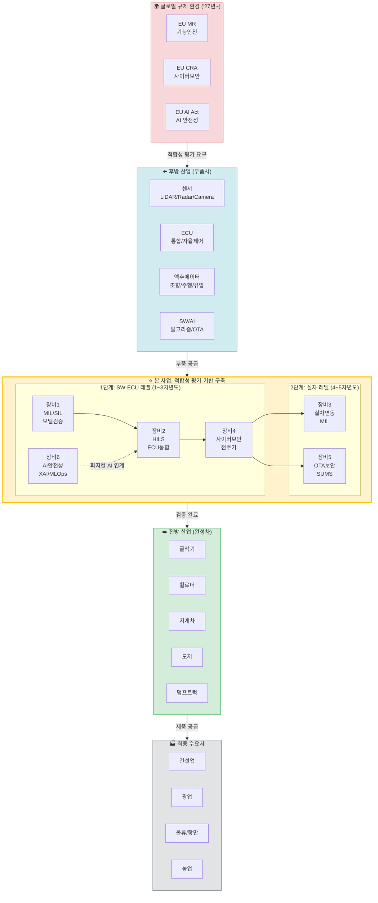
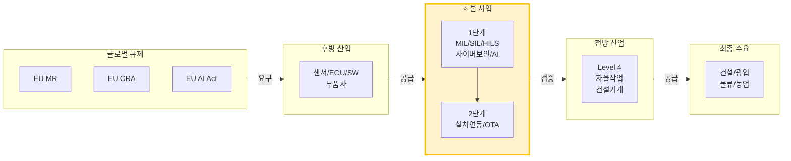
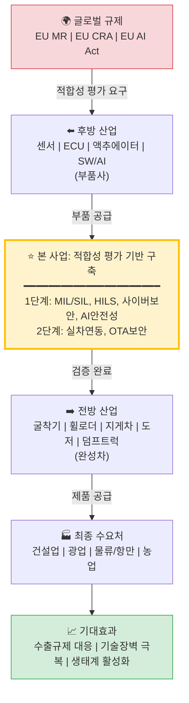

# 산업구조 및 제안수요 기반구축사업 포지셔닝 구조도

> **버전**: v1.1  
> **작성일**: 2026.01.15  
> **목적**: 제안수요 산업의 연구개발구조 기술 포지셔닝 (전후방 연계기술 및 산업)

---

## 통합 산업구조 및 기술 포지셔닝 (1-Page)

```
┌─────────────────────────────────────────────────────────────────────────────────────┐
│                          【글로벌 규제 환경 ('27년~)】                                │
│         EU MR (기능안전)  │  EU CRA (사이버보안)  │  EU AI Act (AI 안전성)           │
└───────────────────────────────────┬─────────────────────────────────────────────────┘
                                    │ 적합성 평가 요구
                                    ▼
┌─────────────────────────────────────────────────────────────────────────────────────┐
│【후방 산업】                                                                         │
│  부품사: 경우시스테크, 동서콘트롤, 태하, 컴씨스, 기원전자 등                           │
│  ┌────────────┐ ┌────────────┐ ┌────────────┐ ┌────────────┐                        │
│  │ 센서       │ │ ECU        │ │ 액추에이터  │ │ SW/AI     │                        │
│  │LiDAR/Radar │ │통합/자율제어│ │조향/주행/유압│ │알고리즘/OTA│                        │
│  └────────────┘ └────────────┘ └────────────┘ └────────────┘                        │
└───────────────────────────────────┬─────────────────────────────────────────────────┘
                                    │ 부품 공급
                                    ▼
┌═════════════════════════════════════════════════════════════════════════════════════┐
║  ★★★ 【본 사업: 기능안전/사이버보안/AI 안전성 적합성 평가 기반 구축】 ★★★           ║
╠═════════════════════════════════════════════════════════════════════════════════════╣
║                                                                                     ║
║   【1단계: SW·ECU 레벨 (1~3차년도)】          【2단계: 실차 레벨 (4~5차년도)】       ║
║   ┌─────────┐ ┌─────────┐ ┌─────────┐       ┌─────────┐ ┌─────────┐              ║
║   │장비1    │ │장비2    │ │장비4    │       │장비3    │ │장비5    │              ║
║   │MIL/SIL │→│ HILS   │→│사이버보안│       │실차연동 │ │OTA보안  │              ║
║   │모델검증 │ │ECU통합 │ │전주기   │       │MIL     │ │SUMS    │              ║
║   └─────────┘ └─────────┘ └─────────┘       └─────────┘ └─────────┘              ║
║        │           │           │                 ↑           ↑                    ║
║        └───────────┴───────────┴─────────────────┴───────────┘                    ║
║                    │                                                               ║
║              ┌─────────┐                                                           ║
║              │장비6    │  ←── 피지컬 AI 초격차 프로젝트 연계                        ║
║              │AI안전성 │                                                           ║
║              │XAI/MLOps│                                                           ║
║              └─────────┘                                                           ║
║                                                                                     ║
║   【핵심 역할】 적합성 평가 + 시나리오 검증 + 기술문서화 + 인증 지원                  ║
╚═════════════════════════════════════════════════════════════════════════════════════╝
                                    │ 검증 완료
                                    ▼
┌─────────────────────────────────────────────────────────────────────────────────────┐
│【전방 산업】                                                                         │
│  완성차: HD현대사이트솔루션, HD건설기계, 두산밥켓, 호룡 등                             │
│  ┌────────────┐ ┌────────────┐ ┌────────────┐ ┌────────────┐ ┌────────────┐        │
│  │ 굴착기     │ │ 휠로더     │ │ 지게차     │ │ 도저      │ │ 덤프트럭   │        │
│  └────────────┘ └────────────┘ └────────────┘ └────────────┘ └────────────┘        │
│                      Level 4 자율작업 건설기계                                       │
└───────────────────────────────────┬─────────────────────────────────────────────────┘
                                    │ 제품 공급
                                    ▼
┌─────────────────────────────────────────────────────────────────────────────────────┐
│【최종 수요처】     건설업  │  광업  │  물류/항만  │  농업                             │
└─────────────────────────────────────────────────────────────────────────────────────┘
                                    │
                                    ▼
                    ┌───────────────────────────────┐
                    │  【기대 효과】                  │
                    │  • 글로벌 수출 규제 대응       │
                    │  • 기술장벽 극복 / 수출 확대   │
                    │  • 생태계 활성화 / 개발 단축   │
                    └───────────────────────────────┘
```

---

## 요약표

| 구분 | 내용 |
|:---:|:---|
| **글로벌 규제** | EU MR (기능안전), EU CRA (사이버보안), EU AI Act (AI 안전성) |
| **후방 산업** | 센서, ECU, 액추에이터, SW/AI (부품사) |
| **본 사업** | 6종 장비 (MIL/SIL, HILS, 실차연동, 사이버보안, OTA, AI안전성) |
| **전방 산업** | 굴착기, 휠로더, 지게차, 도저, 덤프트럭 (완성차) |
| **최종 수요** | 건설업, 광업, 물류/항만, 농업 |
| **정책 연계** | 피지컬 AI 초격차 프로젝트 |

---

## Mermaid 다이어그램 코드

### 버전 1: 전체 산업구조 흐름도



### 버전 2: 간소화 버전



### 버전 3: 수직 흐름 (Top-Down)



---

*문서 끝*
