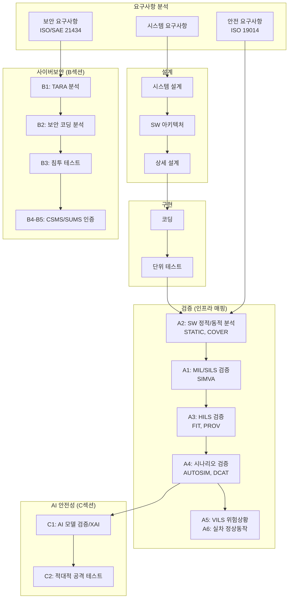

# 4. 인프라 구축 계획 (개선안 v2)

> **수정일**: 2026.01.07  
> **주요 변경**: 슈어소프트테크 검증도구 분석 반영, 산기반 로드맵('26~'28) 정책 연계, 사이버보안 강화, VILS/실차 역할 분담 명확화, B2 건설기계 특화 및 A2 연계 명시, **Automotive Ethernet (SDM 대응) 추가**

---

## 개선 방향

### 1. 건설기계 특화 (ISO 19014 중심)
- 오프로드/작업 환경, 충격·진동, 유압 시스템 등 건설기계 고유 특성 반영
- 자동차(ISO 26262) 기반이 아닌 **ISO 19014(토공기계 기능안전)** 중심 설계
- CAN J1939 프로토콜, 유압 제어 알고리즘 특화 검증 환경

### 2. 사이버보안 강화 (EU CRA 대응)
- UN R155/R156, ISO/SAE 21434 → **EU CRA(사이버복원력법)** 확장 대응
- 독립적 사이버보안 검증 인프라 신설 (TARA, 침투테스트, CSMS/SUMS)
- **텔레매틱스/원격제어 보안** 특화 (건설기계 핵심 요소)

### 3. 단계별 구축 전략 (V-Cycle)
```
[MIL/SILS] → [HILS] → [VILS] → [실차 시험장]
  SW 로직     ECU 통합   위험상황 테스트   정상동작 검증
                         (가상 이상상황)   (실제 환경)
```

### 4. 산기반 로드맵('26~'28) 정책 연계
- 초격차 프로젝트 연계 (자율작업 건설기계)
- 글로벌 규제 대응 (EU MR, CRA, AI Act)
- AI+R&DI 연구기반 조성

---

## 인프라 구축 계획 표

### A. 기능안전 평가 인프라 (ISO 19014 기반)

| 구분 | 시설·장비명(S/W) | 활용용도 (업체지원 수요 내용) | 1차 | 2차 | 3차 | 4차 | 5차 | 비용 | 유형 |
|:---:|:---|:---|:---:|:---:|:---:|:---:|:---:|---:|:---:|
| A1 | **건설기계 제어로직 가상검증 설비 (MIL/SILS)** | • (부품사) Host PC 기반 핵심 부품 국산화 개발품 제어 로직 검증<br>• (완성차) 무인 굴착기/지게차 VCU 로직·SW아키텍처 검증<br>• **건설기계 특화**: 유압 제어 알고리즘, 작업기(붐·암·버킷) 동작 로직, 조향/제동 연동 검증<br>• **적용표준**: ISO 19014 Part 1~4, IEC 61508 | ○ | | | | | 1,550 | 신규구축 |
| A2 | **SW 정적/동적 분석 설비 (코드검증)** | • (부품사/완성차) MISRA-C/C++ 준수율, MC/DC coverage, 단위/통합 테스트<br>• **도구예시**: 슈어소프트테크 STATIC, COVER, CT 등<br>• **건설기계 특화**: ISO 19014 기반 안전 SW 코딩 표준 검증<br>• **지원기능**: 실행시간 오류 검출(산술오류, 메모리오류, 배열경계오류), 코딩규칙 자동검사<br>• 외부망 연결 통한 개발사 원격 접속 지원(웹기반 UI) | | ○ | | | | 725 | 신규구축 |
| A3 | **ECU 레벨 HW-SW 통합검증 설비 (HILS)** | • (부품사) 제어기 개발품(HW-SW 통합품) 작동/성능/안전성 검증<br>• (완성차) 무인 굴착기/지게차 VCU 제어기 작동/성능/안전성 검증<br>• **건설기계 특화 통신 검증**:<br>  - CAN J1939 프로토콜<br>  - Automotive Ethernet (100BASE-T1) - SDM 대응<br>  - 유압밸브 PWM 제어, 유압펌프 용량제어<br>• **Fault Injection 테스트**: 센서 단선/단락, 통신 장애 시 Fail-safe 동작 확인 | | ○ | | | | 1,420 | 신규구축 |
| A4 | **시나리오 기반 구동시스템 검증 설비 (HILS+센서)** | • (부품사) 제어기 개발품의 가상 환경에서 작동/성능/안전성 검증<br>• (완성차) 무인 굴착기/지게차 비접촉 센서 작동/성능/안전성 검증<br>• **도구예시**: 슈어소프트테크 SIMVA, AUTOSIM, DCAT 등<br>• **건설기계 특화 시나리오**:<br>  - 토공작업(굴착·적재·운반·정지)<br>  - 장애물 회피, 충돌 경고<br>  - 작업자 감지 및 비상정지<br>  - 경사지/연약지반 안정성<br>• (부품사/완성차) On-device AI 알고리즘 작동 안전성 검증 | | | ○ | | | 1,350 | 신규구축 |
| A5 | **ECU 실차장착 위험상황 검증 설비 (VILS)** | • (완성차) 실차에 ECU 장착 후, **실제 재현이 위험하거나 불가능한 이상 상황**을 가상으로 시뮬레이션하여 안전성 검증<br>• **VILS 핵심 용도 (위험/이상 상황 테스트)**:<br>  - GPS 스푸핑/교란 대응 검증<br>  - 5G 통신 지연/끊김 시 Fail-safe 동작<br>  - 작업자 급출현 → 비상정지 반응<br>  - 센서 고장/오작동 대응<br>  - 사이버 공격 시나리오 대응<br>• **건설기계 특화**: 실제 유압 부하, 작업기 동작 조건에서 제어기 안전 반응 검증<br>• ※ 정상 동작(경사 주행, 토사 굴착 등)은 **실차 시험장(A6)**에서 검증 | | | | ○ | | 870 | 신규구축 |
| A6 | **실차 시험장 계측 설비 (정상 동작 검증)** | • (완성차) **실제 환경에서 정상 동작 성능 검증** (경사 주행, 토사 굴착, 적재/운반 등)<br>• (부품사) 원격제어(5G 통신) 기반 개발품의 실차 작동/성능 검증<br>• **A6 핵심 용도 (정상 동작 테스트)**:<br>  - 실제 경사지 주행 안정성<br>  - 실제 토사 굴착 시 유압 부하/반력<br>  - 실제 적재량에 따른 성능 변화<br>  - 실제 지형(연약지반 등) 주행성<br>• **건설기계 전용 계측 시스템**:<br>  - 유압 압력/온도 센서<br>  - 실린더 변위 센서<br>  - 버킷 하중 센서(적재량 검증)<br>  - GPS RTK 정밀 위치 측정<br>  - IMU 자세각/가속도 계측<br>• ※ 위험/이상 상황은 **VILS(A5)**에서 검증 | | | | ○ | | 500 | 신규구축 |

**A섹션 소계**: 6,515백만원 (상세 내역: 세부예산서 참조)

---

### B. 사이버보안 평가 인프라 (ISO/SAE 21434 + EU CRA 대응)

| 구분 | 시설·장비명(S/W) | 활용용도 (업체지원 수요 내용) | 1차 | 2차 | 3차 | 4차 | 5차 | 비용 | 유형 |
|:---:|:---|:---|:---:|:---:|:---:|:---:|:---:|---:|:---:|
| B1 | **위협분석 및 위험평가(TARA) 도구** | • (완성차/부품사) ISO/SAE 21434 기반 TARA 수행 지원<br>• **분석 영역**:<br>  - 자산 식별 (ECU, 통신버스, 센서 등)<br>  - 위협 시나리오 도출 (STRIDE 방법론)<br>  - 공격경로 분석 (Attack Tree)<br>  - 위험 수준 평가 (CVSS 기반)<br>• **건설기계 특화 위협 분석**:<br>  - 원격 제어 명령 탈취/변조<br>  - 텔레매틱스 데이터 유출<br>  - OTA 업데이트 악성코드 삽입<br>  - GPS 스푸핑에 의한 위치 조작 | | ○ | | | | 300 | 신규구축 |
| B2 | **SW 보안 코딩 분석 설비** | • (부품사/완성차) ISO/SAE 21434 기반 보안 취약점 정적 분석 (SAST)<br>• **도구예시**: 슈어소프트테크 STATIC (Security 모드)<br>• **지원 코딩규칙**:<br>  - CWE 658/659/660 (보안약점)<br>  - CERT Secure Coding Standards<br>  - ISO/SAE 21434 기반 보안 코딩 표준<br>• **건설기계 특화 보안 취약점 검출**:<br>  - CAN J1939 통신 보안 취약점<br>  - 텔레매틱스/원격제어 관련 취약점<br>  - OTA 업데이트 관련 취약점<br>• **A2(기능안전)와 연계**: 동일 도구(STATIC)의 Safety/Security 모드 병행 운영<br>• AI 기반 결함 수정 가이드 제공 (Fix Assistant) | | ○ | | | | 350 | 신규구축 |
| B3 | **침투테스트(Penetration Test) 설비** | • (완성차/부품사) ECU/통신 시스템 취약점 스캐닝 및 모의 해킹 테스트<br>• **CAN/J1939 보안 테스트**:<br>  - CAN 버스 침입 탐지<br>  - 프로토콜 퍼징(Fuzzing) 테스트<br>  - ECU 펌웨어 역공학 분석<br>  - 메모리 덤프 및 키 추출 시도<br>• **Automotive Ethernet 보안 테스트 (SDM 대응)**:<br>  - 100BASE-T1 통신 취약점 분석<br>  - DoIP(Diagnostics over IP) 보안 검증<br>  - SOME/IP 프로토콜 퍼징<br>  - VLAN 우회 공격 테스트<br>• **건설기계 특화 테스트**:<br>  - 무선통신(5G/LTE) 중간자 공격<br>  - GPS 스푸핑 대응 검증<br>  - 원격제어 명령 탈취/변조 테스트 | | | ○ | | | 320 | 신규구축 |
| B4 | **사이버보안 관리체계(CSMS) 인증 지원 설비** | • (완성차/부품사) UN R155 CSMS 인증 대응 지원<br>• **지원 영역**:<br>  - 사이버보안 정책/프로세스 수립 지원<br>  - 위험관리 체계 구축<br>  - 공급망 보안 평가<br>  - 사고 대응 계획 수립<br>• **EU CRA 적합성 평가** 문서화 지원<br>• **건설기계 특화**: 텔레매틱스 시스템 보안 인증, 원격제어 인증 | | | | ○ | | 230 | 신규구축 |
| B5 | **소프트웨어 업데이트 관리체계(SUMS) 검증 설비** | • (완성차/부품사) UN R156 SUMS 인증 대응 지원<br>• **검증 항목**:<br>  - OTA 업데이트 프로세스 보안성<br>  - 업데이트 무결성 검증 (서명/암호화)<br>  - 롤백(Rollback) 기능 검증<br>  - 업데이트 이력 관리 (5년 보관)<br>• **건설기계 특화**: 필드 장비 OTA 환경(저대역폭, 불안정 네트워크) 검증 | | | | ○ | | 250 | 신규구축 |
| B6 | **보안 이상탐지 및 로그분석 시스템** | • (완성차/부품사) 실시간 네트워크 이상 탐지(IDS/IPS)<br>• **기능**:<br>  - CAN/Ethernet 트래픽 모니터링<br>  - 이상 패턴 탐지 및 경보<br>  - 보안 로그 수집 및 장기 보관(EU MR 요구: 5년 이상)<br>  - 보안 사고 포렌식 분석 지원<br>• **SIEM(Security Information & Event Management)** 연동 | | | | | ○ | 250 | 신규구축 |

**B섹션 소계**: 1,700백만원 (상세 내역: 세부예산서 참조)

---

### C. AI 안전성 평가 인프라 (EU AI Act 대응)

| 구분 | 시설·장비명(S/W) | 활용용도 (업체지원 수요 내용) | 1차 | 2차 | 3차 | 4차 | 5차 | 비용 | 유형 |
|:---:|:---|:---|:---:|:---:|:---:|:---:|:---:|---:|:---:|
| C1 | **AI/ML 모델 검증 및 설명가능성(XAI) 분석 설비** | • (완성차/부품사) EU AI Act 대응 위한 AI 모델 성능/안전성 검증<br>• **검증 항목**:<br>  - 객체 인식 정확도(mAP, IoU)<br>  - 장애물 탐지 신뢰성<br>  - False Positive/Negative 분석<br>  - 설명가능성(XAI) 레포트 생성<br>• **건설기계 특화 환경 검증**:<br>  - 먼지/분진 환경 AI 성능<br>  - 강한 진동 조건 센서 성능<br>  - 저조도/역광 조건 인식률<br>  - 금속/암석 구분 정확도 | | | ○ | | | 455 | 신규구축 |
| C2 | **AI 적대적 공격(Adversarial Attack) 테스트 설비** | • (완성차/부품사) AI 모델 대상 적대적 입력 테스트<br>• **테스트 시나리오**:<br>  - 이미지 적대적 패치(Adversarial Patch)<br>  - LiDAR 포인트 클라우드 조작<br>  - 센서 기만(Spoofing) 공격<br>  - 데이터 변조(Data Poisoning)<br>• **건설기계 특화**:<br>  - LiDAR 반사판 오인식<br>  - Camera 눈부심/오염 오동작<br>  - 작업자 vs 장비 오분류 | | | | ○ | | 210 | 신규구축 |
| C3 | **AI 모델 수명주기 관리 설비** | • (완성차/부품사) AI 모델 버전 관리 및 성능 모니터링<br>• **기능**:<br>  - 모델 버전 관리(MLOps)<br>  - 필드 데이터 기반 재학습 검증<br>  - 성능 드리프트(Drift) 탐지<br>  - 모델 업데이트 영향도 분석 | | | | | ○ | 215 | 신규구축 |

**C섹션 소계**: 880백만원 (상세 내역: 세부예산서 참조)

---

### D. 기업지원 인프라 (중소·중견기업 기술역량 강화)

| 구분 | 시설·장비명(S/W) | 활용용도 (업체지원 수요 내용) | 1차 | 2차 | 3차 | 4차 | 5차 | 비용 | 유형 |
|:---:|:---|:---|:---:|:---:|:---:|:---:|:---:|---:|:---:|
| D1 | **기능안전/사이버보안 통합 기술지원 시스템** | • 중소 부품사 대상 기술 컨설팅 및 교육<br>• **지원 내용**:<br>  - ISO 19014 기능안전 프로세스 교육<br>  - ISO/SAE 21434 사이버보안 프로세스 교육<br>  - 적합성 평가 문서화 지원 (기술문서 작성 가이드)<br>  - 인증 프로세스 지원 (자기적합성 선언/제3자 인증)<br>• **온라인 교육 플랫폼** 운영 | ○ | ○ | ○ | ○ | ○ | 320 | 운영 |
| D2 | **원격 접속 검증 서비스 플랫폼** | • (부품사) 원격으로 SILS/HILS 설비 접속하여 검증 수행<br>• **기능**:<br>  - VPN 기반 보안 원격 접속<br>  - 실시간 시뮬레이션 결과 모니터링<br>  - 테스트 리포트 자동 생성<br>• **도구예시**: 슈어소프트테크 COVER Cloud 연동 | | ○ | ○ | ○ | ○ | 215 | 운영 |

**D섹션 소계**: 535백만원 (기술지원 + 원격검증, 운영비 포함)

---

## 연차별 예산 요약

| 구분 | 1차년도 | 2차년도 | 3차년도 | 4차년도 | 5차년도 | 합계 |
|:---|---:|---:|---:|---:|---:|---:|
| **A. 기능안전 평가** | 1,550 | 2,195 | 1,400 | 1,370 | - | **6,515** |
| **B. 사이버보안 평가** | - | 650 | 320 | 480 | 250 | **1,700** |
| **C. AI 안전성 평가** | - | - | 455 | 210 | 215 | **880** |
| **장비비 소계** | **1,550** | **2,845** | **2,175** | **2,060** | **465** | **9,095** |
| **기술개발비** | 900 | 900 | 900 | 900 | 900 | **4,500** |
| **운영비** | 300 | 300 | 300 | 300 | 300 | **1,500** |
| **연간 합계** | **2,750** | **4,045** | **3,375** | **3,260** | **1,665** | **15,095** |

> ⚠️ **예산 조정 안내**: 환경시험(온도챔버, 진동시험기) 제외로 A5 감소분 50백만원을 A3/A4에 재배분하여 장비비 총액 약간 증가. 기술개발비에서 95백만원 조정 예정.

> ※ 총 사업비: 150억원 (국비 100억원 + 지방비 50억원)  
> ※ 구성: 장비비 90억(60%) + 기술개발비 45억(30%) + 운영비 15억(10%)  
> ※ 부가세 포함, 간접비 별도  
> ※ 상세 내역: `4_인프라구축계획_세부예산.md` 참조

---

## 수요 업체

### 완성차 제조사
- HD현대사이트솔루션, HD현대인프라코어, HD현대건설기계, 두산밥켓, 호룡 등

### 부품 제조사  
- 경우시스테크, 동서콘트롤, 태하, 컴씨스, 기원전자, ESC prime 등

### 연관 산업
- 농기계(대동, LS엠트론 등), 특장차, AGV/AMR 물류로봇 기업

---

## 핵심 개선 포인트 요약 (v1 → v2)

| 기존 문제점 (v1) | 개선 내용 (v2) |
|:---|:---|
| 자동차 중심 HILS/SILS | **ISO 19014 기반** 건설기계 특화 시나리오 (토공작업, 유압제어, J1939) |
| 사이버보안 장비 4개 | **6개로 확대**: TARA, SW보안코딩(STATIC), 침투테스트, CSMS, SUMS, 로그분석 분리 |
| 도구 예시 미기재 | **슈어소프트테크 도구** 명시: STATIC, COVER, SIMVA, AUTOSIM, DCAT 등 |
| AI 안전성 2개 장비 | **3개로 확대**: XAI, 적대적 공격, AI 수명주기 관리 |
| 원격 지원 미반영 | **D2 원격접속 검증 서비스** 추가 (COVER Cloud 연동) |
| 예산 근거 불명확 | **150억 (장비 90억+기술개발 45억+운영 15억)** 세부 내역 제공 |
| VILS/실차 역할 모호 | **VILS=위험상황 테스트, 실차=정상동작 검증** 역할 분담 명확화 |

---

## 관련 규제 및 표준 대응 매핑

| 규제/표준 | 대응 설비 | 발효/적용 시점 | 비고 |
|:---|:---|:---:|:---|
| **EU Machinery Regulation (2023/1230)** | A1~A6, C1~C3 | '27.1.20 | 기능안전+AI 안전성 의무화 |
| **ISO 19014 (건설기계 기능안전)** | A1~A6 | 제정됨 | 건설기계 전용 기능안전 표준 |
| **ISO 25119 (농기계 기능안전)** | A1~A6 | 제정됨 | 농기계 확장 적용 시 참조 |
| **ISO/SAE 21434 (사이버보안)** | B1~B6 | '21 제정 | 자동차 기반, 건설기계 확장 적용 |
| **UN R155 (CSMS)** | B4 | EU '22.7 | 사이버보안관리시스템 인증 |
| **UN R156 (SUMS)** | B5 | EU '22.7 | 소프트웨어 업데이트 관리 인증 |
| **EU CRA (Cyber Resilience Act)** | B1~B6 | '27 예정 | 디지털 제품 전반 사이버보안 |
| **EU AI Act (2024/1689)** | C1~C3 | '26.8 단계적 | 고위험 AI 제3자 적합성 평가 |

---

## 참고 도구 목록 (슈어소프트테크 기준)

| 카테고리 | 도구명 | 용도 | 적용 설비 |
|:---|:---|:---|:---:|
| **코드검증** | STATIC | 코드 정적분석 (MISRA, CWE, ES95489-23) | A2, B2 |
| **코드검증** | COVER | 코드 커버리지 측정 (MC/DC) | A2 |
| **코드검증** | CT | 코드 테스트 자동화 | A2 |
| **시스템검증** | PROV | 자원 모니터링 (CPU, 메모리, 태스크) | A3, A4 |
| **시스템검증** | FIT | Fault Injection 테스트 | A3 |
| **미래기술검증** | SIMVA | 시뮬레이션 기반 검증 (SILS) | A1, A4 |
| **미래기술검증** | AUTOSIM | 자율주행 시나리오 시뮬레이션 | A4 |
| **미래기술검증** | DCAT | 데이터 수집/분석 도구 | A4, A6 |
| **프로세스** | V-SPICE | ASPICE 프로세스 리포팅 자동화 | D1 |
| **빌드자동화** | VPES | 빌드 및 시험 자동화 | A2, D2 |

---

## Mermaid 다이어그램: V-Cycle 기반 검증 인프라 매핑



---

*문서 끝*
