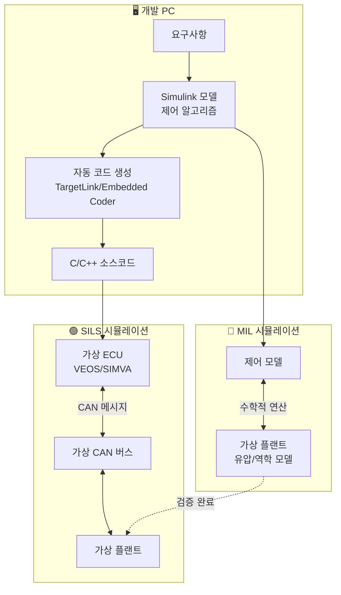
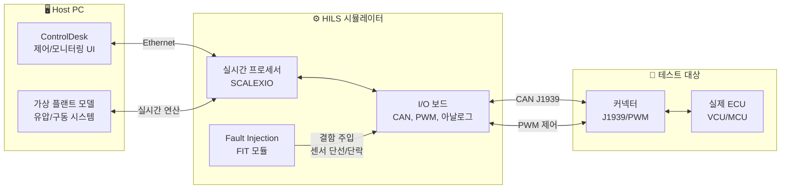
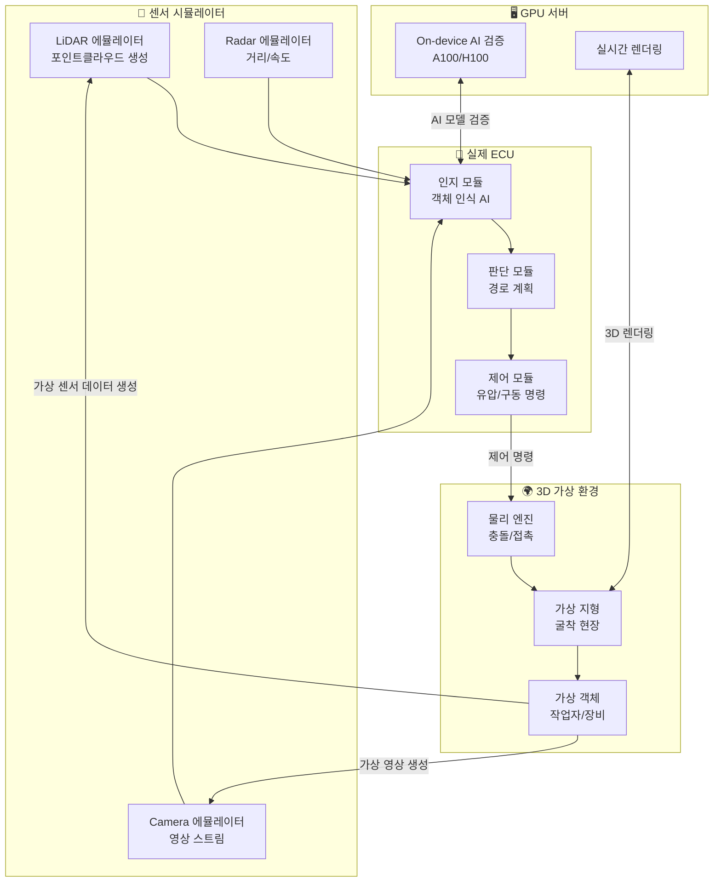
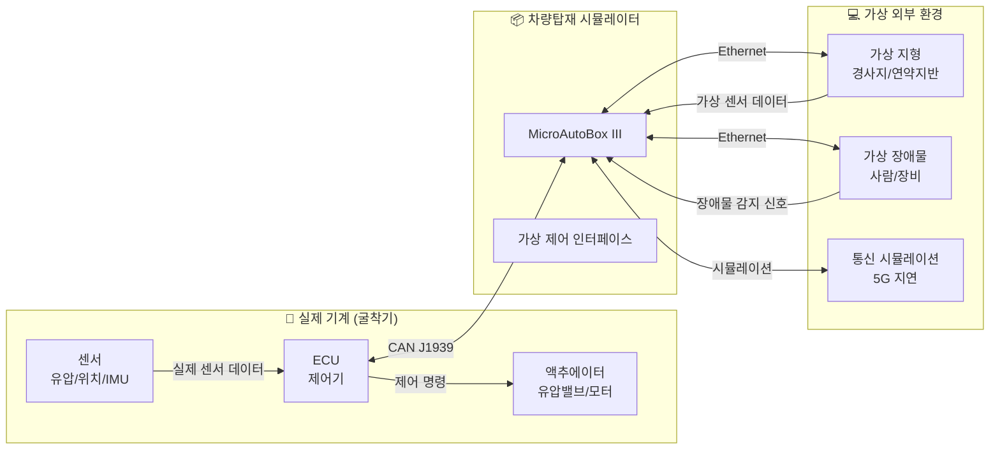
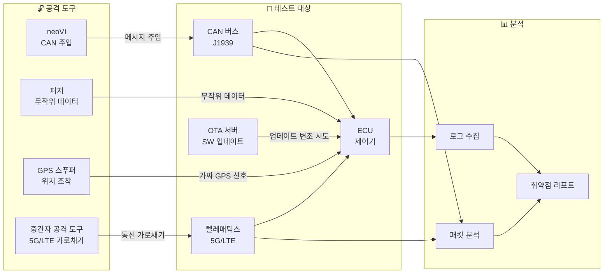

# 4. 인프라 구축 계획 - 상세 설명서

> **목적**: 인프라 구축 계획표에 포함된 시설·장비명과 용어에 대한 상세 설명  
> **대상 독자**: 비기술자, 기획 담당자, PD  
> **수정일**: 2026.01.06

---

## 📖 문서 구성

이 문서는 **인프라 구축 계획표 순서**대로 다음 내용을 설명합니다:

1. **시설·장비명이 무엇인지** (쉬운 비유 포함)
2. **실제 상용 제품이 있는지** (제조사, 가격대)
3. **국내 도입 사례**
4. **관련 용어 설명**

---

# 🔷 A섹션: 기능안전 평가 인프라

## A1. 건설기계 제어로직 가상검증 설비 (MIL/SILS)

### 🎯 이게 뭔가요?

**한 줄 요약**: 실제 기계를 만들기 전에, **컴퓨터 화면에서 먼저 테스트**하는 시스템입니다.

**쉬운 비유**:
> 비행기 조종사가 실제 비행 전에 "비행 시뮬레이터"에서 연습하는 것과 같습니다.  
> 굴착기가 "버킷을 들어올려라" 명령을 받았을 때 어떻게 동작할지를 **실제 굴착기 없이** 컴퓨터에서 미리 확인합니다.

### 📦 용어 설명

| 용어 | 풀어쓰기 | 의미 |
|:---|:---|:---|
| **MIL** | Model-in-the-Loop | **모델 기반 시뮬레이션**. 수학적 공식(모델)으로 시스템 동작을 예측. 개발 가장 초기 단계. |
| **SILS** | Software-in-the-Loop Simulation | **소프트웨어 기반 시뮬레이션**. 실제 코딩된 프로그램을 가상 환경에서 테스트. |
| **V-Cycle** | V-Model 개발 프로세스 | 왼쪽에서 설계, 오른쪽에서 검증하는 V자 모양 개발 방법론. ISO 26262에서 필수. |

### 🏭 실제 상용 제품

| 제조사 | 제품명 | 가격대 (추정) | 특징 |
|:---|:---|:---|:---|
| **MathWorks** (미국) | MATLAB/Simulink | 라이선스당 300~500만원/년 | 전 세계 표준 모델링 도구, 국내 현대차/기아 사용 |
| **dSPACE** (독일) | VEOS | 시스템 구축 1~3억원 | 가상 ECU 플랫폼, 실시간 시뮬레이션 |
| **ETAS** (독일/보쉬 계열) | COSYM | 시스템 구축 1~2억원 | MIL/SIL 통합 시뮬레이션 플랫폼 |
| **슈어소프트테크** (한국) | SIMVA | 국산 대안 (가격 협의) | 국내 기업 맞춤형 지원 |

### 🇰🇷 국내 도입 사례

| 기업/기관 | 적용 분야 | 비고 |
|:---|:---|:---|
| 현대자동차 | 파워트레인 제어 SW 검증 | MATLAB/Simulink + dSPACE |
| 현대로템 | 열차 제어 시스템 | SILS 환경 구축 |
| LIG넥스원 | 무기체계 SW 초기 검증 | 국방 분야 표준 적용 |
| 한국항공우주연구원 | UAV 비행 제어 시스템 | MIL/SIL/HIL 전 과정 적용 |

### 🔄 MIL/SILS 시스템 구성도

**단순 블록도**:
```
┌──────────────────────────────────────────────────────┐
│                    Host PC                            │
│  ┌──────────┐    ┌──────────┐    ┌──────────┐        │
│  │ 제어 모델 │ → │ 자동 코드 │ → │ 가상 ECU │        │
│  │(Simulink)│    │  생성기   │    │ (SILS)  │        │
│  └──────────┘    └──────────┘    └──────────┘        │
│       ↑                               ↓               │
│  ┌──────────┐                   ┌──────────┐         │
│  │ 유압모델 │ ←───────────────── │가상플랜트 │        │
│  │ 작업기   │                   │ (굴착기) │         │
│  └──────────┘                   └──────────┘         │
└──────────────────────────────────────────────────────┘
```

**상세 신호 흐름**:


---

## A2. SW 정적/동적 분석 설비 (코드검증)

### 🎯 이게 뭔가요?

**한 줄 요약**: 프로그래머가 작성한 코드에 **오류나 위험한 부분이 있는지 자동으로 검사**하는 도구입니다.

**쉬운 비유**:
> 문서를 작성하고 "맞춤법 검사"를 돌리는 것과 비슷합니다.  
> 하지만 단순한 오타가 아니라, **"이 코드가 실행되면 기계가 멈출 수 있다"** 같은 심각한 문제를 찾아냅니다.

### 📦 용어 설명

| 용어 | 풀어쓰기 | 의미 |
|:---|:---|:---|
| **정적 분석** | Static Analysis | 코드를 **실행하지 않고** 소스코드 자체를 분석. 맞춤법 검사와 유사. |
| **동적 분석** | Dynamic Analysis | 코드를 **실제로 실행하면서** 메모리 누수, 속도 문제 등을 찾음. |
| **MISRA-C** | Motor Industry Software Reliability Association | 자동차 산업에서 만든 **C언어 코딩 규칙**. "이렇게 코딩하면 안전하다"는 가이드. |
| **MC/DC** | Modified Condition/Decision Coverage | 테스트가 **모든 조건 분기를 충분히 검사했는지** 측정하는 지표. 항공/자동차 필수. |
| **코드 커버리지** | Code Coverage | 테스트가 전체 코드의 몇 %를 실행했는지. 80% 이상이 일반적 목표. |

### 🏭 실제 상용 제품

| 제조사 | 제품명 | 가격대 (추정) | 특징 |
|:---|:---|:---|:---|
| **슈어소프트테크** (한국) | STATIC | 연간 수천만원 | 국산, MISRA-C/CWE 100% 지원, AI 결함 수정 가이드 |
| **슈어소프트테크** (한국) | COVER | (STATIC과 번들) | 코드 커버리지 측정 (MC/DC 포함) |
| **MathWorks** (미국) | Polyspace | 수천만원/년 | MATLAB 연동, 자동차 OEM 표준 |
| **LDRA** (영국) | LDRA Testbed | 수천만~억원 | 항공/방산 표준, DO-178C 인증 |
| **Synopsys** (미국) | Coverity | 억원대 | 대규모 엔터프라이즈용 |
| **IAR Systems** (스웨덴) | C-STAT | 수백만원 | IAR 컴파일러 연동, 임베디드 특화 |

### 🇰🇷 국내 도입 사례

| 기업/기관 | 적용 도구 | 적용 분야 |
|:---|:---|:---|
| 현대모비스 | LDRA Testbed | ADAS, 차량 제어 SW |
| LIG넥스원 | 슈어소프트테크 STATIC | 국방 SW 신뢰성 검증 |
| 한화시스템 | Polyspace | 항공전자 SW |
| 삼성전자 | Coverity | 가전/모바일 SW 보안 |

### 🔎 A2(코드검증)와 B2(보안코딩)의 차이

| 구분 | A2. 코드검증 (기능안전) | B2. 보안코딩 (사이버보안) |
|:---|:---|:---|
| **목적** | 코드의 **신뢰성/안정성** 확보 | 코드의 **보안 취약점** 제거 |
| **적용 표준** | MISRA-C/C++ (기능안전 코딩규칙) | CWE, CERT, ES95489-23 (보안 코딩규칙) |
| **검출 예시** | 미초기화 변수, 무한루프, 배열 범위 초과 | 버퍼 오버플로우, SQL 인젝션, 인증 우회 |
| **대상 규제** | ISO 19014 (기능안전) | ISO/SAE 21434, EU CRA (사이버보안) |
| **비유** | "문법적 오류/논리적 오류 검사" | "해커가 침입할 수 있는 구멍 검사" |

> **결론**: A2와 B2는 **같은 도구(STATIC 등)**를 사용할 수 있지만, **적용하는 규칙 세트가 다릅니다**.  
> A2는 MISRA-C 규칙, B2는 CWE/CERT 규칙을 적용합니다.

---

## A3. ECU 레벨 HW-SW 통합검증 설비 (HILS)

### 🎯 이게 뭔가요?

**한 줄 요약**: 실제 제어기(ECU)를 **가상의 기계에 연결**해서 테스트하는 시스템입니다.

**쉬운 비유**:
> 게임 레이싱 휠을 PC에 연결하고, 화면 속 자동차를 조종하는 것과 비슷합니다.  
> 실제 ECU(레이싱 휠)가 가상의 굴착기(화면 속 게임)를 제어합니다.  
> 이렇게 하면 실제 굴착기를 망가뜨리지 않고도 ECU가 제대로 작동하는지 확인할 수 있습니다.

### 📦 용어 설명

| 용어 | 풀어쓰기 | 의미 |
|:---|:---|:---|
| **HILS** | Hardware-in-the-Loop Simulation | 실제 HW(ECU)를 시뮬레이터에 연결하여 테스트 |
| **ECU** | Electronic Control Unit | **전자제어장치**. 기계의 "두뇌" 역할. 엔진, 유압, 조향 등을 제어. |
| **CAN** | Controller Area Network | 차량/기계 내부 통신 프로토콜. ECU들이 대화하는 방식. |
| **J1939** | SAE J1939 | **건설기계/농기계/트럭용 CAN 프로토콜**. 자동차용 CAN과 다름. |
| **PWM** | Pulse Width Modulation | 유압밸브 등을 제어하는 신호 방식. 펄스 폭으로 세기 조절. |
| **Fault Injection** | 결함 주입 | 일부러 오류 상황(센서 단선 등)을 만들어 시스템 반응 테스트 |

### 🏭 실제 상용 제품

| 제조사 | 제품명 | 가격대 (추정) | 특징 |
|:---|:---|:---|:---|
| **dSPACE** (독일) | SCALEXIO | 시스템 5~20억원 | 업계 표준 HILS, 모듈형 확장 가능 |
| **NI (National Instruments)** (미국) | VeriStand + PXI | 시스템 3~10억원 | LabVIEW 연동, 유연한 I/O 구성 |
| **ETAS** (독일) | LABCAR | 시스템 5~15억원 | 보쉬 계열, 파워트레인 특화 |
| **Vector** (독일) | VT System | 시스템 5~10억원 | 네트워크(CAN/Ethernet) 테스트 강점 |
| **슈어소프트테크** (한국) | FIT | (컴포넌트) | Fault Injection 테스트 도구 |

### 🇰🇷 국내 도입 사례

| 기업/기관 | 적용 도구 | 적용 분야 |
|:---|:---|:---|
| 현대자동차 | dSPACE SCALEXIO | 차량 전장 통합 테스트 |
| 현대로템 | NI VeriStand | 열차 제어 시스템 |
| HD현대인프라코어 | dSPACE | 건설기계 엔진 제어 |
| 두산밥켓 | ETAS LABCAR | 소형 건설기계 ECU |

### 🔄 HILS 시스템 구성도

**단순 블록도**:
```
┌──────────────┐              ┌──────────────┐
│   Host PC    │   Ethernet   │ HILS 시뮬레이터 │
│ (ControlDesk)│ ←──────────→ │  (SCALEXIO)   │
└──────────────┘              └──────────────┘
                                     ↑↓
                              ┌──────────────┐
                              │ I/O 인터페이스 │
                              │CAN/PWM/아날로그│
                              └──────────────┘
                                     ↑↓
                              ┌──────────────┐
                              │   실제 ECU    │
                              │  (테스트 대상) │
                              └──────────────┘
```

**상세 신호 흐름**:


---

## A4. 시나리오 기반 구동시스템 검증 설비 (HILS+센서)

### 🎯 이게 뭔가요?

**한 줄 요약**: 굴착기가 **실제 작업 상황(굴착, 적재, 장애물 회피)**을 가상으로 경험하며 테스트하는 시스템입니다.

**쉬운 비유**:
> 자동차 회사가 "충돌 테스트"를 하듯이,  
> 굴착기가 "앞에 사람이 나타나면 어떻게 반응하나?"를  
> **가상 환경에서 수만 번 테스트**합니다.

### 📦 용어 설명

| 용어 | 풀어쓰기 | 의미 |
|:---|:---|:---|
| **시나리오 테스트** | Scenario-based Testing | 특정 상황(시나리오)을 재현하여 시스템 반응 검증 |
| **LiDAR** | Light Detection and Ranging | 레이저로 거리를 측정하는 센서. 자율주행 필수. |
| **카메라 센서** | Camera Sensor | 영상 인식용 센서. AI가 객체를 인식. |
| **센서 퓨전** | Sensor Fusion | LiDAR + 카메라 + 레이더 데이터를 합쳐서 더 정확하게 인식 |
| **On-device AI** | 온디바이스 AI | 클라우드가 아닌 **기계 자체**에서 AI가 동작 |

### 🏭 실제 상용 제품

| 제조사 | 제품명 | 가격대 (추정) | 특징 |
|:---|:---|:---|:---|
| **슈어소프트테크** (한국) | AUTOSIM | 시스템 수억원 | 자율주행 시나리오 시뮬레이션 |
| **슈어소프트테크** (한국) | DCAT | (컴포넌트) | 데이터 수집/분석 도구 |
| **IPG Automotive** (독일) | CarMaker | 시스템 5~10억원 | 차량 시뮬레이션 업계 표준 |
| **ANSYS** (미국) | AVxcelerate | 억원대 | 센서 시뮬레이션, 시나리오 생성 |
| **51WORLD** (중국) | 51Sim-One | 수억원 | 디지털 트윈 기반 시뮬레이션 |

### 🇰🇷 국내 도입 사례

| 기업/기관 | 적용 분야 |
|:---|:---|
| 현대자동차 | 자율주행차 시나리오 검증 |
| 현대건설기계 | 무인 굴착기 자율작업 시뮬레이션 |
| 네이버랩스 | 자율주행 로봇 시나리오 테스트 |

### 🔄 시나리오 HILS 시스템 구성도

**단순 블록도**:
```
┌──────────────┐    ┌──────────────┐    ┌──────────────┐
│   센서 모델   │ →  │    ECU       │ →  │  가상 환경    │
│ LiDAR/Camera │    │  (실제 HW)   │    │ 3D 시뮬레이션 │
└──────────────┘    └──────────────┘    └──────────────┘
       ↑                                       ↓
       └───────────── 피드백 ──────────────────┘
```

**상세 신호 흐름**:


**🔎 A4와 C섹션(AI 안전성)의 차이**:
- **A4 (시나리오 HILS)**: 기능안전 관점에서 AI의 **작동 안전성** 검증 (장애물 인식 시 정지하는가?)
- **C1~C2 (AI 안전성)**: AI 모델 자체의 **성능/보안** 검증 (정확도, 설명가능성, 적대적 공격 대응)

---

## A5. ECU 실차장착 작동성능 검증 설비 (VILS)

### 🎯 이게 뭔가요?

**한 줄 요약**: ECU를 **실제 차량/기계에 장착**한 상태에서 **외부 환경(도로, 장애물, 통신)을 가상으로 시뮬레이션**하여 테스트합니다.

**쉬운 비유**:
> HILS가 "ECU를 가상 기계에 연결"이라면,  
> VILS는 "실제 기계 안에 ECU를 넣고, **가상의 작업 현장(경사지, 장애물, 작업자)**을 시뮬레이션"합니다.

**⚠️ 주의: 환경시험과의 차이**
- **VILS (이 장비)**: 외부 환경(지형, 장애물, 통신)을 **가상으로** 시뮬레이션
- **환경시험 (본 사업 미포함)**: 온도챔버, 진동시험기 등 **물리적 환경**을 재현 (별도 사업 필요)

### 📦 용어 설명

| 용어 | 풀어쓰기 | 의미 |
|:---|:---|:---|
| **VILS** | Vehicle-in-the-Loop Simulation | 실제 차량/기계를 시뮬레이션 환경에 연결 |
| **가상 지형** | Virtual Terrain | 경사지, 연약지반, 장애물 등을 컴퓨터로 재현 |
| **V2X 시뮬레이션** | Vehicle-to-Everything | 차량과 외부(서버, 다른 차량)간 통신 시뮬레이션 |
| **원격 통신 지연** | Latency Simulation | 5G/LTE 통신 지연을 가상으로 재현하여 제어 안정성 검증 |

### 🏭 실제 상용 제품

| 제조사 | 제품명 | 특징 |
|:---|:---|:---|
| **dSPACE** | MicroAutoBox III | 실차 장착용 컴팩트 시뮬레이터 |
| **dSPACE** | SYNECT | 실차-가상환경 연동 통합 SW |
| **MathWorks** | RoadRunner | 가상 도로/지형 생성 도구 |
| **51WORLD** | 51Sim | 건설현장 디지털 트윈 가상 환경 |
| **AVL** (오스트리아) | AVL CRUISE | 파워트레인 VILS 전문 |

### 🔄 VILS 시스템 구성도

**단순 블록도**:
```
┌─────────────────┐      ┌─────────────────┐
│   실제 기계      │ ←──→ │  가상 외부 환경   │
│  (ECU 장착)     │      │  (지형, 장애물)  │
└─────────────────┘      └─────────────────┘
        ↑                        ↑
        │      MicroAutoBox      │
        └────────────────────────┘
```

**상세 신호 흐름**:


---

## A6. VILS 전용 실측 차량용 계측 설비

### 🎯 이게 뭔가요?

**한 줄 요약**: 실제 기계에서 **유압 압력, 온도, 위치 등을 정밀하게 측정**하는 센서와 장비입니다.

**쉬운 비유**:
> 병원에서 환자에게 심전도, 혈압계를 달듯이,  
> 굴착기에 **각종 센서를 달아 상태를 실시간으로 측정**합니다.

### 📦 용어 설명

| 용어 | 풀어쓰기 | 의미 |
|:---|:---|:---|
| **GPS RTK** | Real-Time Kinematic GPS | 센티미터 수준의 정밀 위치 측정 |
| **IMU** | Inertial Measurement Unit | 가속도/자이로 센서. 기계의 기울기, 회전 측정. |
| **로드셀** | Load Cell | 무게/하중을 측정하는 센서 |
| **LVDT** | Linear Variable Differential Transformer | 실린더 위치(변위)를 정밀 측정 |

### 🏭 실제 상용 제품

| 제조사 | 제품명 | 용도 |
|:---|:---|:---|
| **HBK (HBM)** (독일) | 스트레인 게이지, 로드셀 | 하중/응력 측정 |
| **MOOG** (미국) | 유압 압력 센서 | 유압 시스템 계측 |
| **Trimble** (미국) | GPS RTK 수신기 | 정밀 위치 측정 |
| **Dewesoft** (슬로베니아) | 데이터 수집 시스템 | 다채널 신호 수집 |

---

# 🔶 B섹션: 사이버보안 평가 인프라

## B1. 위협분석 및 위험평가(TARA) 도구

### 🎯 이게 뭔가요?

**한 줄 요약**: **"해커가 이 시스템을 어떻게 공격할 수 있을까?"**를 체계적으로 분석하는 도구입니다.

**쉬운 비유**:
> 은행이 금고를 설계할 때 "도둑이 어떻게 침입할 수 있을까?"를 미리 상상하는 것과 같습니다.  
> 모든 가능한 해킹 시나리오를 목록화하고, 위험 수준을 평가합니다.

### 📦 용어 설명

| 용어 | 풀어쓰기 | 의미 |
|:---|:---|:---|
| **TARA** | Threat Analysis and Risk Assessment | 위협 분석 및 위험 평가. ISO/SAE 21434 핵심 프로세스. |
| **STRIDE** | Spoofing, Tampering, Repudiation, Information Disclosure, DoS, Elevation | 마이크로소프트가 만든 위협 분류 방법론 |
| **Attack Tree** | 공격 트리 | 해커의 공격 경로를 트리 구조로 시각화 |
| **CVSS** | Common Vulnerability Scoring System | 취약점 심각도를 0~10점으로 평가 |

### 🏭 실제 상용 제품

| 제조사 | 제품명 | 가격대 (추정) | 특징 |
|:---|:---|:---|:---|
| **itemis** (독일) | YAKINDU Security Analyst | 수천만원/년 | ISO/SAE 21434 특화 |
| **ANSYS** (미국) | medini analyze | 억원대 | 기능안전+사이버보안 통합 |
| **Siemens** (독일) | Polarion | 억원대 | 요구사항 관리 + TARA 연동 |

---

## B2. SW 보안 코딩 분석 설비

### 🎯 이게 뭔가요?

**한 줄 요약**: 코드에 **해킹당할 수 있는 취약점**이 있는지 자동으로 검사합니다.

**쉬운 비유**:
> A2(코드 검증)가 "문법 오류"를 찾는다면,  
> B2(보안 코딩)는 "**도둑이 들어올 수 있는 뒷문**"을 찾습니다.

### 📦 용어 설명

| 용어 | 풀어쓰기 | 의미 |
|:---|:---|:---|
| **CWE** | Common Weakness Enumeration | 보안 취약점 목록. 예: CWE-119(버퍼 오버플로우) |
| **CERT Secure Coding** | - | 미국 CERT가 만든 보안 코딩 표준 |
| **ES 95489-23** | 현대차그룹 사이버보안 코딩규칙 | 국내 자동차 OEM 표준 |
| **SAST** | Static Application Security Testing | 정적 보안 분석. 코드를 실행하지 않고 취약점 탐지. |

### 🏭 실제 상용 제품

| 제조사 | 제품명 | 특징 |
|:---|:---|:---|
| **슈어소프트테크** (한국) | STATIC | ES 95489-23 100% 지원, AI Fix Assistant |
| **Checkmarx** (이스라엘) | CxSAST | 웹/모바일 앱 보안 분석 강점 |
| **Fortify** (마이크로포커스) | SCA | 엔터프라이즈 표준 |

---

## B3. 침투테스트(Penetration Test) 설비

### 🎯 이게 뭔가요?

**한 줄 요약**: **실제 해커처럼** ECU나 통신 시스템을 공격해보는 테스트입니다.

**쉬운 비유**:
> 회사가 보안 전문가를 고용해서 "우리 회사를 해킹해보세요"라고 요청하는 것과 같습니다.  
> 실제 공격이 성공하는지 확인하고, 취약점을 수정합니다.

### 📦 용어 설명

| 용어 | 풀어쓰기 | 의미 |
|:---|:---|:---|
| **퍼징 (Fuzzing)** | - | 무작위 데이터를 ECU에 보내 비정상 동작 유발 시도 |
| **CAN 버스 침입** | - | 차량 내부 통신망에 악의적 메시지 주입 |
| **GPS 스푸핑** | GPS Spoofing | 가짜 GPS 신호로 위치 조작 |
| **중간자 공격** | Man-in-the-Middle | 통신 중간에서 데이터 가로채기/변조 |

### 🏭 실제 상용 제품

| 제조사 | 제품명 | 특징 |
|:---|:---|:---|
| **Argus Cyber Security** (이스라엘) | Argus Suite | 자동차 사이버보안 전문 |
| **Upstream Security** (이스라엘) | C4 Platform | 클라우드 기반 차량 보안 모니터링 |
| **Intrepid Control Systems** (미국) | neoVI | CAN 버스 분석/침투 테스트 |
| **Vector** (독일) | CANoe.Security | CAN 보안 테스트 확장 |

### 🔄 침투테스트 시스템 구성도

**단순 블록도**:
```
┌──────────────┐              ┌──────────────┐
│   공격 도구   │   CAN/ETH   │   테스트 대상   │
│  (neoVI 등)  │ ──────────→ │    ECU/네트워크 │
└──────────────┘              └──────────────┘
       │                              ↑
       │          ┌──────────────┐    │
       └─────────→│   분석 도구   │────┘
                  │ 로그/패킷 분석 │
                  └──────────────┘
```

**상세 신호 흐름**:


---

## B4~B5. CSMS/SUMS 인증 지원 설비

### 🎯 이게 뭔가요?

**한 줄 요약**: 자동차/건설기계 제조사가 **사이버보안 인증**을 받기 위한 프로세스와 문서를 관리하는 시스템입니다.

### 📦 용어 설명

| 용어 | 풀어쓰기 | 의미 |
|:---|:---|:---|
| **CSMS** | Cyber Security Management System | 사이버보안 관리 체계. UN R155 필수. |
| **SUMS** | Software Update Management System | 소프트웨어 업데이트 관리 체계. UN R156 필수. |
| **OTA** | Over-The-Air | 무선으로 소프트웨어 업데이트. 테슬라가 유명. |
| **UN R155/R156** | UN 규정 | EU에서 차량 형식승인 시 필수 요건 (2022년 7월~) |

### 🇰🇷 국내 도입 사례

| 기업 | 인증 현황 |
|:---|:---|
| 현대자동차 | UN R155 CSMS 인증 완료 |
| 기아 | UN R155/R156 인증 완료 |
| 현대모비스 | ISO/SAE 21434 프로세스 구축 |

---

## B6. 보안 이상탐지 및 로그분석 시스템

### 🎯 이게 뭔가요?

**한 줄 요약**: 기계 내부 통신을 **실시간 감시**하여 이상 징후를 탐지하고, 기록을 보관합니다.

### 📦 용어 설명

| 용어 | 풀어쓰기 | 의미 |
|:---|:---|:---|
| **IDS** | Intrusion Detection System | 침입 탐지 시스템 |
| **IPS** | Intrusion Prevention System | 침입 방지 시스템 (탐지 + 자동 차단) |
| **SIEM** | Security Information & Event Management | 보안 이벤트 통합 관리 플랫폼 |
| **포렌식** | Forensics | 보안 사고 후 원인 분석 |

---

# 🔷 C섹션: AI 안전성 평가 인프라

## C1. AI/ML 모델 검증 및 설명가능성(XAI) 분석 설비

### 🎯 이게 뭔가요?

**한 줄 요약**: AI가 **왜 그런 판단을 내렸는지** 설명할 수 있게 하고, 성능을 검증합니다.

**쉬운 비유**:
> AI가 "앞에 사람이 있다"고 판단했을 때,  
> **"왜 사람이라고 생각했어?"**라고 물으면 AI가 근거를 보여주는 것입니다.

### 📦 용어 설명

| 용어 | 풀어쓰기 | 의미 |
|:---|:---|:---|
| **XAI** | Explainable AI | 설명가능한 인공지능. EU AI Act 요구사항. |
| **mAP** | mean Average Precision | 객체 인식 AI의 정확도 지표 |
| **IoU** | Intersection over Union | 탐지 박스가 실제 위치와 얼마나 겹치는지 |
| **False Positive** | 오탐 | 없는 것을 있다고 잘못 판단 |
| **False Negative** | 미탐 | 있는 것을 놓침 |

### 🏭 실제 상용 제품

| 제조사 | 제품명 | 특징 |
|:---|:---|:---|
| **IBM** | AI Fairness 360 | 오픈소스, 편향성 검사 |
| **Google** | What-If Tool | 모델 분석 시각화 |
| **NVIDIA** | TAO Toolkit | 자동차 AI 모델 검증 |

---

## C2. AI 적대적 공격 테스트 설비

### 🎯 이게 뭔가요?

**한 줄 요약**: AI를 **속이는 공격**이 가능한지 테스트합니다.

**쉬운 비유**:
> 도로 표지판에 스티커를 붙여서  
> AI가 "정지 표지판"을 "속도제한 60"으로 오인하게 만드는 것입니다.  
> 이런 공격에 AI가 속지 않는지 확인합니다.

### 📦 용어 설명

| 용어 | 풀어쓰기 | 의미 |
|:---|:---|:---|
| **Adversarial Patch** | 적대적 패치 | AI를 속이기 위해 설계된 이미지 패턴 |
| **Data Poisoning** | 데이터 오염 | 학습 데이터에 악의적 데이터 주입 |
| **Model Inversion** | 모델 역추적 | AI 모델에서 학습 데이터 유출 시도 |

---

# 🔷 D섹션: 기업지원 인프라

## D1. 기능안전/사이버보안 통합 기술지원 시스템

### 🎯 이게 뭔가요?

**한 줄 요약**: 중소기업이 **기능안전/사이버보안 전문지식 없이도** 인증을 받을 수 있도록 지원합니다.

---

## D2. 원격 접속 검증 서비스 플랫폼

### 🎯 이게 뭔가요?

**한 줄 요약**: 중소기업이 **사무실에서 인터넷으로** 검증 설비에 접속하여 테스트할 수 있는 서비스입니다.

### 🏭 실제 상용 제품

| 제조사 | 제품명 | 특징 |
|:---|:---|:---|
| **슈어소프트테크** | COVER Cloud | 웹 기반 코드 커버리지 분석 |
| **dSPACE** | SYNECT Cloud | 클라우드 기반 시뮬레이션 |

---

# 📚 부록: 표준 및 규제 용어 정리

## 기능안전 표준

| 표준 | 적용 분야 | 핵심 내용 |
|:---|:---|:---|
| **IEC 61508** | 산업 전반 | 모든 기능안전 표준의 "부모". 전기/전자 시스템 안전. |
| **ISO 26262** | 자동차 | ASIL A~D 등급. 가장 성숙한 기능안전 표준. |
| **ISO 19014** | 건설기계 (토공기계) | 굴착기, 불도저 등 건설기계 전용. Part 1~4로 구성. |
| **ISO 25119** | 농기계 | 트랙터, 콤바인 등 농업기계 전용. AgPL 등급 사용. |
| **ISO 13849** | 기계류 일반 | 산업용 기계. PL(Performance Level) 사용. |

## 사이버보안 규제

| 규제/표준 | 적용 분야 | 핵심 내용 |
|:---|:---|:---|
| **ISO/SAE 21434** | 자동차 | 차량 사이버보안 엔지니어링 프로세스 |
| **UN R155** | 자동차 | CSMS(사이버보안관리체계) 인증 의무화 |
| **UN R156** | 자동차 | SUMS(소프트웨어 업데이트 관리) 인증 의무화 |
| **EU CRA** | 디지털 제품 전반 | 2027년 발효 예정. 건설기계도 적용 가능성. |
| **EU AI Act** | AI 시스템 | 고위험 AI는 제3자 적합성 평가 필수 |

---

# 📊 요약: 주요 상용 제품 한눈에 보기

| 분야 | 글로벌 대표 제품 | 국산 대안 |
|:---|:---|:---|
| MIL/SILS | MATLAB/Simulink, dSPACE VEOS | 슈어소프트테크 SIMVA |
| HILS | dSPACE SCALEXIO, NI VeriStand | - (국산 없음) |
| 코드 정적분석 | Polyspace, LDRA | **슈어소프트테크 STATIC** |
| 코드 커버리지 | LDRA, VectorCAST | **슈어소프트테크 COVER** |
| 시나리오 시뮬레이션 | IPG CarMaker | 슈어소프트테크 AUTOSIM |
| 침투 테스트 | Argus, Upstream | - (국산 부족) |
| TARA 도구 | itemis, ANSYS medini | - (국산 부족) |

---

*문서 끝*
