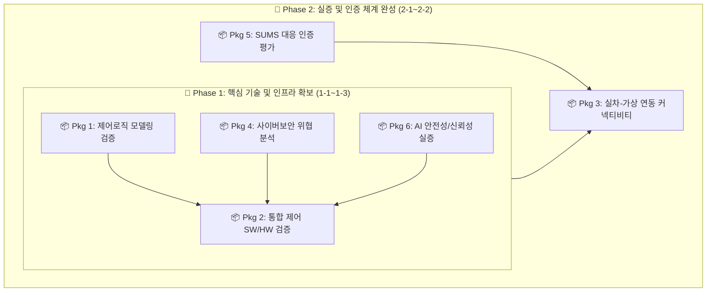

# 자율 작업형 건설기계 통합 제어기 평가 인프라 구축 계획 (v2)

> **버전**: v2.0 (2단계 5개년 체계 반영)  
> **작성일**: 2026.01.08  
> **주요 변경**: 장비비 80억 고정, 공용시설 예산 제외, 2단계 5개년(1-1~2-2) 로드맵 개편, 패키지별 적용 표준 명시

---

## 1. 추진 전략 변경

### 1.1 기존 접근법 vs v2 개선 접근법

| 구분 | 기존 접근법 | v2 개선 접근법 |
|:---|:---|:---|
| **구성 방식** | 개별 장비 16종 분산 구축 | **6종 통합 패키지 시스템** |
| **연차 체계** | 1~5차년도 단일 단계 | **2단계 5개년** (Phase 1: 1-1~1-3, Phase 2: 2-1~2-2) |
| **구축 일정** | 1~5차년도 분산 | **1-1~1-3차 집중 구축** (조기 성과 도출) |
| **장비비** | 93억원 | **80억원** (순수 패키지 구축비 집중) |
| **공용 시설** | 장비비 포함 | **장비비 제외** (인프라 조성비 별도 관리) |
| **검증 관점** | 장비 단위 기능 검증 | **시스템 레벨 통합 검증** |

### 1.2 통합 시스템 구축의 장점
```
[기존: 개별 장비 중심]              [개선: 통합 시스템 중심]
A1, A2, A3, A4, A5, A6...           Package 1~6 통합 시스템
     ↓                                    ↓
장비 간 인터페이스 복잡              통합 데이터 흐름
중복 투자 발생                      시설/SW 공유로 비용 절감
개별 운영 비효율                    원스톱 검증 서비스 가능
```

---

## 2. 6종 통합 패키지 시스템 구성

### 2.1 통합 구성도 (2단계 연계)



### 2.2 인프라 구축 계획 표 (6종 통합 패키지)

| 패키지 | 시설·장비명(S/W) | 활용용도 (업체지원 수요 내용) | 구축 시기 | 비용(백만) | 적용 표준 |
|:---:|:---|:---|:---:|---:|:---|
| **Pkg 1** | **제어로직 모델링 검증 시스템**<br>(A1 MIL/SILS) | • (부품사) **PC 기반** 핵심 부품 제어 로직 검증 (실시간 HW 불필요)<br>• (완성차) 무인 굴착기/지게차 VCU 로직·SW아키텍처 검증<br>• **MIL/SILS**: dSPACE VEOS 가상 ECU + MATLAB/Simulink 모델링 | 1-1~1-2차 | 1,600 | ISO 19014, IEC 61508 |
| **Pkg 2** | **통합 제어 SW/HW 시나리오 검증 시스템**<br>(A2+A3+A4 통합) | • (부품사/완성차) **SW 코드분석→ECU 통합→시나리오 기반 검증** 파이프라인<br>• **A3 HILS**: dSPACE SCALEXIO + ECU 연결<br>• **A4 시나리오**: CARLA 3D 환경 연동, LiDAR/Camera 시뮬레이션 | 1-2~1-3차 | 2,800 | ISO 26262, MISRA-C/C++ |
| **Pkg 3** | **실차-가상 연동 커넥티비티 평가 시스템**<br>(A5+A6+B6 통합) | • (완성차) 실차+가상환경 연동 통합 검증<br>• **A5 VILS**: GPS 스푸핑, 5G 통신 지연 등 위험 상황 재현<br>• **B6 커넥티비티**: 5G/LTE 프로토콜 분석, IDS 이상탐지 | 2-1~2-2차 | 1,450 | UN R155, ISO 21434 |
| **Pkg 4** | **전주기 사이버보안 위협 분석 시스템**<br>(B1~B4 통합) | • (완성차/부품사) **설계→구현→검증→운영** 전주기 사이버보안 검증<br>• **B1 TARA**: 위협 분석 / **B3 침투테스트**: CAN/Ethernet 퍼징 | 1-2차 | 950 | NIST SP 800-115 |
| **Pkg 5** | **SUMS 대응 인증 평가 시스템**<br>(B5 SUMS) | • (완성차/부품사) **UN R156 SUMS 인증** 대응 지원<br>• **OTA 보안 검증**: 업데이트 무결성, 롤백 기능 검증 | 2-1차 | 350 | UN R156, ISO 24089 |
| **Pkg 6** | **AI 안전성/신뢰성 실증 시스템**<br>(C1~C3 통합) | • (완성차/부품사) **EU AI Act** 대응 AI 모델 안전성 검증<br>• **C1 XAI**: 설명가능성 / **C2 적대적 공격**: LiDAR 공격/Patch 생성 | 1-3차 | 850 | EU AI Act, ISO 42001 |
| | **장비비 합계** | | | **8,000** | |

---

## 3. 예산 요약 및 집행 계획

### 3.1 전체 사업비 구성 (단위: 백만원)

| 구분 | 1-1차 | 1-2차 | 1-3차 | 2-1차 | 2-2차 | 합계 | 비율 |
|:---|---:|---:|---:|---:|---:|---:|---:|
| **장비비** | 800 | 3,150 | 2,250 | 1,075 | 725 | **8,000** | 53.3% |
| **활동/운영비** | 500 | 500 | 500 | 500 | 500 | **2,500** | 16.7% |
| **인건비** | 700 | 700 | 700 | 700 | 700 | **3,500** | 23.3% |
| **재료비** | 50 | 50 | 50 | 50 | 50 | **250** | 1.7% |
| **간접비** | 150 | 150 | 150 | 150 | 150 | **750** | 5.0% |
| **합계** | **2,200** | **4,550** | **3,650** | **2,475** | **2,125** | **15,000** | 100% |

### 3.2 패키지별 연차 장비비 배분표 (단위: 백만원)

| 패키지 | 1-1차 | 1-2차 | 1-3차 | 2-1차 | 2-2차 | 합계 | 비고 |
|:---|---:|---:|---:|---:|---:|---:|:---|
| **Pkg 1** | 800 | 800 | - | - | - | **1,600** | |
| **Pkg 2** | - | 1,400 | 1,400 | - | - | **2,800** | |
| **Pkg 3** | - | - | - | 725 | 725 | **1,450** | |
| **Pkg 4** | - | 950 | - | - | - | **950** | |
| **Pkg 5** | - | - | - | 350 | - | **350** | |
| **Pkg 6** | - | - | 850 | - | - | **850** | |
| **소계** | **800** | **3,150** | **2,250** | **1,075** | **725** | **8,000** | |

---

## 4. 글로벌 규제 대응 매핑

| Package | EU MR | ISO 19014 | ISO 21434 | EU CRA | EU AI Act | UN R155/156 |
|:---:|:---:|:---:|:---:|:---:|:---:|:---:|
| **1** | ✅ | ✅ | - | - | - | - |
| **2** | ✅ | ✅ | ✅ | - | ✅ | - |
| **3** | ✅ | ✅ | ✅ | ✅ | ✅ | ✅ |
| **4** | - | - | ✅ | ✅ | - | ✅ |
| **5** | - | - | ✅ | ✅ | - | ✅ |
| **6** | ✅ | - | - | - | ✅ | - |

---

## 5. 건설기계 모델 확보 전략

### 5.1 범용 모듈형 시뮬레이션 환경
*   **문제점**: 기종별(굴착기, 로더, 지게차 등) 개별 개발은 비용/시간 비효율.
*   **해결 전략**: 유압, 구동계, 작업기 서브시스템을 모듈화하여 라이브러리화.
*   **확보 방안**: 자체 개발(핵심) + 업체 협업(파라미터) 병행.

---

## 6. 기대 효과

### 6.1 정량적 효과
*   **지원 기업 수**: 연간 30개사 이상.
*   **검증 건수**: 연간 100건 이상.
*   **인증 지원**: 5년간 50건 이상.

### 6.2 정성적 효과
*   **글로벌 규제 선제 대응**: EU MR, AI Act 등 발효 전 인프라 확보를 통한 수출 장벽 해소.
*   **기술 자립**: 건설기계 특화 시뮬레이션 및 보안 검증 기술의 국산화.

---

*문서 끝*
