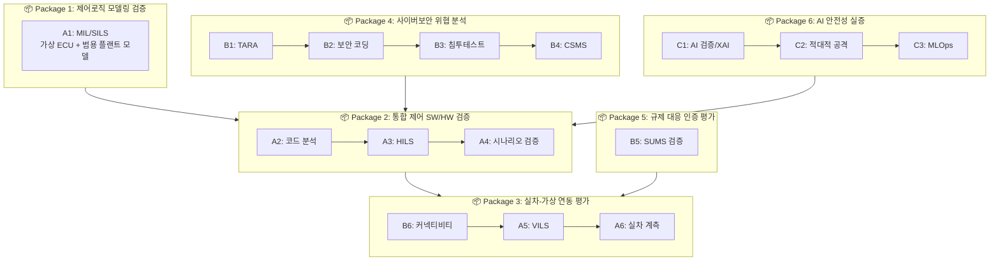

# 자율 작업형 건설기계 통합 제어기 평가 인프라 구축 계획

> **버전**: v3.0 (피드백 반영)  
> **작성일**: 2026.01.07  
> **주요 변경**: 6종 통합 패키지 시스템으로 재구성, 장비비 90억 조정, 2~4차년도 집중 구축

---

## 1. 추진 전략 변경

### 1.1 기존 접근법 vs 개선 접근법

| 구분 | 기존 접근법 | 개선 접근법 |
|:---|:---|:---|
| **구성 방식** | 개별 장비 16종 분산 구축 | **6종 통합 패키지 시스템** |
| **검증 관점** | 장비 단위 기능 검증 | **시스템 레벨 통합 검증** |
| **구축 일정** | 1~5차년도 분산 | **2~4차년도 집중** (3년 집중 구축) |
| **장비비** | 93억원 | **90억원** (통합 효율화) |
| **기종 대응** | 개별 기종별 모델 | **범용 모듈형 시뮬레이션** |

### 1.2 통합 시스템 구축의 장점

```
[기존: 개별 장비 중심]              [개선: 통합 시스템 중심]
A1, A2, A3, A4, A5, A6...           Package 1~6 통합 시스템
     ↓                                    ↓
장비 간 인터페이스 복잡              통합 데이터 흐름
중복 투자 발생                      시설/SW 공유로 비용 절감
개별 운영 비효율                    원스톱 검증 서비스 가능
```

---

## 2. 6종 통합 패키지 시스템 구성

### 2.1 통합 구성도



### 2.2 인프라 구축 계획 표 (6종 통합 패키지)

| 구분 | 시설·장비명(S/W) | 활용용도 (업체지원 수요 내용) | 1차 | 2차 | 3차 | 4차 | 5차 | 비용 | 유형 |
|:---:|:---|:---|:---:|:---:|:---:|:---:|:---:|---:|:---:|
| **Pkg1** | **제어로직 모델링 검증 시스템**<br>(A1 MIL/SILS) | • (부품사) **PC 기반** 핵심 부품 제어 로직 검증 (실시간 HW 불필요)<br>• (완성차) 무인 굴착기/지게차 VCU 로직·SW아키텍처 검증<br>• **MIL/SILS**: dSPACE VEOS 가상 ECU + MATLAB/Simulink 모델링<br>• **범용 모듈형 시뮬레이션**: 유압/구동/작업기 서브시스템 라이브러리<br>• **건설기계 특화**: 유압 제어 알고리즘, 작업기(붐·암·버킷) 동작 로직<br>• ※ SCALEXIO는 A3 HILS 단계에서 사용<br>• **적용표준**: ISO 19014 Part 1~4, IEC 61508 | | ○ | | | | 1,300 | 신규구축 |
| **Pkg2** | **통합 제어 SW/HW 시나리오 검증 시스템**<br>(A2+A3+A4 통합) | • (부품사/완성차) **SW 코드분석→ECU 통합→시나리오 기반 검증** 파이프라인<br>• **A2 코드검증 (PC)**: MISRA-C/C++ 준수율, MC/DC coverage, 보안 취약점 정적분석<br>• **A3 HILS (ECU 실물)**: **dSPACE SCALEXIO** + ECU 연결, CAN J1939/Automotive Ethernet<br>• **A4 시나리오 (ECU+센서)**: 토공작업(굴착·적재·운반), 장애물 회피, 작업자 감지, 경사지 안정성<br>• **A4 3D 환경**: **CARLA (오픈소스)** 활용, LiDAR/Camera 시뮬 내장 (별도 구매 불필요)<br>• ※ LGSVL 2022년 지원 종료 → CARLA 단일화<br>• **도구예시**: 슈어소프트테크 STATIC, COVER, CT, FIT, AUTOSIM<br>• **Fault Injection**: 센서 단선/단락, 통신 장애 시 Fail-safe 동작 확인<br>• ※ **모델 연계**: A3/A4 유압 시뮬레이션은 **A1 범용 플랜트 모델 재사용** (SW 중복 개발 없음) | | ○ | ○ | | | 2,280 | 신규구축 |
| **Pkg3** | **실차-가상 연동 커넥티비티 평가 인프라**<br>(A5+A6+B6 통합) | • (완성차) 실차+가상환경 연동 통합 검증<br>• **A5 VILS (위험상황)**: GPS 스푸핑, 5G 통신 지연, 작업자 급출현, 센서 고장, 사이버 공격 시나리오<br>• **A6 실차시험장 (정상동작)**: 경사 주행, 토사 굴착, 적재/운반, 연약지반 주행성<br>• **B6 커넥티비티**: 5G/LTE 통신 분석, V2X 시뮬레이션, IDS/IPS 이상탐지<br>• **실차 계측**: GPS RTK (Trimble R12i), IMU, 유압 센서, 버킷 하중 센서<br>• **보안 로그 수집**: EU MR 요구 5년 보관 | | | ○ | ○ | | 1,170 | 신규구축 |
| **Pkg4** | **전주기 사이버보안 위협 분석 체계**<br>(B1~B4 통합) | • (완성차/부품사) **설계→구현→검증→운영** 전주기 사이버보안 검증<br>• **B1 TARA**: itemis SECURE, STRIDE 방법론, Attack Tree, CVSS 위험평가<br>• **B2 보안코딩**: CWE/CERT 규칙, 슈어소프트테크 STATIC Security (A2와 연계)<br>• **B3 침투테스트**: CAN/Ethernet 퍼징, ECU 펌웨어 역공학, GPS 스푸핑 테스트<br>• **B4 CSMS**: UN R155 인증 지원, 보안관리체계 구축, 공급망 보안 평가<br>• **건설기계 특화**: 원격제어 명령 탈취/변조, 텔레매틱스 보안, OTA 악성코드 삽입 | | ○ | ○ | | | 775 | 신규구축 |
| **Pkg5** | **국제 규제 대응 인증 평가 도구**<br>(B5 SUMS) | • (완성차/부품사) **UN R156 SUMS 인증** 대응 지원<br>• **OTA 보안 검증**: 업데이트 무결성(서명/암호화), 롤백 기능, 이력 관리(5년)<br>• **EU CRA 적합성 평가** 문서화 지원<br>• **건설기계 특화**: 필드 장비 OTA 환경(저대역폭, 불안정 네트워크) 검증 | | | | ○ | | 280 | 신규구축 |
| **Pkg6** | **신뢰할 수 있는 AI 안전성 실증 설비**<br>(C1~C3 통합) | • (완성차/부품사) **EU AI Act** 대응 AI 모델 안전성 검증<br>• **C1 XAI (PC/GPU)**: 객체 인식 정확도(mAP, IoU), 설명가능성 레포트<br>• **C2 적대적 공격 (PC+ECU)**: Adversarial Patch, LiDAR 스푸핑, 오분류 테스트<br>• **C3 MLOps (ECU+Cloud)**: 모델 버전 관리, 성능 드리프트 탐지<br>• **건설기계 특화**: 먼지/분진, 강한 진동, 저조도/역광 환경 검증 | | | ○ | ○ | | 650 | 신규구축 |
| | **공용 시설** | • 통합 시험실 (전력/UPS 50kVA, 냉각, 네트워크)<br>• 고속 네트워크 (10G 스위치, 방화벽)<br>• 물리 보안 (출입통제, CCTV) | ○ | ○ | | | | 425 | 시설공유 |
| | **장비비 합계** | | | | | | | **6,880** | |

**예산 요약 (단위: 백만원)**

| 구분 | 1차년도 | 2차년도 | 3차년도 | 4차년도 | 5차년도 | 합계 |
|:---|---:|---:|---:|---:|---:|---:|
| **장비비** | 100 | 3,500 | 2,000 | 2,300 | 100 | **8,000** |
| **기술개발비** | 900 | 900 | 900 | 900 | 900 | **4,500** |
| **운영비** | 100 | 300 | 300 | 400 | 400 | **1,500** |
| **예비비** | - | - | - | 500 | 500 | **1,000** |
| **연간 합계** | **1,100** | **4,700** | **3,200** | **4,100** | **1,900** | **15,000** |

> ※ 총 사업비: 150억원 (국비 100억원 + 지방비 50억원)  
> ※ 구성: 장비비 90억(60%) + 기술개발비 45억(30%) + 운영비 15억(10%)  
> ※ 장비비 중 기술개발비로 전환분 포함 (범용 모델 개발)

---

## 3. 글로벌 규제 대응 매핑

### 3.1 패키지별 규제 대응표

| Package | EU MR<br>(2023/1230) | ISO 19014<br>(기능안전) | ISO/SAE 21434<br>(사이버보안) | EU CRA<br>(사이버복원력) | EU AI Act<br>(2024/1689) | UN R155/R156 |
|:---:|:---:|:---:|:---:|:---:|:---:|:---:|
| **1** | ✅ | ✅ | - | - | - | - |
| **2** | ✅ | ✅ | ✅ | - | ✅ | - |
| **3** | ✅ | ✅ | ✅ | ✅ | ✅ | ✅ |
| **4** | - | - | ✅ | ✅ | - | ✅ |
| **5** | - | - | ✅ | ✅ | - | ✅ |
| **6** | ✅ | - | - | - | ✅ | - |

### 3.2 규제 발효 일정과 구축 연계

```
2026 ─────── 2027.1.20 ──────── 2027.8 ──────── 2028
  │            │                  │               │
  │         EU MR 발효         EU AI Act        EU CRA
  │            │               단계적 발효       완전 발효
  │            │                  │               │
  ▼            ▼                  ▼               ▼
┌─────────────────────────────────────────────────────┐
│ 2차년도(2027): Package 1, 2, 4 구축 완료            │
│ 3차년도(2028): Package 3, 6 구축 완료               │
│ 4차년도(2029): Package 5 + 전체 통합 운영           │
└─────────────────────────────────────────────────────┘
```

---

## 4. 건설기계 모델 확보 전략

### 4.1 다기종 대응의 문제점

| 기종 | 작업기 구조 | 유압 시스템 | 주행 방식 | 모델 복잡도 |
|:---|:---|:---|:---|:---:|
| 굴착기 | 붐-암-버킷 (3관절) | 복합 유압 | 크롤러/휠 | ★★★ |
| 휠로더 | 버킷 (1관절) | 단순 유압 | 휠+관절조향 | ★★ |
| 지게차 | 포크-마스트 | 단순 유압 | 휠+후륜조향 | ★★ |
| 도저 | 블레이드 | 복합 유압 | 크롤러 | ★★☆ |

→ **모든 기종 개발은 비용/시간 비효율**

### 4.2 해결 전략: 범용 모듈형 시뮬레이션 환경

```
┌───────────────────────────────────────────────────────────┐
│           범용 건설기계 모델 라이브러리 (신규 개발)          │
├─────────────────┬─────────────────┬───────────────────────┤
│  유압 서브시스템  │  구동계 서브시스템 │  작업기 서브시스템    │
│  (공통 모듈)     │  (공통 모듈)      │  (기종별 모듈)       │
├─────────────────┼─────────────────┼───────────────────────┤
│ • 가변용량 펌프   │ • 크롤러 모듈    │ • 굴착기 붐-암-버킷   │
│ • 비례제어 밸브   │ • 휠 구동 모듈   │ • 로더 버킷          │
│ • 유압 실린더    │ • 조향 모듈      │ • (추가 확장 가능)    │
│ • 유압 회로      │ • 제동 모듈      │                      │
└─────────────────┴─────────────────┴───────────────────────┘
                           │
                           ▼
┌───────────────────────────────────────────────────────────┐
│              모듈 조합으로 다양한 기종 구성                 │
├─────────────────┬─────────────────┬───────────────────────┤
│   굴착기 모델    │   휠로더 모델    │   추가 기종 (3차~)    │
│  (1차년도)      │  (2차년도)      │   업체 요청 시        │
└─────────────────┴─────────────────┴───────────────────────┘
```

### 4.3 확보 방안

| 방안 | 내용 | 장점 | 단점 |
|:---|:---|:---|:---|
| **자체 개발** | 범용 모듈형 라이브러리 개발 | 건설기계 특화, 유연성 | 개발 비용/시간 |
| **상용 도구 활용** | dSPACE ASM, IPG 연동 | 검증된 품질 | 건설기계 미지원 |
| **산학 협력** | 대학/연구소 모델 활용 | 전문성, 비용 절감 | 품질 편차 |
| **업체 협업** | 완성차 모델 데이터 제공 | 정확도 높음 | 업체 협조 필요 |

→ **권장: 자체 개발(핵심) + 업체 협업(파라미터) 병행**

---

## 5. 연차별 구축 로드맵

### 5.1 집중 구축 일정 (2~4차년도)

| 연차 | 구축 패키지 | 주요 활동 | 장비비 |
|:---:|:---|:---|---:|
| **1차 (2026)** | - | 설계, 조달 준비, 시설 기반 | 100 |
| **2차 (2027)** | **Package 1, 2, 4** | 핵심 검증 시스템 구축 | 3,900 |
| **3차 (2028)** | **Package 3, 6** | 실차 연동 + AI 검증 | 2,350 |
| **4차 (2029)** | **Package 5 + 통합** | 인증 도구 + 전체 통합 | 2,550 |
| **5차 (2030)** | - | 고도화, 안정화 운영 | 100 |
| | **합계** | | **9,000** |

### 5.2 Gantt 차트

```
        1차(2026)  2차(2027)  3차(2028)  4차(2029)  5차(2030)
         Q1-Q4      Q1-Q4      Q1-Q4      Q1-Q4      Q1-Q4
─────────────────────────────────────────────────────────────
Pkg 1    [설계]    ████████
Pkg 2    [설계]    ████████████████
Pkg 3              [설계]     ████████████
Pkg 4    [설계]    ████████
Pkg 5                         [설계]     ████████
Pkg 6                         ████████████
통합                                     ████████   [고도화]
─────────────────────────────────────────────────────────────
장비비    100       3,900      2,350      2,550      100
```

---

## 6. 비용 절감 효과

### 6.1 통합 구축에 따른 절감

| 항목 | 기존 (개별) | 개선 (통합) | 절감액 | 절감 근거 |
|:---|---:|---:|---:|:---|
| 시험실 시설 | 600 | 400 | 200 | 공용 시험실 (3→1개) |
| SW 라이선스 | 800 | 650 | 150 | 통합 라이선스 계약 |
| I/O 인터페이스 | 400 | 300 | 100 | 공유 I/O 랙 |
| 설치/시운전 | 200 | 150 | 50 | 통합 설치 |
| **합계** | 2,000 | 1,500 | **500** | |

### 6.2 예산 조정 결과

| 구분 | 기존 | 개선 | 변화 |
|:---|---:|---:|:---:|
| **장비비** | 9,300 | 9,000 | ▼300 |
| 기술개발비 | 4,500 | 4,500 | - |
| 운영비 | 1,500 | 1,500 | - |
| **총 사업비** | 15,300 | **15,000** | ▼300 |

---

## 7. 기대 효과

### 7.1 정량적 효과

| 지표 | 목표 |
|:---|:---|
| 지원 기업 수 | 연간 30개사 이상 |
| 검증 건수 | 연간 100건 이상 |
| 인증 지원 | 5년간 50건 이상 |
| 고용 창출 | 상주 인력 15명 이상 |

### 7.2 정성적 효과

- **글로벌 규제 대응**: EU MR, CRA, AI Act 발효 전 인프라 확보
- **국내 최초**: 건설기계 분야 통합 안전성 검증 인프라
- **중소기업 지원**: 원스톱 검증 서비스로 진입장벽 완화
- **기술 자립**: 건설기계 특화 플랜트 모델 국산화

---

*문서 끝*
