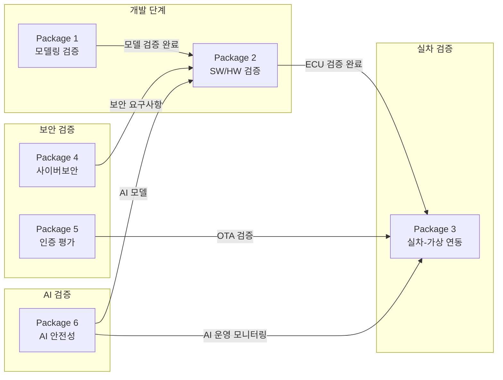

# 자율 작업형 건설기계 통합 제어기 평가 인프라 - 상세 설명서

> **버전**: v3.1 (C2 개발 항목 추가)  
> **작성일**: 2026.01.08  
> **대상 독자**: 비기술자, 기획 담당자, PD, 평가위원

---

## 📖 문서 개요

본 문서는 6종 통합 패키지 시스템의 **상세 사양, 기능, 활용 용도**를 설명합니다.

---

# 📦 Package 1: 제어로직 모델링 검증 시스템

## 1.1 시스템 개요

| 항목 | 내용 |
|:---|:---|
| **구성 장비** | A1 (MIL/SILS) |
| **핵심 기능** | 제어 알고리즘의 가상 환경 검증 |
| **검증 레벨** | **PC 기반** (소프트웨어 레벨, 실시간 HW 불필요) |
| **적용 표준** | ISO 19014, IEC 61508 |
| **예산** | 1,500백만원 |
| **구축 연차** | 1-1~1-2차 (2026~2027) |

## 1.2 시스템 구성도

```
┌──────────────────────────────────────────────────────────────┐
│                 Package 1: 제어로직 모델링 검증               │
├──────────────────────────────────────────────────────────────┤
│  ┌─────────────┐    ┌─────────────┐    ┌─────────────┐      │
│  │  모델링 도구  │ →  │  코드 생성   │ →  │  가상 ECU   │      │
│  │ (Simulink)  │    │ (TargetLink)│    │  (VEOS)    │      │
│  └─────────────┘    └─────────────┘    └─────────────┘      │
│         ↑                                     ↓              │
│  ┌──────────────────────────────────────────────────┐       │
│  │         범용 건설기계 플랜트 모델 라이브러리         │       │
│  │  ┌────────┐  ┌────────┐  ┌────────┐  ┌────────┐ │       │
│  │  │유압 모듈│  │구동 모듈│  │작업기  │  │센서 모듈│ │       │
│  │  └────────┘  └────────┘  └────────┘  └────────┘ │       │
│  └──────────────────────────────────────────────────┘       │
└──────────────────────────────────────────────────────────────┘
```

## 1.3 범용 모듈형 시뮬레이션 환경

### 문제 인식
- 건설기계는 굴착기, 휠로더, 지게차, 도저 등 기종이 다양
- 각 기종별 유압 시스템, 작업기 구조, 주행 방식이 상이
- 모든 기종을 개별 개발하면 비용/시간 비효율

### 해결 방안: 모듈형 아키텍처

```
┌───────────────────────────────────────────────────────────────┐
│                   모듈형 플랜트 모델 라이브러리                  │
├───────────────────┬───────────────────┬───────────────────────┤
│   유압 서브시스템   │   구동계 서브시스템  │   작업기 서브시스템    │
├───────────────────┼───────────────────┼───────────────────────┤
│ [HYD-001]         │ [DRV-001]         │ [WRK-001]             │
│ 가변용량 펌프      │ 크롤러 구동        │ 굴착기 붐-암-버킷      │
│ (파라미터 조정)    │ (속도/토크)        │ (3관절 기구학)        │
├───────────────────┼───────────────────┼───────────────────────┤
│ [HYD-002]         │ [DRV-002]         │ [WRK-002]             │
│ 비례제어 밸브      │ 휠 구동           │ 로더 버킷             │
│ (개도-유량)        │ (4WD/2WD)         │ (1관절)               │
├───────────────────┼───────────────────┼───────────────────────┤
│ [HYD-003]         │ [DRV-003]         │ [WRK-003]             │
│ 유압 실린더       │ 조향 시스템        │ 지게차 마스트          │
│ (힘-변위)         │ (관절/휠 조향)     │ (승강)                │
├───────────────────┼───────────────────┼───────────────────────┤
│ [HYD-004]         │ [DRV-004]         │ [확장 슬롯]            │
│ 유압 회로         │ 제동 시스템        │ 업체 요청 시 추가      │
└───────────────────┴───────────────────┴───────────────────────┘
```

### 기종별 모델 구성 예시

| 기종 | 유압 모듈 | 구동 모듈 | 작업기 모듈 | 구축 시기 |
|:---|:---|:---|:---|:---:|
| **굴착기** | HYD-001~004 | DRV-001, 003, 004 | WRK-001 | 1-1차 |
| **휠로더** | HYD-001~003 | DRV-002, 003, 004 | WRK-002 | 1-2차 |
| **지게차** | HYD-002, 003 | DRV-002, 003, 004 | WRK-003 | 2-1차 |

## 1.4 활용 시나리오

### 시나리오 1: 부품사 유압 펌프 제어 알고리즘 검증

```
[부품사 A]                         [Package 1 인프라]
                                   
"펌프 용량 제어 알고리즘"  ───────→  범용 유압 시스템 모델
     (Simulink 모델)                     │
          ↑                              ▼
          │                        가상 시뮬레이션
          │                              │
          └──────────────────────── 결과 피드백
                                   (압력, 유량 응답)
```

### 시나리오 2: 완성차 VCU 로직 사전 검증

```
[완성차 B]                         [Package 1 인프라]

"무인 굴착기 VCU 로직"   ───────→   굴착기 통합 모델
   (C 소스코드)                   (유압+구동+작업기)
        │                              │
        ▼                              ▼
   자동 코드 생성            가상 ECU + 플랜트 연동
   (TargetLink)                        │
        │                              ▼
        └───────────────────→    MIL/SILS 검증
                                  (100+ 시나리오)
```

## 1.5 주요 장비 사양

> **MIL/SILS 특성**: PC 기반 가상 시뮬레이션 (실시간 HW 불필요)

| 구분 | 품목 | 사양 | 수량 | 비고 |
|:---|:---|:---|---:|:---|
| HW | 모델링 워크스테이션 | 128GB RAM, RTX4090, i9-14900K | 10 | 모델 개발/실행 |
| SW | 모델링 도구 | MATLAB/Simulink R2024b | 5 라이선스 | 제어 로직 모델링 |
| SW | 코드 생성기 | dSPACE TargetLink 5.x | 4 라이선스 | 자동 코드 생성 |
| SW | 가상 ECU 플랫폼 | dSPACE VEOS 4.x | 4 라이선스 | **PC 기반** 가상 ECU |
| SW | 가상 CAN 통신 | CANoe (Vector) | 2 라이선스 | J1939 가상 검증 |
| 개발 | 플랜트 모델 | 범용 모듈형 라이브러리 | 1식 | **핵심 개발** |

> ⚠️ **참고**: 실시간 HW(dSPACE SCALEXIO)는 A3 HILS 단계에서 사용

---

# 📦 Package 2: 통합 제어 SW/HW 시나리오 검증 시스템

## 2.1 시스템 개요

| 항목 | 내용 |
|:---|:---|
| **구성 장비** | A2 (코드분석) + A3 (HILS) + A4 (시나리오) |
| **핵심 기능** | SW 코드 품질 → ECU 통합 → 시나리오 기반 검증 파이프라인 |
| **검증 레벨** | PC(A2) → **ECU 실물**(A3) → ECU+센서(A4) |
| **적용 표준** | ISO 26262(기능안전), MISRA-C(코딩규격) |
| **예산** | 2,980백만원 |
| **구축 연차** | 1-2~1-3차 (2027~2028) |
| **모델 연계** | A1의 범용 플랜트 모델을 A3/A4에서 재사용 |

## 2.2 시스템 구성도

```
┌───────────────────────────────────────────────────────────────────┐
│              Package 2: 통합 제어 SW/HW 시나리오 검증              │
├───────────────────────────────────────────────────────────────────┤
│                                                                    │
│  ┌─────────────┐    ┌─────────────┐    ┌─────────────────────┐   │
│  │ A2: 코드분석 │ →  │ A3: HILS    │ →  │ A4: 시나리오 검증    │   │
│  │             │    │             │    │                     │   │
│  │ • 정적분석   │    │ • ECU 연결  │    │ • 가상 센서         │   │
│  │ • 커버리지   │    │ • I/O 테스트│    │ • 작업 시나리오     │   │
│  │ • 단위테스트 │    │ • Fault Inj │    │ • AI 동작 검증      │   │
│  └─────────────┘    └─────────────┘    └─────────────────────┘   │
│         │                  │                    │                 │
│         ▼                  ▼                    ▼                 │
│  ┌─────────────────────────────────────────────────────────────┐ │
│  │              통합 테스트 관리 플랫폼 (CI/CD 연동)             │ │
│  └─────────────────────────────────────────────────────────────┘ │
└───────────────────────────────────────────────────────────────────┘
```

## 2.3 A1 → A3 모델 재사용 구조

> **핵심**: A3 HILS의 유압 시뮬레이션은 A1에서 개발한 범용 플랜트 모델을 재사용합니다.

```
┌──────────────────────────────────────────────────────────────────┐
│  [Package 1: A1]                 [Package 2: A3]                 │
│       │                               │                          │
│  범용 플랜트 모델 개발          ──재사용──→  SCALEXIO에서 실시간 실행   │
│  (유압/구동/작업기 SW 모델)              │                          │
│       │                               ▼                          │
│       │                     ┌─────────────────────┐             │
│       │                     │ 유압 부하 시뮬레이터 │             │
│       │                     │ (전자식 부하 박스)   │             │
│       │                     │   = HW only        │             │
│       │                     └─────────────────────┘             │
│       │                               │                          │
│       │                          ECU ↔ I/O 연결                  │
└──────────────────────────────────────────────────────────────────┘
```

| 항목 | A1 (MIL/SILS) | A3 (HILS) |
|:---|:---|:---|
| **유압 모델 SW** | 개발 (400백만원) | **재사용** (추가 비용 없음) |
| **부하 시뮬레이터** | 불필요 (PC 내부 계산) | **HW 구매** (100백만원) |
| **실행 환경** | 가상 ECU (VEOS) | 실제 ECU + SCALEXIO |

## 2.4 단계별 검증 흐름

```
[STEP 1: A2 코드분석]       [STEP 2: A3 HILS]        [STEP 3: A4 시나리오]
         │                        │                         │
    소스코드 입력              ECU 연결                 가상 환경 연동
         │                        │                         │
    ┌────┴────┐            ┌────┴────┐              ┌────┴────┐
    │정적분석  │            │통신검증  │              │센서시뮬  │
    │MISRA-C  │            │J1939/ETH│              │LiDAR/CAM│
    └────┬────┘            └────┬────┘              └────┬────┘
         │                        │                         │
    ┌────┴────┐            ┌────┴────┐              ┌────┴────┐
    │커버리지  │            │Fault Inj│              │시나리오  │
    │MC/DC   │            │센서단선  │              │토공작업  │
    └────┬────┘            └────┬────┘              └────┬────┘
         │                        │                         │
         ▼                        ▼                         ▼
    [코드 품질 OK?]          [ECU 동작 OK?]           [안전 동작 OK?]
```

## 2.4 활용 시나리오

### 시나리오 3: 부품사 ECU 통합 검증

```
[부품사 C]                    [Package 2 인프라]

ECU (제어기 HW)  ─────────→   A3 HILS 연결
ECU 소스코드    ─────────→   A2 코드분석
                                   │
                             ┌─────┴─────┐
                             │ 통합 검증  │
                             │ 파이프라인 │
                             └─────┬─────┘
                                   │
                             ┌─────┴─────┐
                             ▼           ▼
                        [코드 품질]  [ECU 동작]
                        리포트       리포트
```

### 시나리오 4: 자율작업 시나리오 검증

```
[완성차 D]                    [Package 2 인프라]

VCU + 인지 ECU  ─────────→   A4 시나리오 검증
                                   │
                             ┌─────┴─────┐
                             │ 가상 센서  │
                             │ LiDAR/CAM │
                             └─────┬─────┘
                                   │
                    ┌──────────────┼──────────────┐
                    ▼              ▼              ▼
              [장애물 회피]   [작업자 감지]   [비상정지]
               시나리오        시나리오        시나리오
```

## 2.5 주요 장비 사양

| 모듈 | 품목 | 사양 | 수량 | 비고 |
|:---|:---|:---|---:|:---|
| **A2** | 정적분석 | 슈어소프트테크 STATIC v7.x | 6 | MISRA-C:2012/CWE |
| A2 | 커버리지 | 슈어소프트테크 COVER v5.x | 6 | MC/DC 100% |
| A2 | 테스트 자동화 | 슈어소프트테크 CT v4.x | 6 | 단위/통합 테스트 |
| A2 | 분석 서버 | Dell PowerEdge (32코어, 128GB) | 4 | CI/CD 연동 |
| **A3** | **HILS 시뮬레이터** | **dSPACE SCALEXIO LabBox** | 2 | **ECU 실물 연결** |
| A3 | I/O 보드 세트 | DS2655(CAN), DS2680(Ethernet) | 12 | J1939+100BASE-T1 |
| A3 | 유압 부하 시뮬레이터 | 전자식 부하 박스 (16ch) | 2 | **HW only** ※A1 모델 재사용 |
| A3 | Fault Injection | 슈어소프트테크 FIT v3.x | 3 | 센서 단선/단락 |
| **A4** | GPU 서버 | Dell PowerEdge + NVIDIA A100 80GB ×4 | 3 | 센서 시뮬/AI |
| A4 | 3D 환경 엔진 | **CARLA (오픈소스)** | 1 | ※ LiDAR/Camera 내장 |
| A4 | 시나리오 도구 | 슈어소프트테크 AUTOSIM | 3 | 토공작업 시나리오 |
| A4 | 건설현장 맵 | CARLA 커스텀 환경 | 1식 | 굴착/건설 현장 모델 |

> ⚠️ **CARLA 센서 시뮬레이션 (별도 구매 불필요)**:
> - LiDAR: Velodyne VLP-16/32, Ouster OS1 에뮬레이션 (포인트클라우드 생성)
> - Camera: RGB/Depth/Semantic Segmentation 카메라
> - Radar: 2D/3D 레이더 시뮬레이션
> - ※ LGSVL은 2022년 1월 지원 종료 → CARLA 단일화

---

# 📦 Package 3: 실차-가상 연동 커넥티비티 평가 시스템

## 3.1 시스템 개요

| 항목 | 내용 |
|:---|:---|
| **구성 장비** | A5 (VILS) + A6 (실차 계측) + B6 (커넥티비티) |
| **핵심 기능** | 실차에 ECU 장착 후 가상 환경 연동 + 5G/LTE 통신 보안 검증 |
| **검증 레벨** | 실차 + 가상 환경 |
| **적용 표준** | ISO 15143-3(데이터 통신), UN R155/156 |
| **예산** | 1,410백만원 |
| **구축 연차** | 2-1~2-2차 (2029~2030) |

## 3.2 시스템 구성도

```
┌───────────────────────────────────────────────────────────────────┐
│           Package 3: 실차-가상 연동 커넥티비티 평가 시스템           │
├───────────────────────────────────────────────────────────────────┤
│                                                                    │
│  ┌──────────────────┐         ┌──────────────────────────────┐   │
│  │    실제 굴착기    │ ←─────→ │      가상 외부 환경           │   │
│  │   (ECU 장착)     │         │  • 가상 지형 (경사/연약)      │   │
│  │                  │         │  • 가상 장애물 (작업자)       │   │
│  │  ┌────────────┐  │         │  • 통신 시뮬레이션 (5G 지연)  │   │
│  │  │MicroAutoBox│  │         └──────────────────────────────┘   │
│  │  └────────────┘  │                      │                      │
│  └──────────────────┘                      │                      │
│           │                                │                      │
│           ▼                                ▼                      │
│  ┌──────────────────┐         ┌──────────────────────────────┐   │
│  │  A6: 실차 계측    │         │  B6: 커넥티비티 검증          │   │
│  │  • GPS RTK       │         │  • 5G/LTE 프로토콜 분석      │   │
│  │  • IMU          │         │  • IDS 이상탐지 (Suricata)   │   │
│  │  • 유압 센서     │         │  • Ethernet 분석 (SDM 대응)  │   │
│  └──────────────────┘         └──────────────────────────────┘   │
└───────────────────────────────────────────────────────────────────┘
```

## 3.3 VILS vs 실차 시험장 역할 분담

| 테스트 유형 | VILS (A5) | 실차 시험장 (A6) |
|:---|:---|:---|
| **성격** | 위험/이상 상황 | 정상 동작 |
| **GPS 스푸핑** | ✅ | ❌ (불가) |
| **통신 지연/끊김** | ✅ | ❌ (불가) |
| **작업자 급출현** | ✅ (가상) | ❌ (위험) |
| **경사 주행** | △ (가상) | ✅ (실제) |
| **토사 굴착** | △ (가상) | ✅ (실제) |
| **적재 성능** | △ (가상) | ✅ (실제) |

## 3.4 활용 시나리오

### 시나리오 5: 원격 제어 통신 지연 대응 검증

```
[완성차 E]                    [Package 3 인프라]

무인 굴착기 + VCU  ─────→   실차-가상 연동 시스템
                                   │
                             ┌─────┴─────┐
                             │ 통신 시뮬  │
                             │ 5G 지연   │
                             │ (100~500ms)│
                             └─────┬─────┘
                                   │
                    ┌──────────────┴──────────────┐
                    ▼                             ▼
              [100ms 지연]                  [500ms 지연]
              정상 동작 확인               Fail-safe 동작
```

### 시나리오 6: 사이버 공격 대응 검증

```
[완성차 F]                    [Package 3 인프라]

원격 제어 시스템  ─────────→   B6 커넥티비티 검증
                                   │
                             ┌─────┴─────┐
                             │ 공격 시뮬  │
                             │GPS 스푸핑 │
                             │CAN 인젝션 │
                             └─────┬─────┘
                                   │
                             [안전 동작 확인]
                             비상정지/격리
```

---

# 📦 Package 4: 전주기 사이버보안 위협 분석 시스템

## 4.1 시스템 개요

| 항목 | 내용 |
|:---|:---|
| **구성 장비** | B1 (TARA) + B2 (보안코딩) + B3 (침투테스트) + B4 (CSMS) |
| **핵심 기능** | 설계~운영 전 주기 사이버보안 검증 |
| **검증 레벨** | 문서 → PC → ECU → 프로세스 |
| **적용 표준** | EU CRA(사이버복원력법), ISO/SAE 21434 |
| **예산** | 860백만원 |
| **구축 연차** | 1-2차 (2027) |

## 4.2 시스템 구성도

```
┌───────────────────────────────────────────────────────────────────┐
│              Package 4: 전주기 사이버보안 위협 분석 시스템           │
├───────────────────────────────────────────────────────────────────┤
│                                                                    │
│  [설계 단계]      [구현 단계]      [검증 단계]      [운영 단계]    │
│       │               │               │               │          │
│       ▼               ▼               ▼               ▼          │
│  ┌─────────┐    ┌─────────┐    ┌─────────┐    ┌─────────┐       │
│  │B1: TARA │ →  │B2: 보안 │ →  │B3: 침투 │ →  │B4: CSMS │       │
│  │위협분석  │    │코딩분석 │    │테스트   │    │인증지원 │       │
│  └─────────┘    └─────────┘    └─────────┘    └─────────┘       │
│       │               │               │               │          │
│  • 자산 식별     • CWE 검출     • CAN 퍼징     • 정책 수립      │
│  • STRIDE       • CERT 규칙    • GPS 스푸핑    • 공급망 평가    │
│  • Attack Tree  • 취약점 수정   • Ethernet 공격  • 사고 대응     │
│                                                                    │
└───────────────────────────────────────────────────────────────────┘
```

## 4.3 활용 시나리오

### 시나리오 7: ISO/SAE 21434 대응 전주기 검증

```
[완성차 G]                    [Package 4 인프라]

시스템 설계서  ─────────→   B1 TARA 분석
                                   │
                             위협 시나리오 도출
                                   │
소스코드      ─────────→   B2 보안 코딩 분석
                                   │
                             취약점 수정 가이드
                                   │
ECU 샘플      ─────────→   B3 침투 테스트
                                   │
                             모의 해킹 리포트
                                   │
인증 신청     ─────────→   B4 CSMS 지원
                                   │
                             인증 문서 패키지
```

---

# 📦 Package 5: SUMS 대응 인증 평가 시스템

## 5.1 시스템 개요

| 항목 | 내용 |
|:---|:---|
| **구성 장비** | B5 (SUMS 검증) |
| **핵심 기능** | OTA 업데이트 보안성 검증, UN R156 대응 |
| **검증 레벨** | ECU + OTA 서버 |
| **적용 표준** | ISO 24089(SW 업데이트), UN R156 |
| **예산** | 280백만원 |
| **구축 연차** | 2-1차 (2029) |

## 5.2 시스템 구성도

```
┌───────────────────────────────────────────────────────────────────┐
│              Package 5: SUMS 대응 인증 평가 시스템                   │
├───────────────────────────────────────────────────────────────────┤
│                                                                    │
│  ┌─────────────────┐              ┌─────────────────┐            │
│  │   OTA 서버       │   ───────→  │    ECU          │            │
│  │  (업데이트 배포)  │   5G/LTE   │  (수신/설치)     │            │
│  └─────────────────┘              └─────────────────┘            │
│           │                              │                        │
│           ▼                              ▼                        │
│  ┌─────────────────────────────────────────────────────┐         │
│  │                B5: SUMS 검증 도구                    │         │
│  │  • 업데이트 무결성 검증 (서명/암호화)                  │         │
│  │  • 롤백(Rollback) 기능 테스트                        │         │
│  │  • 업데이트 이력 관리 (5년 보관)                      │         │
│  │  • 저대역폭/불안정 네트워크 환경 검증                  │         │
│  └─────────────────────────────────────────────────────┘         │
└───────────────────────────────────────────────────────────────────┘
```

---

# 📦 Package 6: AI 안전성/신뢰성 실증 시스템

## 6.1 시스템 개요

| 항목 | 내용 |
|:---|:---|
| **구성 장비** | C1 (XAI) + C2 (Adversarial) + C3 (MLOps) |
| **핵심 기능** | AI 모델 성능/보안/수명주기 검증 |
| **검증 레벨** | PC(GPU) → ECU → Cloud |
| **적용 표준** | EU AI Act, ISO/IEC 23894(AI 위험관리) |
| **예산** | 970백만원 |
| **구축 연차** | 1-3차 (2028) |

## 6.2 시스템 구성도

```
┌───────────────────────────────────────────────────────────────────┐
│              Package 6: AI 안전성/신뢰성 실증 시스템                 │
├───────────────────────────────────────────────────────────────────┤
│                                                                    │
│  [개발/학습]         [배포 전 검증]         [운영/유지]           │
│       │                   │                    │                  │
│       ▼                   ▼                    ▼                  │
│  ┌─────────────┐   ┌─────────────┐   ┌─────────────────┐        │
│  │C1: AI 검증  │ → │C2: 적대적   │ → │C3: MLOps        │        │
│  │   + XAI    │   │   공격 개발 │   │  수명주기 관리   │        │
│  └─────────────┘   └─────────────┘   └─────────────────┘        │
│       │                   │                    │                  │
│  • 정확도 측정      • LiDAR 공격      • 버전 관리               │
│  • mAP/IoU           시뮬레이터      • 드리프트 탐지            │
│  • XAI 리포트      • Patch 생성       • 재학습 검증              │
│  • 환경 검증         시스템          • 업데이트 영향도           │
│   (먼지/진동)      • 물리적 공격                                │
└───────────────────────────────────────────────────────────────────┘
```

## 6.3 EU AI Act 대응

| EU AI Act 요구사항 | 대응 기능 |
|:---|:---|
| **설명가능성 (Explainability)** | C1: XAI 리포트 자동 생성 |
| **편향성 검증** | C1: 환경별 성능 편차 분석 |
| **강건성 (Robustness)** | C2: 적대적 공격 테스트 |
| **사후 모니터링** | C3: 필드 성능 드리프트 탐지 |
| **인적 감독** | C3: 모델 업데이트 승인 워크플로우 |

## 6.4 활용 시나리오

### 시나리오 8: 자율작업 AI 모델 인증 지원

```
[완성차 H]                    [Package 6 인프라]

객체 인식 AI 모델  ─────→   C1: 성능/XAI 검증
                                   │
                             ┌─────┴─────┐
                             │ 정확도 98%│
                             │ XAI OK   │
                             └─────┬─────┘
                                   │
                             C2: 적대적 공격
                                   │
                             ┌─────┴─────┐
                             │ 공격 방어 │
                             │  테스트   │
                             └─────┬─────┘
                                   │
                             C3: MLOps 등록
                                   │
                             [인증 제출 패키지]
```

---

## 📊 패키지간 데이터 흐름



---

*문서 끝*
