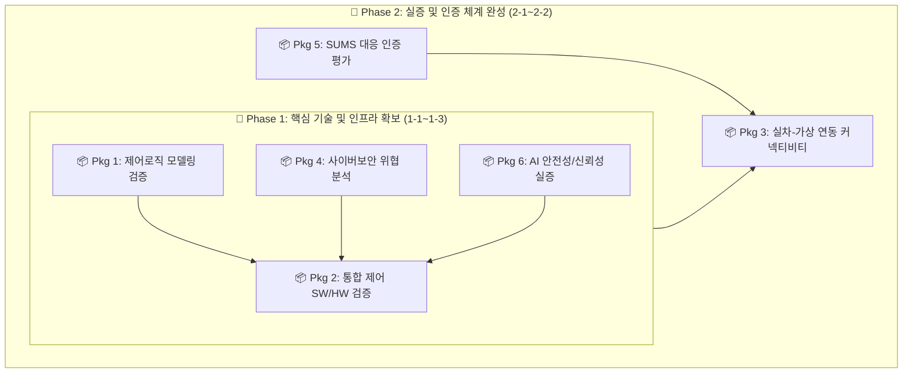

# 자율 작업형 건설기계 통합 제어기 평가 인프라 구축 계획 (v2)

> **버전**: v2.0 (2단계 5개년 체계 반영)  
> **작성일**: 2026.01.08  
> **주요 변경**: 장비비 80억 고정, 공용시설 예산 제외, 2단계 5개년(1-1~2-2) 로드맵 개편, 패키지별 적용 표준 명시

---

## 1. 추진 전략 변경

### 1.1 기존 접근법 vs v2 개선 접근법

| 구분 | 기존 접근법 | v2 개선 접근법 |
|:---|:---|:---|
| **구성 방식** | 개별 장비 16종 분산 구축 | **6종 통합 패키지 시스템** |
| **연차 체계** | 1~5차년도 단일 단계 | **2단계 5개년** (Phase 1: 1-1~1-3, Phase 2: 2-1~2-2) |
| **구축 일정** | 1~5차년도 분산 | **1-1~1-3차 집중 구축** (조기 성과 도출) |
| **장비비** | 93억원 | **80억원** (순수 패키지 구축비 집중) |
| **공용 시설** | 장비비 포함 | **장비비 제외** (인프라 조성비 별도 관리) |

### 1.2 통합 시스템 구축의 장점
```
[기존: 개별 장비 중심]              [개선: 통합 시스템 중심]
A1, A2, A3, A4, A5, A6...           Package 1~6 통합 시스템
     ↓                                    ↓
장비 간 인터페이스 복잡              통합 데이터 흐름
중복 투자 발생                      시설/SW 공유로 비용 절감
개별 운영 비효율                    원스톱 검증 서비스 가능
```

---

## 2. 6종 통합 패키지 시스템 구성

### 2.1 통합 구성도 (2단계 연계)



### 2.2 패키지별 구축 일정 및 적용 표준

| 구분 | 패키지명 | 구축 시기 | 적용 표준 및 규제 |
|:---:|:---|:---:|:---|
| **Pkg 1** | **제어로직 모델링 검증 시스템**<br>(A1 MIL/SILS) | 1-1~1-2차 | ISO 19014 (건설기계 안전), IEC 61508 (기능안전) |
| **Pkg 2** | **통합 제어 SW/HW 시나리오 검증 시스템**<br>(A2+A3+A4 통합) | 1-2~1-3차 | ISO 26262 (차량 기능안전), MISRA-C/C++ (코딩 표준) |
| **Pkg 3** | **실차-가상 연동 커넥티비티 평가 시스템**<br>(A5+A6+B6 통합) | 2-1~2-2차 | UN R155 (사이버보안), ISO/SAE 21434 (보안 공학) |
| **Pkg 4** | **전주기 사이버보안 위협 분석 시스템**<br>(B1~B4 통합) | 1-2차 | NIST SP 800-115 (침투테스트), ISO 21434 TARA |
| **Pkg 5** | **SUMS 대응 인증 평가 시스템**<br>(B5 SUMS) | 2-1차 | UN R156 (SUMS), ISO 24089 (OTA 업데이트) |
| **Pkg 6** | **AI 안전성/신뢰성 실증 시스템**<br>(C1~C3 통합) | 1-3차 | EU AI Act (인공지능법), ISO/IEC 42001 (AI 경영) |

---

## 3. 예산 요약 및 집행 계획

### 3.1 전체 사업비 구성 (단위: 백만원)

| 구분 | 1-1차 | 1-2차 | 1-3차 | 2-1차 | 2-2차 | 합계 | 비율 | 비고 |
|:---|---:|---:|---:|---:|---:|---:|---:|:---|
| **장비비** | 800 | 3,150 | 2,250 | 1,075 | 725 | **8,000** | 53.3% | 6종 통합 패키지 (순수 장비) |
| **인건비** | 700 | 700 | 700 | 700 | 700 | **3,500** | 23.3% | 전문 연구 인력 확보 |
| **활동/운영비** | 500 | 500 | 500 | 500 | 500 | **2,500** | 16.7% | 기술교류, 수수료, 유지관리 |
| **재료비** | 50 | 50 | 50 | 50 | 50 | **250** | 1.7% | 소모성 부품, 테스트 시료 |
| **간접비** | 150 | 150 | 150 | 150 | 150 | **750** | 5.0% | 총액의 5% |
| **합계** | **2,200** | **4,550** | **3,650** | **2,475** | **2,125** | **15,000** | 100% | |

> ※ 총 사업비: 150억원 (국비 100억원 + 지방비 50억원)  
> ※ 공용 시설(시험실 조성 등)은 비장비비(활동/운영비 등) 내 인프라 조성 비용으로 처리함

### 3.2 패키지별 연차 장비비 배분표 (단위: 백만원)

| 패키지 | 1-1차 | 1-2차 | 1-3차 | 2-1차 | 2-2차 | 합계 | 비고 |
|:---|---:|---:|---:|---:|---:|---:|:---|
| **Pkg 1** | 800 | 800 | - | - | - | **1,600** | 1-1~1-2차 분할 집행 |
| **Pkg 2** | - | 1,400 | 1,400 | - | - | **2,800** | 1-2~1-3차 분할 집행 |
| **Pkg 3** | - | - | - | 725 | 725 | **1,450** | 2-1~2-2차 분할 집행 |
| **Pkg 4** | - | 950 | - | - | - | **950** | 1-2차 전액 집행 |
| **Pkg 5** | - | - | - | 350 | - | **350** | 2-1차 전액 집행 |
| **Pkg 6** | - | - | 850 | - | - | **850** | 1-3차 전액 집행 |
| **합계** | **800** | **3,150** | **2,250** | **1,075** | **725** | **8,000** | |

---

## 4. 글로벌 규제 대응 매핑

| Package | EU MR | ISO 19014 | ISO 21434 | EU CRA | EU AI Act | UN R155/156 |
|:---:|:---:|:---:|:---:|:---:|:---:|:---:|
| **1** | ✅ | ✅ | - | - | - | - |
| **2** | ✅ | ✅ | ✅ | - | ✅ | - |
| **3** | ✅ | ✅ | ✅ | ✅ | ✅ | ✅ |
| **4** | - | - | ✅ | ✅ | - | ✅ |
| **5** | - | - | ✅ | ✅ | - | ✅ |
| **6** | ✅ | - | - | - | ✅ | - |

---

## 5. 연차별 로드맵 및 Gantt 차트

```
       1-1차(2026)  1-2차(2027)  1-3차(2028)  2-1차(2029)  2-2차(2030)
───────────────────────────────────────────────────────────────────
Pkg 1   ████████     ████████
Pkg 2                ████████     ████████
Pkg 3                             [준비]       ████████     ████████
Pkg 4                ████████
Pkg 5                             [준비]       ████████
Pkg 6                             ████████
통합                                           ████████     ████████
───────────────────────────────────────────────────────────────────
장비비     800         3,150        2,250        1,075         725
```

---

## 6. 비용 절감 및 기대 효과

### 6.1 통합 구축에 따른 절감
- **SW 라이선스**: 패키지 통합 계약을 통해 개별 구매 대비 약 15% 비용 절감.
- **I/O 인터페이스**: Pkg 2, 3 간 I/O 랙 및 보드 공유로 중복 투자 방지.
- **GPU 서버**: Pkg 2와 Pkg 6의 센서 시뮬레이션/AI 연산 서버를 통합 운영하여 자원 효율성 극대화.

### 6.2 기대 효과
- **국내 최초**: 건설기계 분야 6종 통합 안전성/보안성 실증 인프라 확보.
- **수출 지원**: EU 및 UN의 최신 규제(MR, AI Act, R155/156) 원스톱 대응 지원.
- **중소기업 상생**: 고가 인프라 공유를 통해 중소 부품사의 자율주행 기술 개발 장벽 완화.

---

*문서 끝*
