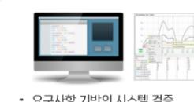
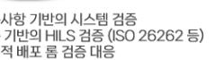
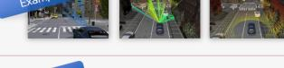
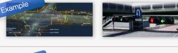
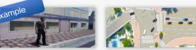
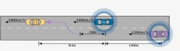
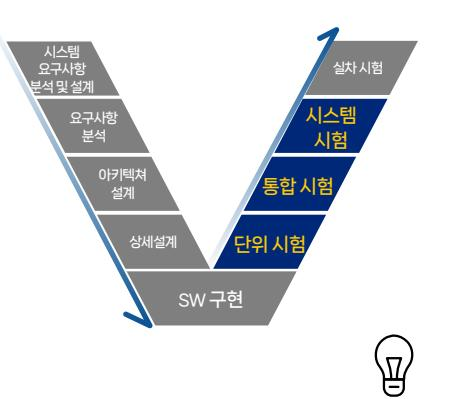
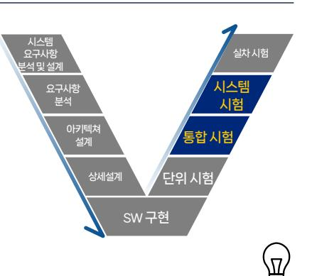

Software for Safe World

# 건설기계 전자제어 및 지능형 핵심부품 기능안전평가 기반구축

2025. 10. AX사업개발 1팀 신영만 대리

## 건설기계 규정 및 제안 항목

### Machinery Regulation EU 2023/2130 + 기계/자동차 표준

- 주요법규및표준별내용요약
  - 시행일정(2027년) 도입시점에 맞춰 연차별 도입시스템 구성 변경
  - 주요내용대응수행가능항목반영

| 구분                      | 주요 내용                                                                                         | 적용범위              | 시행 일정 / 영향              |  |
|-------------------------|-----------------------------------------------------------------------------------------------|-------------------|-------------------------|--|
| EU Machinery Regulation | 기존 *Machinery Directive (2006/42/EC)*를 대체하는 신규 법규                                             | 기계류, 전자제어장비,      | 2027.1.20 시행            |  |
| (EU) 2023/1230          | SW, Al, loT, 사이버보안 포함한 최신 기술까지 규제 대상 확대                                                       | AI 탑재형 건설기계 포함    | (42개월 전환 유예기간)          |  |
| EU AI Act               | 고위험 Al 시스템을 공인인증기관 인증 대상으로 지정                                                                 | 고위험군 Al           | 2027년 저유 에저             |  |
| (2024/06 발효)            | <mark>AI 탑재형 건설기계(자율작업장비 등)는 인증 대상 가능성 높음</mark>                                              | (제조·건설 장비 등)      | 2027년 적용 예정             |  |
| EU Cyber Resilience Act | U Cyber Resilience Act                                                                        |                   | 2024 반표 2027년년 시행       |  |
| (CRA)                   | 네트워크 연결 장비는 필수적으로 <mark>취약성 관리·보안 업데이트 수행</mark>                                              | (기계류 포함)          | 2024 필표, 2027부터 시행      |  |
| ISO 19014               | 하드웨어 및 제어시스템의 <mark>기능안전 요건 규정</mark>                                                         | 거성기게 그차기 기개차 드    | ISO 표준 진행중              |  |
| (건설기계 기능안전)             | <mark>CAN 버스 결함주입, 고장률 계산, 안전기능 검증 요구</mark>                                                  | 1신걸기계, 걸꾹기, 지계자 등 | (Type C 표준 부합화 중)       |  |
| ISO 25119 (농기계 기능안전) | 농기계 및 비도로형 장비 제어시스템의 <mark>안전검증 절차 정의</mark>                                                  | 농업·임업 장비          | 유사 구조로 건설기계에 확장 가능      |  |
| ISO 26262 (자동차 기능안전) | SW 검증 프로세스 (Part 6), 시스템 통합시험 (Part 4, 8), Fault Injection Tes t (Table 7.1(I)) 등 상세 절차 제공 | 도로형 건설기계, 특장차     | 건설기계 ISO 19014 대응 기반 참조 |  |

### 분야 및 표준 별 주요 요구사항 매칭 장비 제안

- SW 및HILS 구축관점으로기술적대응방향제안
  - SW검증~ 기능안전프로세스까지모든분야대응가능시스템구축목표
  - 시뮬레이션검증+ 사이버보안항목초기도입변경

| 분야                         | 주요 요구사항                                                                                            | 기술적 대응 방향                                                                                            |
|----------------------------|-------------------------------------------------------------------------------------------------------|------------------------------------------------------------------------------------------------------------|
| 시뮬레이션 및 사이버보안 검증  | - SW 자체 적합성 선언 불가(고위험군은 인증 필요) - CRA에 따른 네트워크 보안 및 취약성관리 의무 | - ISO 26262 기반 SILS/HILS 통합 검증체계 구축 - CAN/Ethernet Fuzzing 시험 장비(ARCHON Z 등) 도입 필요 |
| 제어기 통합 검증            | 부품 레벨 Fail-safe 동작 검증 필수                                                                  | ISO 19014 기반 장비 운용 (결함 주입, 통신, 자원사용량, 데이터 등)                                                |
| 기반 인프라 구축 및 검증 | SW 코딩 규칙 및 요구사항 정합성 검증                                                              | ISO 26262 기반 장비 운용 (SW 및 모델 정적검증, 단위/통합 검증 등)                                      |
| 기능안전 프로세스               | 위험원 식별 및 문서화(ASIL/PLr 수준)                                                                    | ASPICE 기반 프로세스 관리 시스템(VSPICE) 구축 필요                                                            |
| AI 탑재 제어기               | AI 모델 성능, 강건성, 해석가능성 요구                                                                         | ISO/IEC TS 4213 기반 AI 안전성 평가 시스템 필요                                                            |

| Code Analysis                             |  |
|-------------------------------------------|--|
| 사이버보안 코딩 룰 검증 - CWE, CERT C, MISRA C 등 |  |
|                                           |  |

| CWE     | 알반적인 소프트웨어의 취약점들을 분류한 코딩 룰                      |
|---------|----------------------------------------------------|
| CERT C  | C언어코드작성시주의사항들을 가이드한코딩를                          |
| MISRA C | C언어로 작성된 임베티드 시스템의 코드 안전성, 신뢰성을 확보하기 위한 코딩 룰 |
| _       |                                                    |

| 관련내용 | 확인    |   |
|------|-------|---|
| 语    |       | E |
|      | Dumb  |   |
| t    | Smart |   |
|      |       |   |

| 데이터 처리 방식 |                               |  |  |  |
|-----------|-------------------------------|--|--|--|
| 생성 기반     | 지속적으로 새로운 테스트 케이스를 생성하여 수행 |  |  |  |
| 번이 기반     | 수행된테스트케이스를 변형하여수행          |  |  |  |

요건

### CON-SAFE Platform 구축 사업

- 구축 기간 內 연차 별 HW/SW 구축 및 실증 서비스 & 교육 지원 (연차별 플랫폼 구축이나, 결과적으로 하나의 통합 시험 및 평가 플랫폼으로 귀결) ■ 1차년도 : 시뮬레이션 및 사이버보안 검증 시스템
- 주요 항목 : 시뮬레이션 검증 / HILS 검증 / 사이버보안 검증

| 단계                     | 시험 항목                                                                 | 장비명                                   | 특성 및 주요 기능                                                                                 | 라이선스 타입                                                                                                |
|------------------------|-----------------------------------------------------------------------|---------------------------------------|-----------------------------------------------------------------------------------------------|--------------------------------------------------------------------------------------------------------|
| Cyber Security      | 예측 가능한 제 3자 악의적 시도로 인한 위험한 상황이 발생하지 않도록 설계                         | ARCHONZ (200,000,000)              | 1. 차량 내/외부 네트워크기반 무작위 입력을 통해 제어기/실차 오작동 확인                                                 | 1. 퍼징 시험 장비 HW - 1EA 2. 적용 프로토콜 선택 (Bluetooth, CAN 등) 3. License 기간 : Permanent                  |
| System Verification | Hardware-In-the-Loop Simulation (안전 요구사항 시나리오 검증, 모델vs실제 결과 비교) | HILS 장비 (300,000,000)              | 1. 검증 대상 제어기에 대한 HILS 장비 커스터마이징 (주요 제어기 선정 적용) 2. ASW, BSW, 제어기 HW 검증 수행             | 구성 항목 선정 장비 설치 및 기술지원 제공                                                                            |
| Simulation             | 모델 기반 개발 및 시뮬레이션을 통한 검증 수행                                            | AUTOSIM & DCAT (350,000,000) | 1. 건설 기계 성능 평가 및 검증 수행을 위한 가상 검증 환경 구축 2. 가상환경 및 건설기계 부품 모델링 SW, 시나리오 저작 및 데이터 수집&분석 | 1. User : 1 User 2. License 기간 : Permanent 3. 가상 환경 모델링 및 동작 시나리오 제공 4. 검증 데이터 수집&결과 분석 기능 제공 |
| Verification           | 시뮬레이션, HIL, SIL 검증 SW 단위/통합 시험 단계 - 시뮬레이션 기반 검증 수행                 | SIMVA (200,000,000)                | 1. 가상 ECU 기반 통합 시뮬레이션 솔루션 2. 가상 ECU 입출력 인터페이스 제공                                           | 1. Users - 1 User 2. License 기간 : Permenent                                                         |

솔루션

### CON-SAFE Platform 구축 사업

요건 솔루션

- 구축 기간 **內** 연차 별 HW/SW 구축 및 실증 서비스 & 교육 지원 (연차별 플랫폼 구축이나, 결과적으로 하나의 통합 시험 및 평가 플랫폼으로 귀결)
- 2차년도 : 제어기 통합 시험 시스템

주요 항목 : 결함 주입 시험 검증 / 통신 및 네트워크 검증 / 자원사용량 측정 / 차량 제어기 및 주행 데이터 검증

| 단계                                                       | 시험 항목                          | 장비명                       | 특성 및 주요 기능                                                                                                                       | 라이선스 타입                                                                                                                                      |
|----------------------------------------------------------|-----------------------------------|---------------------------|-------------------------------------------------------------------------------------------------------------------------------------------|-------------------------------------------------------------------------------------------------------------------------------------------------|
|                                                          | 결함 주입 시험                    | FIT (100,000,000)      | Embedded SW(Basic SW)에 대한 결함 주입 시험                                                                                            | 1. Users - 1 User 2. License 기간 : Permenent 3. 인터페이스 : JTAG Debugger                                                                      |
| Software Integration and Integration Testing | 통신 및 네트워크 시험             | AUTORACT (100,000,000) | 1. 다차종 통신 자동화 검증 2. 네트워크 관련 검증을 위한 하드웨어 연결 관리 3. ISO 19014 Part 4 (통신 안전 요구) Fault Injection 시험 수행 | 1. Users - 1 User 2. License 기간 : Permenent 3. Vector VN 계열 CAN/FD, Ethernet 장치, PEAK-System CAN/FD 장치 지원                              |
|                                                          | 자원사용량 측정 시험                 | PROV (100,000,000)     | 1. 타이밍 및 자원사용량 측정 2. 탑침 삽입&실시간 자원 사용량 측정                                                                          | 1. Users - 1 User 2. License 기간 : Permenent 3. 타겟 OS 및 CPU 사전 확인 - 지원 CPU : Tricore/AURIX, Freescale MPC - 지원 OS : OSEK 계열, POSIX 등 |
|                                                          | 차량 제어기 및 주행 데이터 검증 | AESOP (100,000,000)    | 1. Calibration 데이터 검증 자동화 2. 주행 데이터 평가 자동화 3. ISO 26262 Safety Case 활용 보고서 출력                   | 1. Users - 1 User 2. License : Permenent(Nodelock) 3. INCA Workspace 연동(INCA) 4. HEX, 텍스트 등 데이터파일, ASAM MCD-2 롬 데이터 형태 지원           |

### CON-SAFE Platform 구축 사업

- 구축 기간 **內** 연차 별 HW/SW 구축 및 실증 서비스 & 교육 지원 (연차별 플랫폼 구축이나, 결과적으로 하나의 통합 시험 및 평가 플랫폼으로 귀결)
- 3차년도 : 건설기계 기반 인프라 및 검증 시스템 주요 항목 : 단위시험 / 통합시험 / 프로세스 자동화

요건 솔루션

| 시스템 요구사항 분석및설계                                                                                                                                                                                                                                                                                                                                                                                                                                                                                                                                                                                                                                                                                                                                                                                                                                                                                                                                                                                                                                                                                                                                                                                                                                                                                                                                                                                                                                                                                                                                                                                                                                                                                                                                                                                                                                                               | 실차시험         |
|------------------------------------------------------------------------------------------------------------------------------------------------------------------------------------------------------------------------------------------------------------------------------------------------------------------------------------------------------------------------------------------------------------------------------------------------------------------------------------------------------------------------------------------------------------------------------------------------------------------------------------------------------------------------------------------------------------------------------------------------------------------------------------------------------------------------------------------------------------------------------------------------------------------------------------------------------------------------------------------------------------------------------------------------------------------------------------------------------------------------------------------------------------------------------------------------------------------------------------------------------------------------------------------------------------------------------------------------------------------------------------------------------------------------------------------------------------------------------------------------------------------------------------------------------------------------------------------------------------------------------------------------------------------------------------------------------------------------------------------------------------------------------------------------------------------------------------------------------------------------------------|--------------|
| 요구사항 분석 아키텍쳐                                                                                                                                                                                                                                                                                                                                                                                                                                                                                                                                                                                                                                                                                                                                                                                                                                                                                                                                                                                                                                                                                                                                                                                                                                                                                                                                                                                                                                                                                                                                                                                                                                                                                                                                                                                                                                                                 | 시스템 시험    |
| 설계 상세설계                                                                                                                                                                                                                                                                                                                                                                                                                                                                                                                                                                                                                                                                                                                                                                                                                                                                                                                                                                                                                                                                                                                                                                                                                                                                                                                                                                                                                                                                                                                                                                                                                                                                                                                                                                                                                                                                         | 통합시험 단위시험 |
| s and the second second second second second second second second second second second second second second second second second second second second second second second second second second second second second second second second second second second second second second second second second second second second second second second second second second second second second second second second second second second second second second second second second second second second second second second second second second second second second second second second second second second second second second second second second second second second second second second second second second second second second second second second second second second second second second second second second second second second second second second second second second second second second second second second second second second second second second second second second second second second second second second second second second second second second second second second second second second second second second second second second second second second second second second second second second second second second second second second second second second second second second second second second second second second second second second second second second second second second second second second second second second second second second second second second second second second second second second second second second second second second second second second second second second second second second second second second second second second second second second second second second second second second second second second second second second second second second second second second s | SW 구현        |
|                                                                                                                                                                                                                                                                                                                                                                                                                                                                                                                                                                                                                                                                                                                                                                                                                                                                                                                                                                                                                                                                                                                                                                                                                                                                                                                                                                                                                                                                                                                                                                                                                                                                                                                                                                                                                                                                                    |              |

| 단계                            | 시험 항목                      | 장비명                     | 특성 및 주요 기능                                                                     | 라이선스 타입                                                                             |
|-------------------------------|-------------------------------|-------------------------|-----------------------------------------------------------------------------------------|----------------------------------------------------------------------------------------|
| Software                      | 단위 시험 및 커버리지 측정            | CT (100,000,000)     | 요구 사항 및 구조 기반 시험 커버리지 측정 지원                                     | 1. Users - 1 User 2. License 기간 : Permenent 3. Floating / NodeLock 라이선스 타입 선택 제공 |
| Verification                  | 통합시험 및 커버리지 측정             | COVER (100,000,000)  | 실행파일 내 탐침코드 삽입 후 타겟 동작 결과를 통해 실제 수행 커버리지 측정 지원   | 1. Users - 1 User 2. License 기간 : Permenent 3. Floating / NodeLock 라이선스 타입 선택 제공 |
| Process Operation          | 검증 사이클 모니터링 및 개발 라이프사이클 관리 | VSPICE (100,000,000) | 개발 안전 요구사항 충족을 위한 라이프사이클 관리/검사 및 검증                             | 1. Users - 1 User 2. License 기간 : Permenent 3. Floating / NodeLock 라이선스 타입 선택 제공 |
| Software                      | 코딩규칙 검증                       | STATIC                  | 코딩 규칙 검증, 취약점 점검, 소스 코드 메트릭                                           | 1. Server-Client 구조 2. Users - 3 Users                                              |
| Verification                  | 소스코드 메트릭 점검                   | (80,000,000)            | 점검 항목 SW 신뢰성 시험 기준 준수 지원                                              | 3. License 기간 : Permenent                                                              |
| Model Static Verification  | 모델링 규칙 준수 검사                  | MI (50,000,000)      | 1. 모델 복잡도, 가독성, 추적성 관리 2. 대규모 규칙(711개) 지원                                   | 1. Users - 1 User 2. License 기간 : Permenent 3. Floating / NodeLock 라이선스 타입 선택 제공 |
| Model Dynamic Verification | 모델 실행 기반 동적 분석                | MV (50,000,000)      | 1. MIL/SIL/HIL 연계 2. MC/DC 등 고급 커버리지 분석 3. 실차 데이터 기반 회귀시험 지원 | 1. Users - 1 User 2. License 기간 : Permenent 3. Floating / NodeLock 라이선스 타입 선택 제공 |

### CON-SAFE Platform 구축 사업

- 구축 기간 **內** 연차 별 HW/SW 구축 및 실증 서비스 & 교육 지원 (연차별 플랫폼 구축이나, 결과적으로 하나의 통합 시험 및 평가 플랫폼으로 귀결)
- 4차년도 : AI 활용 검증 고도화 시스템
  - 주요 항목 : AI 모델 검증 / 개발 문서 자동화 플랫폼
  - 제안 항목 외 추가 요구사항 반영 가능

| C | D | ア |
|---|---|---|
| 4 | 1 | Ĺ |

| 요건 |   | 솔루션 |
|----|---|-----|
|    | Ť |     |

| 단계                      | 시험 항목                                         | 장비명                        | 특성 및 주요 기능                                                                         | 라이선스 타입                                                                                             |
|-------------------------|--------------------------------------------------|----------------------------|---------------------------------------------------------------------------------------------|--------------------------------------------------------------------------------------------------------|
| AI Model Verifcation | AI 모델 신뢰성 검증을 통한 개발 방향성 고도화 | VERIFAI-M (200,000,000) | 1. AI 모델 강건성 시험, 성능 시험, 뉴런 커버리지 측정 2. 표준 기반 ML 모델 평가 지표 계산 | 1. Users - 1 User 2. License 기간 : Permenent 3. PYTORCH, Keras, TensorFlow 등 프레임워크 지원 |
| Auto Documentation   | AI 활용 SW의 문서(SRS,SDD등) 자동화                 | ALIRA-AI (300,000,000)  | 실행파일 내 탐침코드 삽입 후 타겟 동작 결과를 통해 실제 수행 커버리지 측정 지원       | 1. Users - 1 User 2. License 기간 : Permenent 3. Floating / NodeLock 라이선스 타입 선택 제공  |
| …                       | …                                                | …                          | …                                                                                           | …                                                                                                      |